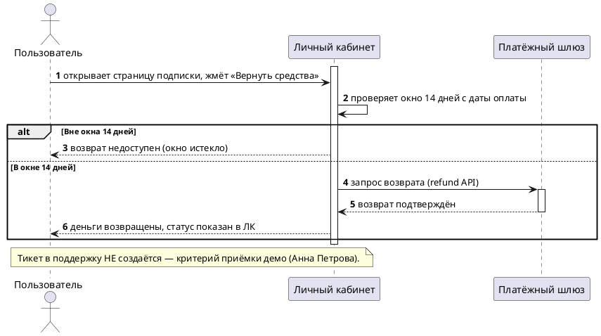

<!--
golden_deep_output.md — eval-артефакт merge-гейта (Task 10).
Прогон: bft-deep-swarm на examples/golden_deep_summary.md, epic_slug = golden-refund.
Режим: SOLO NATIVE RUN. ruflo MCP и живые JIRA/Confluence/repowise недоступны в этой сессии →
по правилу деградации SKILL.md роли (Обогатитель/Verifier/Reviewer) исполнены native-Task одним
проходом, грудинг — ТОЛЬКО на текст входного summary (examples/golden_deep_summary.md).
Следствие для якорей: R1 (код) и R2 (трекер/wiki) недоступны в этом прогоне — все SOURCE-факты
заякорены R3 («кто сказал» + дата встречи + summary), а не выдуманы под видом R1/R2.
Артефакт не отгружается в JIRA/Confluence (/bft-deliver не вызывался) — стоп на валидированном
черновике, как предписывает SKILL.md §Принципы.
Иллюстративный образец degraded-прогона (без ruflo/JIRA/Confluence); авторитетный merge-гейт —
повторный прогон судьи по resources/eval_rubric.md на свежем выводе, не факт наличия этого файла.
-->
---
source: "[УТОЧНИТЬ — страница Confluence не создана в этом прогоне]"
space: "[УТОЧНИТЬ]"
version: 0.1
synced: 2026-07-14
jira: "[СОЗДАТЬ эпик] (epic_slug: golden-refund, JIRA key не выдан)"
status: Черновик 0.1 (deep-swarm, solo native run)
---

# [БФТ] golden-refund: Самообслуживаемый возврат средств (self-service refund)

Бизнес описание
===============

Пользователь с активной подпиской сможет вернуть деньги сам — кнопкой «Вернуть средства» в личном кабинете подписки, без обращения в поддержку.

**Образ результата:** в личном кабинете подписки появляется кнопка «Вернуть средства»; пользователь инициирует возврат сам, деньги уходят через refund-API платёжного шлюза, тикет в поддержку не создаётся (демо принимает Анна Петрова, support-lead) [Анна Петрова, встреча 10.07.2026].

**Зачем делать:** сейчас возврат — ручная операция оператора поддержки, SLA до 3 рабочих дней, и 40% тикетов поддержки за июнь — про возвраты [Анна Петрова, встреча 10.07.2026, отчёт поддержки]. Самообслуживание должно снять долю этой ручной нагрузки. Точная целевая метрика эффекта (на сколько тикетов/часов снизится нагрузка) и привязка к KR/стратегии квартала на встрече не звучали — `[УТОЧНИТЬ у Ирины Соколовой]` (planning_root не подключён в этом прогоне — solo native run без ruflo).

Подробный контекст (полное описание для LLM)

Эпик обсуждён на встрече 10.07.2026 (участники: Ирина Соколова — PO, Дмитрий Волков — тимлид backend, Анна Петрова — support-lead/приёмщик демо, Олег Кузнецов — платёжный интегратор внешней команды billing).

Сейчас возврат делает только оператор поддержки вручную через админку, SLA обработки — до 3 рабочих дней [Анна Петрова]. Возврат должен стать возможен только в течение 14 дней с даты оплаты — правило со ссылкой на оферту [Ирина Соколова]. Платёжный шлюз (провайдер billing) поддерживает API рефанда — подтвердил представитель внешней команды billing [Олег Кузнецов]. Целевое демо: пользователь сам инициирует возврат, деньги уходят, тикет НЕ создаётся [Анна Петрова].

Часть решений на встрече не приняты (частичный/полный возврат, поведение при промо, порог модерации, канал уведомления) — см. «Вводные для разрабатываемого функционала».

В документе описываются требования к сценариям:
* Инициация возврата пользователем из личного кабинета подписки в окне 14 дней.
* Отказ/явное сообщение при попытке возврата вне 14-дневного окна.

Общая информация
================

| Поле | Значение |
| --- | --- |
| Название проекта | Самообслуживаемый возврат средств (epic_slug: golden-refund) |
| Ответственный за продукт | Ирина Соколова (PO) [встреча 10.07.2026] |
| Ответственный за документ | `[УТОЧНИТЬ у Ирины Соколовой]` (не названо на встрече) |
| Задача/Epic Jira | `[СОЗДАТЬ эпик]` — не создан в этом прогоне |
| Статус | АНАЛИЗ |
| Системные требования | `[УТОЧНИТЬ]` — ссылка на СА/FNR не существует в этом прогоне |

Заинтересованные стороны
========================

| ФИО | Роль/должность | Контакты |
| --- | --- | --- |
| Ирина Соколова | PO | `[УТОЧНИТЬ]` |
| Дмитрий Волков | Тимлид backend | `[УТОЧНИТЬ]` |
| Анна Петрова | Support-lead, приёмщик демо | `[УТОЧНИТЬ]` |
| Олег Кузнецов | Платёжный интегратор, внешняя команда billing | `[УТОЧНИТЬ]` |

История изменений
=================

| # | Дата | Автор | Суть изменений |
| --- | --- | --- | --- |
| 1 | 14.07.2026 | bft-deep-swarm (solo native run) | Обогащение seed (Summary 2026-07-10) по 3 осям (ценность/what-if/границы) + укладка в канон-структуру MTS. Стоп на валидированном черновике, /bft-deliver не вызывался. |

Дополнительные материалы и артефакты
====================================

| Артефакт/Файл/Ссылка | Описание |
| --- | --- |
| `examples/golden_deep_summary.md` (вход, встреча 10.07.2026) | Единственный источник фактов этого прогона — JIRA/Confluence/repowise недоступны (solo native run) |

Проблема которую решаем
=======================

| Срез | Содержание |
| --- | --- |
| **ДЛЯ КОГО** | Пользователь с активной подпиской, который хочет вернуть деньги [тема встречи 10.07.2026] |
| **ЧТО ДЕЛАЕМ** | Даём пользователю самому вернуть средства за подписку из личного кабинета, без обращения в поддержку [тема встречи] |
| **ASIS** | Возврат делает только оператор поддержки вручную через админку; SLA обработки — до 3 рабочих дней [Анна Петрова, встреча 10.07.2026] |
| **ПРОБЛЕМА** | <ul><li>40% тикетов поддержки за июнь — про возвраты, по отчёту поддержки [Анна Петрова, встреча 10.07.2026]</li><li>Ручная обработка создаёт SLA-задержку до 3 дней для пользователя, который мог бы получить возврат мгновенно [Анна Петрова]</li></ul> |
| **TOBE** | <ul><li>Кнопка «Вернуть средства» в личном кабинете подписки, возврат в течение 14 дней с даты оплаты [Ирина Соколова, встреча, ссылка на оферту]</li><li>Возврат через refund-API платёжного шлюза, тикет в поддержку не создаётся [Олег Кузнецов; Анна Петрова, критерий демо]</li></ul> |

Изменение в UJM
===============

| Точка демо | Было (As-Is) | Стало (To-Be) |
| --- | --- | --- |
| Страница подписки в личном кабинете | Пользователь пишет в поддержку → оператор вручную оформляет возврат в админке, до 3 рабочих дней [Анна Петрова] | Пользователь жмёт «Вернуть средства» → возврат через API платёжного шлюза → тикет не создаётся [Олег Кузнецов, Анна Петрова] |

План демонстрации
=================

### Акторы

| Актор | Описание |
| --- | --- |
| Пользователь | Владелец активной подписки, инициирует возврат сам |
| Личный кабинет (ЛК) | Витрина, где размещена кнопка «Вернуть средства» |
| Платёжный шлюз | Внешняя система billing, исполняет refund через API [Олег Кузнецов] |

### Сценарий приёмки (happy path + alt)

**Расширенный сценарий приёмки (ось «что если», стресс happy path):**

| What-if | Есть источник? | Результат |
| --- | --- | --- |
| Возврат запрошен позже 14 дней с даты оплаты | Да — Ирина Соколова, оферта | Покрыто веткой `alt` выше → ФТ-1 |
| Пользователь запрашивает частичный, а не полный возврат | Нет | `[УТОЧНИТЬ у Ирины Соколовой]` — правило не обсуждалось (см. «Вводные», строка про частичный возврат) |
| У подписки активен промокод/скидка на момент возврата | Нет | `[УТОЧНИТЬ у Ирины Соколовой]` — не обсуждалось |
| Сумма возврата превышает некий порог N₽ | Частично — Ирина сказала «надо подумать» (решение не принято) | `[УТОЧНИТЬ у Ирины Соколовой]`, порог N `[УТОЧНИТЬ]` |
| Платёжный шлюз не отвечает / отвечает с ошибкой на refund-запрос | Нет | `[УТОЧНИТЬ у Олега Кузнецова]` — сценарий отказа API не обсуждался |
| Пользователь закрывает ЛК до получения подтверждения от шлюза | Нет | `[УТОЧНИТЬ у Дмитрия Волкова]` — поведение UI при незавершённом запросе не обсуждалось |

Границы
=======

**В зоне БФТ этого эпика:**
- Кнопка «Вернуть средства» в личном кабинете подписки [тема встречи].
- Проверка окна 14 дней с даты оплаты [Ирина Соколова].
- Интеграция с refund-API платёжного шлюза [Олег Кузнецов].
- Демо-критерий «без создания тикета» [Анна Петрова].

**Явный out-of-scope (не входит в зону БФТ этого эпика):**
- Изменение существующего ручного процесса оператора поддержки в админке — эпик добавляет самостоятельный путь пользователя, ручной путь не переписывается (на встрече замены не обсуждали, только добавление кнопки).
- Правила частичного возврата — пока не решено, входят ли они в этот эпик вообще (см. «Вводные»); до решения PO `[УТОЧНИТЬ у Ирины Соколовой]` в демо и ФТ покрыт только полный возврат.

**Операционные заметки:**
- Ручная модерация возвратов свыше порога N₽, если будет введена, — операционная процедура вне UI-сценария демо; порог и сам факт введения — `[УТОЧНИТЬ у Ирины Соколовой]`.
- Канал уведомления пользователя о статусе возврата (email/push) не выбран — влияет на ИТ/ФТ, см. «Вводные».

Бизнес-Требования
=================

## Вводные для разрабатываемого функционала*

| Информация или вопрос | Конспект | Ответ | В рамках чего был получен ответ | Кто ответил | Дата |
| --- | --- | --- | --- | --- | --- |
| Частичный или только полный возврат? | Не решили на встрече | `[УТОЧНИТЬ]` | встреча 10.07.2026 | Ирина Соколова | — |
| Что с возвратом при активном промо/скидке? | Не обсуждали | `[УТОЧНИТЬ]` | встреча 10.07.2026 | Ирина Соколова | — |
| Нужна ли ручная модерация возврата свыше N₽? | Ирина: «надо подумать» | `[УТОЧНИТЬ]`, порог N `[УТОЧНИТЬ]` | встреча 10.07.2026 | Ирина Соколова | — |
| Канал уведомления пользователя о статусе возврата (email/push)? | Канал не выбрали | `[УТОЧНИТЬ]` | встреча 10.07.2026 | Ирина Соколова | — |
| Привязка к JIRA-эпику (epic key)? | Эпик не создан в этом прогоне | `[СОЗДАТЬ эпик]` | solo native run, live JIRA недоступен | Ирина Соколова | — |

## Продуктовая ценность разрабатываемого функционала для бизнес-заказчиков*

Реальное ЗАЧЕМ по факту с встречи — снять долю нагрузки на поддержку: 40% тикетов июня — про возвраты, обработка ручная, до 3 дней SLA [Анна Петрова]. Целевая метрика эффекта (на сколько тикетов/часов снизится нагрузка после запуска) и привязка к KR/стратегии квартала на встрече не звучали — `[УТОЧНИТЬ у Ирины Соколовой]`, planning_root в этом прогоне не подключён.

Ценностные `[УТОЧНИТЬ]`-вопросы к PO:
- Какая целевая метрика успеха (снижение доли тикетов-возвратов, снижение SLA, экономия часов оператора)?
- Есть ли KR квартала, к которому привязан этот эпик?
- Кто заказчик экономического эффекта — support или finance?

| Идентификатор | Наименование требования | Ценность разрабатываемого функционала для бизнес-заказчиков | Краткое описание доработки из данного БФТ | Связанные требования |
| --- | --- | --- | --- | --- |
| БТ-1 | Самообслуживаемый возврат средств | Снижение ручной нагрузки на поддержку (40% тикетов июня — возвраты) [Анна Петрова] | Кнопка возврата в ЛК + refund-API платёжного шлюза, без создания тикета | ПТ-1, ПТ-2, ФТ-1, ФТ-2, ФТ-3 |

Пользовательские требования*
============================

| Идентификатор | Наименование требования | Story | Комментарий | Связанные требования |
| --- | --- | --- | --- | --- |
| ПТ-1 | Самостоятельный возврат из ЛК | **Когда** я (пользователь с активной подпиской) хочу вернуть оплату **Я хочу** нажать «Вернуть средства» в личном кабинете подписки **Чтобы** получить возврат без обращения в поддержку | Тикет не создаётся — критерий демо [Анна Петрова] | БТ-1 |
| ПТ-2 | Отказ вне окна 14 дней | **Когда** я пытаюсь вернуть оплату позже 14 дней с даты оплаты **Я хочу** видеть понятную причину отказа в ЛК **Чтобы** не создавать лишний тикет в поддержку | Окно 14 дней — правило Ирины со ссылкой на оферту | БТ-1 |

Требования к интерфейсам*
=========================

Продукт: личный кабинет пользователя (веб). Платформа/разрешение на встрече не обсуждались — `[УТОЧНИТЬ]`.

| Идентификатор | Наименование требования | Требование к пользовательскому интерфейсу | Предложения по элементам UI, механике и композиции | Связанные требования |
| --- | --- | --- | --- | --- |
| ИТ-1 | Кнопка «Вернуть средства» | На странице подписки в ЛК видна кнопка «Вернуть средства», если подписка в окне 14 дней с даты оплаты [Ирина Соколова, Анна Петрова] | `[УТОЧНИТЬ]` — макет не обсуждался | ПТ-1 |
| ИТ-2 | Отображение статуса возврата | Пользователь видит статус возврата в ЛК после нажатия кнопки; конкретный канал внешнего уведомления (email/push) не выбран | канал уведомления — `[УТОЧНИТЬ у Ирины Соколовой]` | ПТ-1, ПТ-2 |

## Макеты интерфейса*

`[УТОЧНИТЬ — готов ли макет, дизайн: не обсуждалось на встрече]`.

Функциональные требования*
==========================

| Идентификатор | Наименование требования | Приоритет | Функциональные требования | Параметры, ограничения | Связанные требования |
| --- | --- | --- | --- | --- | --- |
| ФТ-1 | Окно возврата 14 дней | Высокий | Система разрешает возврат только в течение 14 дней с даты оплаты подписки [Ирина Соколова, оферта] | Окно = 14 дней от даты оплаты | БТ-1, ПТ-1, ПТ-2 |
| ФТ-2 | Интеграция с refund-API платёжного шлюза | Высокий | При подтверждённом возврате система вызывает refund-API платёжного шлюза billing [Олег Кузнецов] | Провайдер API подтверждён, контракт (эндпоинты/схема) — зона СА, вне БФТ | БТ-1, ПТ-1 |
| ФТ-3 | Тикет не создаётся при самостоятельном возврате | Высокий | При успешном самостоятельном возврате тикет в поддержку не создаётся [Анна Петрова, критерий демо] | — | БТ-1, ПТ-1 |
| ФТ-4 | Частичный vs полный возврат | `[УТОЧНИТЬ]` | Правило поведения при частичном возврате не определено | `[УТОЧНИТЬ у Ирины Соколовой]` | БТ-1 |
| ФТ-5 | Поведение при активном промо/скидке | `[УТОЧНИТЬ]` | Правило поведения при возврате с промокодом/скидкой не определено | `[УТОЧНИТЬ у Ирины Соколовой]` | БТ-1 |
| ФТ-6 | Модерация возврата свыше порога N₽ | `[УТОЧНИТЬ]` | Нужна ли ручная модерация — не решено («надо подумать», Ирина) | порог N — `[УТОЧНИТЬ у Ирины Соколовой]` | БТ-1 |
| ФТ-7 | Уведомление о статусе возврата | `[УТОЧНИТЬ]` | Канал уведомления (email/push) не выбран | канал — `[УТОЧНИТЬ у Ирины Соколовой]` | ПТ-1, ПТ-2, ИТ-2 |

Нефункциональные требования*
============================

Явных числовых НФТ (латентность, нагрузка, TTL) на встрече не звучало — не выдумываются. Два пункта ниже — открытые вопросы, а не подтверждённые требования.

| Идентификатор | Наименование требования | Описание | Связанные требования |
| --- | --- | --- | --- |
| НФТ-1 | Идемпотентность возврата | Повторный вызов кнопки/API не должен провести повторный возврат — поведение не обсуждалось на встрече, `[УТОЧНИТЬ у Дмитрия Волкова]` | ФТ-2 |
| НФТ-2 | Аудит операций возврата | Логирование факта и суммы возврата для support/finance — состав события не обсуждался, `[УТОЧНИТЬ у Дмитрия Волкова]` | ФТ-2, ФТ-3 |

Зависимости
===========

| Команда / система | Тип зависимости | Статус согласования |
| --- | --- | --- |
| Платёжный шлюз (billing, Олег Кузнецов) | API (refund) | Подтверждено — поддержка API рефанда подтверждена на встрече [Олег Кузнецов] |
| Служба поддержки (Анна Петрова) | Согласование критерия приёмки демо | Подтверждено — Анна принимает демо [Анна Петрова] |
| Backend (Дмитрий Волков) | Реализация | Роль обозначена на встрече, объём реализации не детализирован — `[УТОЧНИТЬ]` |

Риски
=====

| Риск | Вероятность | Влияние | Митигация |
| --- | --- | --- | --- |
| Злоупотребление самостоятельным возвратом на крупные суммы без модерации | Средняя | Среднее | Порог модерации N₽ не определён — `[УТОЧНИТЬ у Ирины Соколовой]` (см. ФТ-6) |
| Возврат при активном промо/скидке создаёт финансовое расхождение | Средняя | Высокое | Правило поведения при промо не определено — `[УТОЧНИТЬ у Ирины Соколовой]` (см. ФТ-5) |
| Пользователь не видит статус возврата → повторное обращение в поддержку | Средняя | Среднее | Канал уведомления не выбран — `[УТОЧНИТЬ у Ирины Соколовой]` (см. ФТ-7) |

Ревью требований
================

* Продакт — Ирина Соколова
* Архитектор — `[УТОЧНИТЬ]`
* Аналитик (кросс-ревью) — `[УТОЧНИТЬ]` (solo native run — свежий агент-ревью выполнен тем же прогоном, отдельного кросс-ревью нет)
* Разработка — Дмитрий Волков
* Тестирование — `[УТОЧНИТЬ]`

Якоря истины
============

Все SOURCE-факты этого прогона — ранг **R3** (решение/утверждение участника на встрече 10.07.2026, зафиксировано в `examples/golden_deep_summary.md`). R1 (код) и R2 (трекер/wiki) недоступны — solo native run без repowise/JIRA/Confluence.

| Факт в БФТ | Источник (якорь) | Ранг | Тип |
| --- | --- | --- | --- |
| Возврат сейчас делает только оператор вручную, SLA до 3 дней | Анна Петрова, встреча 10.07.2026 (Summary §Ключевое) | R3 | Решение/утверждение на встрече |
| 40% тикетов поддержки за июнь — про возвраты | Анна Петрова, встреча 10.07.2026, отчёт поддержки (Summary §Ключевое) | R3 | Решение/утверждение на встрече |
| Кнопка «Вернуть средства» в личном кабинете подписки | Тема встречи 10.07.2026 (Summary §Тема, §Ключевое) | R3 | Решение/утверждение на встрече |
| Возврат возможен только в течение 14 дней с даты оплаты | Ирина Соколова, встреча 10.07.2026, ссылка на оферту (Summary §Ключевое) | R3 | Решение PO |
| Платёжный шлюз поддерживает API рефанда | Олег Кузнецов, встреча 10.07.2026 (Summary §Ключевое) | R3 | Решение/утверждение на встрече |
| Демо: возврат без создания тикета, принимает Анна | Анна Петрова, встреча 10.07.2026 (Summary §Ключевое) | R3 | Решение/утверждение на встрече |
| Частичный vs полный возврат | не решено на встрече | — | `[УТОЧНИТЬ у Ирины Соколовой]` |
| Поведение при активном промо/скидке | не обсуждалось на встрече | — | `[УТОЧНИТЬ у Ирины Соколовой]` |
| Модерация возврата свыше порога N₽ | Ирина Соколова, встреча 10.07.2026 — «надо подумать» (решение не принято) | — | `[УТОЧНИТЬ у Ирины Соколовой]`, порог N `[УТОЧНИТЬ]` |
| Канал уведомления о статусе возврата (email/push) | не выбран на встрече | — | `[УТОЧНИТЬ у Ирины Соколовой]` |
| Привязка к JIRA-эпику (epic key) | эпик не создан в этом прогоне | — | `[СОЗДАТЬ эпик]` / `[УТОЧНИТЬ у Ирины Соколовой]` |
