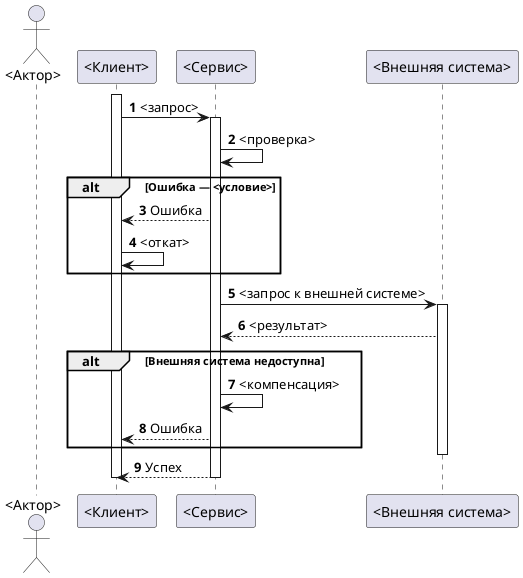

<!--
ideal_bft.md — пустой шаблон БФТ по корпоративному стандарту.
Заполнять СТРОГО по разделам. Не удалять разделы (кроме явно опциональных с пометкой).
Порядок разделов фиксирован (ЗМ-005) — не менять.
Плейсхолдеры <...> заменять реальными значениями или [УТОЧНИТЬ].
-->
---
source: <URL страницы в вашей wiki>
space: <PROJ>
version: <N>
synced: <YYYY-MM-DD>
jira: <PROJECTKEY-XXX>
status: Черновик 0.1
---

# [БФТ] <EPIC>: <Название>

Общая информация
================

| Поле | Значение |
| --- | --- |
| Название проекта | <Проект> |
| Ответственный за продукт | <ФИО> |
| Ответственный за документ | <ФИО> |
| Эпик в трекере | [<PROJECTKEY-XXX>](https://jira.example.com/browse/<PROJECTKEY-XXX>) |
| Статус | АНАЛИЗ / Ревью / Утверждён |

Открытые вопросы
================

<В начале документа (ЗМ-005): всё незакрытое + блокеры на видном месте. Неподтверждённое → `[УТОЧНИТЬ у {кого}]`.>

| Вопрос | Ответ | Кто ответил | Источник (встреча/почта/ТЗ) |
| --- | --- | --- | --- |
| <Вопрос> | <ответ или пусто> | <ФИО> | <источник> |

## Ключевые решения из открытых вопросов

| # | Вопрос | Решение | Кто ответил |
| --- | --- | --- | --- |
| 1 | <Вопрос> | <Решение> | <ФИО> |

Заинтересованные стороны
========================

| ФИО | Роль/должность | Контакты |
| --- | --- | --- |
| <ФИО> | <PO / Архитектор / …> | <email> |

Бизнес описание
===============

Данный документ сформирован для описания бизнес-функциональных, функциональных и нефункциональных требований к <краткая суть домена/функционала>.

В документе описываются требования к сценариям:
* <Сценарий 1>
* <Сценарий 2>

Границы системы
===============

<Структурой, НЕ сплошным абзацем (ЗМ-001). Каждый пункт атомарный — одна зона на буллет.>

**Входит:**
* <пункт> — <краткое описание>
* <пункт> — <краткое описание>

**Не входит:**
* <пункт> — <где реализуется / почему вне>
* <пункт> — <где реализуется / почему вне>

**Вынесено в СА / системные требования** <опц., «высота документа»>:
* <контракты / схемы БД / последовательность вызовов — что фиксирует СА, а не БФТ>

Критерии успеха
===============

<Оцифрованные: метрика → базовое → цель → срок. Обязательно для фичей/миграций.
Для чисто технических API-БФТ — допустимо опустить ТОЛЬКО с пометкой «метрики в НФТ» + обоснование.>

| Метрика | Базовое | Цель | Срок |
| --- | --- | --- | --- |
| <метрика> | <текущее> | <цель> | <срок> |

As-Is → Gap → To-Be
===================

<Таблицей, НЕ текстом (ЗМ-002). Пункты в ячейке через  ; один пункт = один факт/разрыв. As-Is с якорями R1/R2; To-Be не на коде.>

| Срез | Содержание |
| --- | --- |
| **As-Is** | • <текущее поведение>   • <текущее поведение> |
| **Gap (проблема)** | • <разрыв> (US1)   • <разрыв> (US2) |
| **To-Be** | • <целевое поведение>   • <целевое поведение> |

Бизнес-Требования БТ
====================

| Идентификатор | Наименование | Ценность | Краткое описание | Связанные требования |
| --- | --- | --- | --- | --- |
| БТ-1 | <Название> | <Безопасность / Устранение SPOF / Сокращение TTM / …> | <Что реализуется> | [<PROJECTKEY-XXX>](https://jira.example.com/browse/<PROJECTKEY-XXX>) |

Пользовательские требования ПТ
==============================

| Идентификатор | Наименование | Story | Связанные требования |
| --- | --- | --- | --- |
| ПТ-1 | <Название> | **Когда** я (<актор>) <действие> **Я хочу** <результат> **Чтобы** <обоснование> | БТ-1 |

Требования к интерфейсам ИТ
===========================

Продукт: <Продукт/платформа>, <браузеры>, <разрешение>, адаптив.

| Идентификатор | Наименование | Требование | Связанные требования |
| --- | --- | --- | --- |
| ИТ-1 | Протокол взаимодействия | REST API | ФТ-1 |
| ИТ-2 | Идемпотентность | Повторный вызов не выполняет бизнес-логику повторно | ФТ-1 |
| ИТ-3 | Авторизация/Аутентификация | <на уровне шлюза/сервиса> | ФТ-1 |

Функциональные требования ФТ
============================

| Идентификатор | Наименование | Приоритет | Функциональные требования | Параметры, ограничения | Связанные требования |
| --- | --- | --- | --- | --- | --- |
| ФТ-1 | <Название> | Высокий | <Поведение системы> | <TTL, идемпотентность, ограничения> | БТ-1, ПТ-1 |

Нефункциональные требования НФТ
===============================

| Идентификатор | Наименование | Описание | Связанные требования |
| --- | --- | --- | --- |
| НФТ-1 | Скорость ответа API | <≤ 2000 ms P95> | ИТ-1 |
| НФТ-2 | Идемпотентность | Повторный вызов не приводит к повторному выполнению бизнес-логики | БТ-1 |
| НФТ-3 | Мониторинг RED | Попытки/успех/неуспех, латентность, ошибки интеграций | ФТ-1 |
| НФТ-4 | Алертинг | Рост ошибок > порога, рост таймаутов, аномальный рост конфликтов | ФТ-1 |
| НФТ-5 | Логирование | <состав событий>, без чувствительных данных, хранение <N дней>, сквозной trace-id | ФТ-1 |
| НФТ-6 | Нагрузка | <100 RPS чтение / 10 RPS создание> (предварительно) | ФТ-1 |

Сценарии взаимодействия
=======================

### Акторы

| Актор | Описание |
| --- | --- |
| <Актор 1> | <Роль> |
| <Актор 2 / сервис> | <Роль> |

### Атрибутивный состав сообщения <название>

| Параметр | Обязательность | Тип | Описание |
| --- | --- | --- | --- |
| <param> | required | <type> | <описание> |

### Sequence Diagram (happy path + alt)

Зависимости
===========

| Команда / система | Тип зависимости | Статус согласования |
| --- | --- | --- |
| <Команда/система> | <API / данные / документация> | Подтверждено / Требует согласования |

Риски
=====

| Риск | Вероятность | Влияние | Митигация |
| --- | --- | --- | --- |
| <Риск> | Низкая/Средняя/Высокая | Низкое/Среднее/Высокое | <Митигация> |

Ревью требований
================

| Роль | Исполнитель | Статус |
| --- | --- | --- |
| Продакт | <ФИО> | <Статус> |
| Архитектор | <ФИО> | <Статус> |
| Аналитик (кросс-ревью) | <ФИО> | <Статус> |
| Разработка | <ФИО> | <Статус> |
| Тестирование | <ФИО> | <Статус> |

История изменений
=================

| # | Дата | Автор | Суть изменений |
| --- | --- | --- | --- |
| 1 | <DD.MM.YYYY> | <ФИО> | Создание страницы. Начало описания |

Дополнительные материалы
========================

| Артефакт/Ссылка | Описание |
| --- | --- |
| [Confluence <pageId>](https://confluence.example.com/pages/viewpage.action?pageId=<pageId>) | <ТЗ в wiki> |
| [<PROJECTKEY-XXX>](https://jira.example.com/browse/<PROJECTKEY-XXX>) | <Связанный БФТ/СА> |

Якоря истины
============

| Факт в БФТ | Источник (якорь) | Тип |
| --- | --- | --- |
| <факт> | [<PROJECTKEY-XXX>](https://jira.example.com/browse/<PROJECTKEY-XXX>) / решение PO от {дата} / ТЗ § / смежный СА | <тип> |

> Ссылки Jira/Confluence — markdown-ссылкой (ЗМ-004).

> Неподтверждённые факты помечены `[УТОЧНИТЬ у {кого}]` и продублированы в разделе **Открытые вопросы** в начале документа.

<!-- ## Adversarial Review — заполняется на Стадии 6 команды /bft-gen -->
