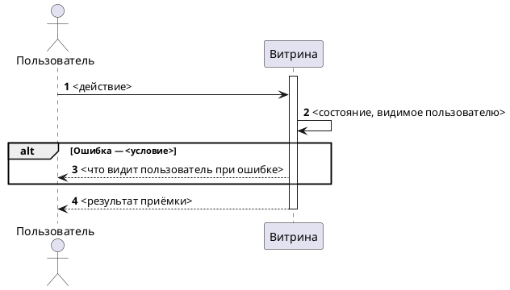

<!--
ideal_bft.md — пустой шаблон БФТ по корпоративному docx-стандарту.
Заполнять СТРОГО по разделам. Не удалять разделы (кроме явно опциональных с пометкой).
Плейсхолдеры <...> заменять реальными значениями или [УТОЧНИТЬ].
-->
---
source: <WIKI_PAGE_URL>
space: <SPACE_KEY>
version: <N>
synced: <YYYY-MM-DD>
jira: <PROJ-XXX>
status: Черновик 0.1
---

# [БФТ] <EPIC>: <Название>

Бизнес описание
===============

Данный документ сформирован для описания бизнес-функциональных, функциональных и нефункциональных требований к <краткая суть домена/функционала>.

В документе описываются требования к сценариям:
* <Сценарий 1>
* <Сценарий 2>

Общая информация
================

| Поле | Значение |
| --- | --- |
| Название проекта | <API-слой / Шина / Витрина / Финтех …> |
| Ответственный за продукт | <ФИО> |
| Ответственный за документ | <ФИО> |
| Эпик в Jira | <PROJ-XXX> |
| Статус | АНАЛИЗ / Ревью / Утверждён |

Заинтересованные стороны
------------------------

| ФИО | Роль/должность | Контакты |
| --- | --- | --- |
| <ФИО> | <PO / Архитектор / …> | <email> |

История изменений
-----------------

| # | Дата | Автор | Суть изменений |
| --- | --- | --- | --- |
| 1 | <DD.MM.YYYY> | <ФИО> | Создание страницы. Начало описания |

Дополнительные материалы
------------------------

| Артефакт/Ссылка | Описание |
| --- | --- |
| <Confluence ТЗ> | <Описание> |
| <Связанный БФТ/СА> | <Описание> |

Границы
=======

**Зона ответственности (ВНУТРИ / СНАРУЖИ).** <Пример: «API-слой — прокси-слой между витринами и поставщиками инвентаря. API-слой не принимает платежи и не отвечает за эквайринг.»>

**Высота документа.** БФТ фиксирует результат и критерии приёмки для бизнеса и пользователя. Системные требования, API-контракты, схемы сообщений, вызовы между сервисами, БД-схемы и код — вне документа (зона СА / системных требований). Если нужна ссылка — указать <ссылка на СА / FNR>.

Критерии успеха и план демонстрации
===================================

<Оцифрованные критерии приёмки: метрика → базовое → цель → срок. Обязательно для фичей/миграций.
Пример: «Доля страниц с персональным FAQ: 0% → ≥X% (90 дней)»; «CR поддержки по теме FAQ: −Y%».>

| Метрика | Базовое | Цель | Срок |
| --- | --- | --- | --- |
| <метрика> | <текущее> | <цель> | <срок> |

**План демонстрации** — что, где и почему изменено с точки зрения приёмки (без технических деталей):

| Точка демо | Было (As-Is) | Стало (To-Be) | Почему изменилось | Критерий готовности к показу |
| --- | --- | --- | --- | --- |
| <экран / сценарий> | <как сейчас> | <как станет> | <бизнес-причина> | <что считаем готовым к демо> |

Бизнес-Требования БТ
====================

| Идентификатор | Наименование | Ценность | Краткое описание | Связанные требования |
| --- | --- | --- | --- | --- |
| БТ-<EPIC>-1 | <Название> | <Безопасность / Устранение SPOF / Сокращение TTM / …> | <Что реализуется> | <PROJ-XXX> |

Пользовательские требования ПТ
==============================

| Идентификатор | Наименование | Story | Связанные требования |
| --- | --- | --- | --- |
| ПТ-<EPIC>-1 | <Название> | **Когда** я (<актор>) <действие> **Я хочу** <результат> **Чтобы** <обоснование> | БТ-<EPIC>-1 |

Требования к интерфейсу приёмки ИТ
==================================

Продукт: <Директ/Проводник>, Web desktop, Chrome/Yandex, 1280–1920px, адаптив.
ИТ описывает интерфейс приёмки: что видит и может сделать актор на экране и в результате. Не API-контракт (эндпоинты, протоколы, схемы запросов — зона СА).

| Идентификатор | Наименование | Требование | Связанные требования |
| --- | --- | --- | --- |
| ИТ-<EPIC>-1 | <Экран / точка приёмки> | <Что видит актор, какие действия доступны, состояние> | ПТ-<EPIC>-1 |
| ИТ-<EPIC>-2 | <Доступность / адаптив> | <Платформа, разрешение, поведение при ошибке на экране> | ПТ-<EPIC>-1 |

Функциональные требования ФТ
============================

| Идентификатор | Наименование | Приоритет | Функциональные требования | Параметры, ограничения | Связанные требования |
| --- | --- | --- | --- | --- | --- |
| ФТ-<EPIC>-1 | <Название> | Высокий | <Поведение системы> | <TTL, идемпотентность, ограничения> | БТ-<EPIC>-1, ПТ-<EPIC>-1 |

Нефункциональные требования НФТ
===============================

| Идентификатор | Наименование | Описание | Связанные требования |
| --- | --- | --- | --- |
| НФТ-<EPIC>-1 | Скорость ответа | <≤ 2000 ms P95> | ФТ-<EPIC>-1 |
| НФТ-<EPIC>-2 | Идемпотентность | Повторный вызов не приводит к повторному выполнению бизнес-логики | БТ-<EPIC>-1 |
| НФТ-<EPIC>-3 | Мониторинг RED | Попытки/успех/неуспех, латентность, ошибки интеграций | ФТ-<EPIC>-1 |
| НФТ-<EPIC>-4 | Алертинг | Рост ошибок > порога, рост таймаутов, аномальный рост конфликтов | ФТ-<EPIC>-1 |
| НФТ-<EPIC>-5 | Логирование | <состав событий>, без ПДн, хранение 7 дней, сквозной trace-id | ФТ-<EPIC>-1 |
| НФТ-<EPIC>-6 | Нагрузка | <100 RPS чтение / 10 RPS создание> (предварительно) | ФТ-<EPIC>-1 |

Сценарии взаимодействия
=======================

### Акторы

| Актор | Описание |
| --- | --- |
| Покупатель | Клиент витрины |
| <Витрина / API-слой.X / Поставщик> | <Роль> |

### Сценарий приёмки (happy path + alt)

Сценарий на уровне актор → действие → результат. PlantUML — actor-level / black-box: акторы и витрина, без вызовов между внутренними сервисами и без имён сообщений/API.

Атрибутивный состав сообщений (параметры и типы запросов/ответов) не входит в БФТ — зона СА / системных требований.

Зависимости
===========

| Команда | Тип зависимости | Статус согласования |
| --- | --- | --- |
| <API-слой / Шина / Процессинг / BI / 1С> | <API / данные / документация> | Подтверждено / Требует согласования |

Риски
=====

| Риск | Вероятность | Влияние | Митигация |
| --- | --- | --- | --- |
| <Риск> | Низкая/Средняя/Высокая | Низкое/Среднее/Высокое | <Митигация> |

Открытые вопросы
================

| Вопрос | Ответ | Кто ответил | Источник (встреча/почта/ТЗ) |
| --- | --- | --- | --- |
| <Вопрос> | <ответ или пусто> | <ФИО> | <источник> |

## Ключевые решения из открытых вопросов

| # | Вопрос | Решение | Кто ответил |
| --- | --- | --- | --- |
| 1 | <Вопрос> | <Решение> | <ФИО> |

Ревью требований
================

| Роль | Исполнитель | Статус |
| --- | --- | --- |
| Продакт | <ФИО> | <Статус> |
| Архитектор | <ФИО> | <Статус> |
| Аналитик (кросс-ревью) | <ФИО> | <Статус> |
| Разработка | <ФИО> | <Статус> |
| Тестирование | <ФИО> | <Статус> |

Якоря истины
============

| Факт в БФТ | Источник (якорь) | Тип |
| --- | --- | --- |
| <факт> | <JIRA / решение PO от {дата} / Confluence ТЗ § / смежный СА> | <тип> |

> Неподтверждённые факты помечены `[УТОЧНИТЬ]` (без кросс-рефов) и собраны в разделе «Открытые вопросы». Стиль и голос — по `resources/writing_style.md`.

<!-- ## Adversarial Review — заполняется на Стадии 6 команды /bft-gen -->
