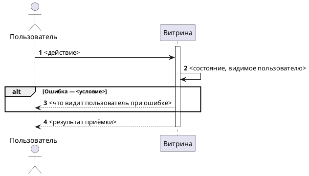

<!--
ideal_bft.md — пустой шаблон ЧИСТОВОГО БФТ по корпоративному docx-стандарту MTS (v10).
Заполнять СТРОГО по разделам. Порядок разделов фиксирован (ЗМ-005) — не менять.
Начинается с «Бизнес описание». В чистовике НЕТ разделов «Границы» и «Критерии успеха»
(метрики) — объём читается из «Образа результата» (Бизнес описание) + строк ДЛЯ КОГО/ЧТО
ДЕЛАЕМ в «Проблеме»; отдельной строки «Скоуп документа —» НЕ вставлять (ЗМ-014).
Границы/критерии/As-Is-Gap — рабочие артефакты стадии решения (problem.md, concept.md).
Плейсхолдеры <...> заменять реальными значениями или [УТОЧНИТЬ].
Frontmatter — только машиночитаемая шапка; НЕ вносить внутренние пути инструмента
(CORTEX/_context-packs, concept.md, context-pack) — это утечка лесов в клиентский документ.
Ссылки Jira/Confluence (ЗМ-004, ЗМ-009, ЗМ-012): markdown-ссылка ТОЛЬКО на существующую
страницу, на КАЖДОМ вхождении в каждой колонке/абзаце. Линкуются и JIRA-проекты
(/projects/{PROJECT}), и Confluence-пространства (/display/{SPACE}), не только ключи задач.
Цель — клик из документа, без поиска снаружи. BR-*/US#N не линкуются.
Нет объекта (эпик не создан) → не ссылка, а [УТОЧНИТЬ]/пометка без URL, не битая ссылка.
При публикации в Confluence (/bft-deliver) ссылки становятся макросами для превью.
-->
<!-- Пример «нет объекта»: эпик ещё не создан → пиши `[СОЗДАТЬ эпик]` (без URL), не выдуманную ссылку. -->
---
source: <WIKI_PAGE_URL>
space: <SPACE_KEY>
version: <N>
synced: <YYYY-MM-DD>
jira: <PROJ-XXX>
status: Черновик 0.1
---

# [БФТ] <EPIC>: <Название>

Бизнес описание
===============

<Кратко и точно, без многословия. Две строки для человека (образ результата + зачем), полный контекст — под спойлер для LLM. НЕ вставлять отдельную строку «Скоуп документа —» (даёт самопротиворечие с деталями, ЗМ-014).>

**Образ результата:** <конкретно, операционно: как выглядит целевое состояние; какие сущности/страницы затронуты; что меняется при рендере. Пример: «FAQ по умолчанию шаблонный на всех страницах; через Direct можно задать персональный FAQ для страницы шоу / персоны / площадки (уточнить полный список сущностей в БФТ). При рендере Ticketland: если FAQ персонализирован — вместо статичного JSON данные из БД, иначе статика».>

**Зачем делать:** <ценность одной строкой + метрика. Пример: «SEO поднимает, продажи улучшатся (метрики уточнить у <кто>)».>

Подробный контекст (полное описание для LLM)

<Развёрнутое описание домена, механики, источников данных, сценариев. Для человека свёрнуто, для LLM/аналитика — доступно.>

В документе описываются требования к сценариям:
* <Сценарий 1>
* <Сценарий 2>

Общая информация
================

| Поле | Значение |
| --- | --- |
| Название проекта | <Проект> |
| Ответственный за продукт | <ФИО> |
| Ответственный за документ | <ФИО> |
| Задача/Epic Jira | [<PROJECTKEY-XXX>](https://jira.mts.ru/browse/<PROJECTKEY-XXX>) — <статус в трекере> |
| Статус | <АНАЛИЗ / Ревью / Утверждён / пусто> |
| Системные требования | <ссылка на СА / FNR или пусто> |

Заинтересованные стороны
========================

<Только реальные участники. Не выдумывать роли и ФИО «для полноты» — если владелец роли неизвестен, `[УТОЧНИТЬ у {кого}]` или не вносить строку.>

| ФИО | Роль/должность | Контакты |
| --- | --- | --- |
| <ФИО> | <PO / SEO-заказчик / Аналитик / …> | <контакт> |

История изменений
=================

| # | Дата | Автор | Суть изменений |
| --- | --- | --- | --- |
| 1 | <DD.MM.YYYY> | bft-draft | Создание страницы. Начало описания. |

Дополнительные материалы и артефакты
====================================

<Ссылки Jira/Confluence — markdown-ссылкой (ЗМ-004), с человекочитаемой подписью. Не вносить внутренние пути инструмента (CORTEX/_context-packs).>

| Артефакт/Файл/Ссылка | Описание |
| --- | --- |
| [<Человеко-подпись> (Confluence <pageId>)](https://confluence.mts.ru/pages/viewpage.action?pageId=<pageId>) | <что это> |
| [<PROJECTKEY-XXX>](https://jira.mts.ru/browse/<PROJECTKEY-XXX>) | <Связанный БФТ / инициатива / US> |

Проблема которую решаем
=======================

<Таблицей, НЕ текстом (ЗМ-002). Строки ДЛЯ КОГО / ЧТО ДЕЛАЕМ / ASIS (с якорями R1/R2) / ПРОБЛЕМА (бизнес-разрыв) / TOBE (целевое, не якорить на код).
ФОРМАТ ЯЧЕЕК (ЗМ-011): одна мысль → простой строкой (ДЛЯ КОГО / ЧТО ДЕЛАЕМ / ASIS); несколько пунктов → НАСТОЯЩИЙ список `<ul><li>…</li></ul>`, а НЕ «• …   • …» (глиф `•` рендерится в Confluence плоско, без висячего отступа).>

| Срез | Содержание |
| --- | --- |
| **ДЛЯ КОГО** | <актор-бенефициар> |
| **ЧТО ДЕЛАЕМ** | <одно предложение сути доработки> |
| **ASIS** | <текущее поведение одной строкой> ([JIRA KEY](https://jira.mts.ru/browse/KEY)) |
| **ПРОБЛЕМА** | <ul><li><в чём боль для бизнеса/пользователя></li><li><разрыв></li></ul> |
| **TOBE** | <ul><li><целевое поведение></li><li><целевое поведение></li></ul> |

Изменение в UJM
===============

<Что и где меняется на пути пользователя, на уровне приёмки (без технических деталей).>

| Точка демо | Было (As-Is) | Стало (To-Be) |
| --- | --- | --- |
| <экран / сценарий> | <как сейчас> | <как станет> |

План демонстрации
=================

### Акторы

| Актор | Описание |
| --- | --- |
| <Пользователь / Контент-менеджер> | <Роль> |
| <Витрина / Админка> | <Роль> |

### Сценарий приёмки (happy path + alt)

Сценарий на уровне актор → действие → результат. PlantUML — actor-level / black-box: акторы и витрина, без вызовов между внутренними сервисами и без имён сообщений/API. При публикации блок оборачивается в **макрос PlantUML** (плагин «PlantUML»), чтобы диаграмма рендерилась визуально, а не как код (ЗМ-015).

Атрибутивный состав сообщений (параметры и типы запросов/ответов) не входит в БФТ — зона СА / системных требований.

Бизнес-Требования
=================

## Вводные для разрабатываемого функционала*

Вводные и открытые вопросы от стейкхолдеров, требующие ответа до/во время реализации. Незакрытое → строка с пустым «Ответ» и `[УТОЧНИТЬ]`; полученный ответ — в тех же колонках. Не дублировать вопрос в двух таблицах.

| Информация или вопрос | Конспект | Ответ | В рамках чего был получен ответ | Кто ответил | Дата |
| --- | --- | --- | --- | --- | --- |
| <вопрос> | <контекст> | <ответ или пусто> | <встреча / почта / решение PO> | <ФИО> | <DD.MM.YYYY> |

## Ценность разрабатываемого функционала для бизнес-заказчиков*

| Идентификатор | Наименование требования | Ценность разрабатываемого функционала для бизнес-заказчиков | Краткое описание доработки из данного БФТ | Связанные требования |
| --- | --- | --- | --- | --- |
| БТ-1 | <Название> | <Безопасность / Устранение SPOF / Сокращение TTM / Рост SEO / …> | <Что реализуется> | ПТ-1, ФТ-1, [<PROJECTKEY-XXX>](https://jira.mts.ru/browse/<PROJECTKEY-XXX>) |

Пользовательские требования*
============================

| Идентификатор | Наименование требования | Story | Комментарий | Связанные требования |
| --- | --- | --- | --- | --- |
| ПТ-1 | <Название> | **Когда** я (<актор>) <действие> **Я хочу** <результат> **Чтобы** <обоснование> | <опц.> | БТ-1 |

Требования к интерфейсам*
=========================

Продукт: <Direct / витрина>, Web desktop + мобильный веб, Chrome/Yandex, 1280–1920px, адаптив. ИТ описывает интерфейс приёмки: что видит и может сделать актор на экране и в результате. Не API-контракт (эндпоинты, протоколы, схемы запросов — зона СА).

| Идентификатор | Наименование требования | Требование к пользовательскому интерфейсу | Предложения по элементам UI, механике и композиции | Связанные требования |
| --- | --- | --- | --- | --- |
| ИТ-1 | <Экран / точка приёмки> | <Что видит актор, какие действия доступны, состояние> | <опц.: элементы, механика, композиция> | ПТ-1 |
| ИТ-2 | <Доступность / адаптив> | <Платформа, разрешение, поведение при ошибке на экране> | <опц.> | ПТ-1 |

## Макеты интерфейса*

<Ссылки на макеты: Figma — <название кадра>. Макет экрана в Direct — [УТОЧНИТЬ: готов ли макет, дизайн — <ФИО>].>

Функциональные требования*
==========================

| Идентификатор | Наименование требования | Приоритет | Функциональные требования | Параметры, ограничения | Связанные требования |
| --- | --- | --- | --- | --- | --- |
| ФТ-1 | <Название> | Высокий | <Поведение системы на уровне результата> | <TTL, идемпотентность, ограничения> | БТ-1, ПТ-1 |

Нефункциональные требования*
============================

<Только измеримое и подтверждённое. Нет требования — писать «нет явных требований», не выдумывать окно/порог. Приоритет — брать из корпоративного реестра НФТ, если есть.>

| Идентификатор | Наименование требования | Описание | Связанные требования |
| --- | --- | --- | --- |
| НФТ-1 | Латентность чтения | <≤ 200 мс блок / ≤ 100 мс API> | ФТ-1 |
| НФТ-2 | Идемпотентность | Повторный вызов/прогон не выполняет бизнес-логику повторно | ФТ-1 |
| НФТ-3 | Безопасность контента | <санитизация, whitelist, защита от XSS> | ФТ-1, ИТ-1 |
| НФТ-4 | Нагрузка | <5000 читателей, пик 18–22 МСК, 2000+ страниц> (предварительно) | ФТ-1 |
| НФТ-5 | Логирование / аудит | <состав событий>, без чувствительных данных, сквозной trace-id | ФТ-1 |

Зависимости
===========

| Команда / система | Тип зависимости | Статус согласования |
| --- | --- | --- |
| <Команда / система> | <API / данные / UI / согласование> | Подтверждено / Требует согласования |

Риски
=====

| Риск | Вероятность | Влияние | Митигация |
| --- | --- | --- | --- |
| <Риск> | Низкая/Средняя/Высокая | Низкое/Среднее/Высокое | <Митигация> |

Ревью требований
================

* Продакт — <ФИО>
* Архитектор — <ФИО>
* Аналитик (кросс-ревью) — <ФИО>
* Разработка — <ФИО>
* Тестирование — <ФИО>

Якоря истины
============

<Служебный раздел трассировки для PO/аналитика: каждый факт БФТ → источник и ранг. Неподтверждённые факты помечены `[УТОЧНИТЬ]` (без кросс-рефов) и продублированы строкой в «Вводных». Ссылки Jira/Confluence — markdown-ссылкой (ЗМ-004).>

| Факт в БФТ | Источник (якорь) | Ранг | Тип |
| --- | --- | --- | --- |
| <факт> | [<PROJECTKEY-XXX>](https://jira.mts.ru/browse/<PROJECTKEY-XXX>) / решение PO от {дата} / ТЗ § | R1/R2/R3 | JIRA / Confluence / BR / Решение PO |

<!-- ## Adversarial Review — заполняется на Стадии 6 команды /bft-gen -->
