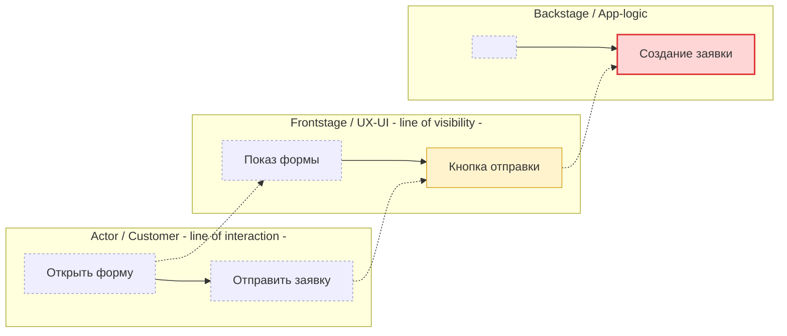

# Mermaid-шаблон: гибрид Journey × Слои

Принцип: `flowchart LR`, один `subgraph` на слой (lane), узлы внутри = шаги journey
по порядку. Scope-маркеры через `class`. Линии visibility/interaction — как метки слоёв.

## Классы scope

```
classDef changed fill:#ffd6d6,stroke:#d33,stroke-width:2px;
classDef affected fill:#fff3cd,stroke:#d4a017,stroke-width:1px;
classDef context fill:#eef,stroke:#99c,stroke-width:1px,stroke-dasharray:3 3;
```

## Раскладка (пример на 2 шага)



## Правила генерации из Scope Model

- Один `subgraph` на каждый `layers[]` в порядке схемы (сверху вниз = слева в легенде слоёв).
- Узел `<LayerShort>_<step>` для каждой `cells[]`. Пустая ячейка слоя на шаге → узел `[" "]:::context` (для выравнивания) либо пропуск.
- `:::changed|affected|context` по `cells[].scope`.
- Вертикальные пунктирные связи `-.->` между слоями на одном шаге = поток взаимодействия.
- Метки «line of interaction» (после Actor) и «line of visibility» (после Frontstage) — в title соответствующего subgraph.

## Легенда (вставляется в blueprint.md под диаграммой)

| Маркер | Значение |
|---|---|
| 🔴 changed | слой/шаг меняется в рамках задачи |
| 🟡 affected | затрагивается, но не основное изменение |
| ⚪ context | контекст, не меняется |
| `(?) GAP` | нет источника в БФТ/Nexus — открытый вопрос |
