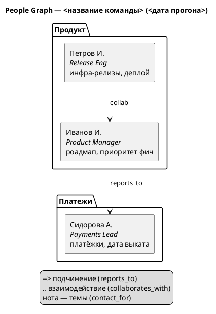

# Рендер People Graph (диаграмма связей)

`/radar-graph` строит PlantUML-исходник из person-узлов `team`-нексуса и рендерит его inline в чат через существующий навык `/diagram-view` (PlantUML → SVG). Это «диаграмма связей в команде» — визуальная проверка графа перед/после калибровки.

> Почему PlantUML, а не отдельный веб-файл: дом уже рендерит диаграммы через `/diagram-view` (см. `.claude/skills/diagram-view/SKILL.md`), ноль новых зависимостей, единый стиль с остальными диаграммами проекта. Исходник самодостаточен и переносим.

## Сборка исходника

1. Прочитай все `GROUND/NEXUS/team/*.md` (кроме `_index`/`_template`). Для каждого узла собери: `node_id`, `full_name`, `role_title`, `reports_to`, `manages`, `collaborates_with`, топ-2 `contact_for`/`expertise_topics`.
2. Один узел = один человек. ID элемента PlantUML = `node_id` (ascii-slug, легально для PlantUML).
3. Три слоя рёбер — разными стилями (легенда обязательна):

| Слой | Источник | Стиль ребра |
|---|---|---|
| **Org Chart** | `reports_to` (стрелка снизу вверх к руководителю) | сплошная `-->` |
| **Social Graph** | `collaborates_with` (без направления) | пунктир `..` |
| **Expertise** | топ `contact_for`/`expertise_topics` | подпись/нота на узле, не ребро |

4. Узлы группируй по `department`, если поле заполнено (`package "Отдел"`).
5. Под каждым человеком — короткая подпись: роль + 1–2 темы `contact_for` (то, ради чего его ищут).

## Скелет PlantUML

(Имена/роли/связи берутся из реальных узлов; выше — иллюстрация формата.)

## Передача в рендер

1. Сохрани исходник в `GROUND/NEXUS/team/_calibration/<run_id>/people-graph.puml` (если прогон задан) либо в `/tmp`, если граф запрошен вне прогона.
2. Передай управление навыку `/diagram-view`: он пишет исходник в `/tmp/*.puml`, гонит `plantuml -tsvg -charset UTF-8`, показывает SVG через `mcp__visualize__show_widget`.
3. `plantuml` не установлен → `/diagram-view` сообщит (это окружение, не ошибка графа); тогда отдай PO готовый `.puml`-исходник, который он отрендерит сам.

## Деградация на больших графах

- **> ~25 человек:** граф читаем, но крупный. Предупреди PO; предложи разрез:
  - по `department` (одна диаграмма на отдел + межотдельные рёбра отдельно);
  - только Org Chart (иерархия) без social-слоя для обзора сверху.
- **Изолированные узлы** (нет ни `reports_to`, ни `manages`, ни `collaborates_with`) — выведи отдельным блоком «вне графа связей»: это сигнал неполноты, релевантный калибровке (такой человек не роутится по связям).

## Связь с калибровкой

Диаграмма — не замена прогона, а его глаза. Полезные срезы перед `/radar-calibrate`:

- **Пересечения экспертизы** (две ноты с одной темой) → кандидаты на дизамбигуацию-вопросы.
- **Висячая иерархия** (`reports_to` на несуществующий node_id) → почини до прогона, иначе эскалация-вопросы упадут гарантированно.
- **Пустые `contact_for`/`expertise_topics`** → человек невидим для роутинга; ожидаемые `[нексус молчит]` на его темах.
