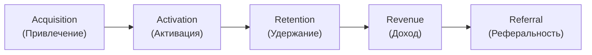

# 6.3 Стратегия привлечения: каналы и целевая аудитория — Полная инструкция

## 🎯 Цель этой инструкции

Определить **стратегию привлечения клиентов**: из каких каналов, с какой целевой аудиторией в каждом канале, через какие активности — чтобы получать нужный объём лидов с приемлемой стоимостью для достижения бизнес-целей.

**Время на выполнение:** 3-5 часов (для новичка: 5-8 часов)  
**Уровень:** Средний  
**После выполнения:** У тебя будет marketing mix с 3-5 ключевыми каналами, описание целевой аудитории по каждому каналу, Customer Journey Map и первичный план маркетинговых экспериментов.

---

## 📋 Что такое стратегия привлечения?

### Простыми словами

**Стратегия привлечения** — это ответ на вопрос: «Откуда придут наши первые 100, 1000, 10 000 клиентов?» Это не просто список каналов — это система, которая определяет: какие активности, для какой аудитории, через какие каналы, с каким бюджетом и с какой ожидаемой конверсией.

### Аналогия

Представь рыбалку. Ты хочешь поймать определённую рыбу (целевого клиента). Для этого тебе нужно:
- Знать, где она живёт (канал)
- Знать, на что она клюёт (контент, оффер)
- Выбрать правильную снасть и наживку (формат, креатив)
- Запастись терпением или выбрать место с гарантированной рыбой (регулярный vs эпизодический поток)

Забросить удочку куда попало — потратить время и деньги впустую. Стратегия привлечения — это карта: где рыбачить, когда, чем и как.

### Связь с предыдущими стадиями

Стратегия привлечения опирается на три артефакта из предыдущих стадий:
1. **Позиционирование** (раннбук [[6.1 Стратегия позиционирования и точки дифференциации]]) — определяет сообщение для каждого канала
2. **УТП и офферы** (раннбук [[6.2 Уникальное торговое предложение и офферы]]) — то, что мы говорим потенциальным клиентам
3. **JTBD и портреты потребителей** (Stage 2) — где «обитает» целевая аудитория

---

## 🎯 Зачем это нужно?

### 3 главные причины

**1. Без стратегии привлечения продукт не будет расти**

Хороший продукт сам по себе не привлекает клиентов. «Сделай хорошо — и они придут» — миф. Нужна система, которая регулярно приводит новых потребителей. Без неё — случайные продажи через знакомых и ноль масштабирования.

**2. Каналы определяют ЦА, а не наоборот**

Одна и та же «целевая аудитория» в разных каналах — это разные люди с разными триггерами. Мама, которая видит твою рекламу в Instagram, и мама, которая ищет тебя в Яндексе — в разных состояниях готовности к покупке. Стратегия привлечения согласовывает канал, аудиторию и сообщение.

**3. Ресурсы ограничены — нельзя быть везде**

Начинающий продукт не может тратить деньги на все каналы сразу. Стратегия привлечения помогает сфокусироваться на 2-3 каналах, где ROI будет максимальным, и не распылиться.

---

## 📊 Что входит в артефакт стадии

После выполнения этой инструкции у тебя будут:

1. **Карта каналов** — полный список релевантных каналов с классификацией
2. **Marketing Mix** — выбранные 3-5 приоритетных каналов с обоснованием
3. **Профили ЦА по каналам** — детальное описание целевой аудитории в каждом канале
4. **Customer Journey Map** — путь потребителя от первого касания до покупки
5. **Plan маркетинговых экспериментов** — какие гипотезы тестировать первыми

---

## 🚀 Phase 0: Подготовка (20 мин)

### Что тебе понадобится

**Инструменты:**
- [ ] Obsidian/Notion/Google Docs — для документирования
- [ ] Miro или Google Slides — для Customer Journey Map
- [ ] Google Analytics / Яндекс.Метрика (если уже есть трафик) — для анализа текущих каналов
- [ ] SimilarWeb / SpyFu (опционально) — для анализа каналов конкурентов

**Артефакты с предыдущих стадий:**
- [ ] Позиционирующее утверждение (6.1)
- [ ] УТП и офферы по сегментам (6.2)
- [ ] Портреты потребителей / JTBD (Stage 2)
- [ ] Validated Value Propositions (Stage 4)
- [ ] Бизнес-модель и unit economics (Stage 5)

**Проверочные вопросы:**
1. Ты знаешь, кто твой главный сегмент ЦА? → Если нет, вернись к Stage 2
2. Ты знаешь свой главный оффер? → Если нет, вернись к 6.2
3. Ты знаешь целевой CAC (стоимость привлечения клиента)? → Если нет, загляни в unit economics из Stage 5

---

## 📝 Phase 1: Классификация каналов привлечения (1 час)

### Цель

Понять полный спектр доступных каналов, классифицировать их и выбрать наиболее подходящие для своих целей.

### Классификация 1: Управляемые vs неуправляемые каналы

**Управляемые каналы** — ты контролируешь объём трафика через бюджет или усилия.

**Неуправляемые каналы** — трафик приходит сам, без прямого управления с твоей стороны.

| Тип | Описание | Примеры |
|-----|----------|---------|
| **Управляемые** | Вложил деньги/усилия → получил клиентов предсказуемо | Контекстная реклама, таргетинг, email-рассылки, холодные продажи |
| **Неуправляемые** | Вырастают сами, непредсказуемо | Сарафанное радио, виральность, PR, отзывы |

**Почему важно разделять:** Управляемые каналы позволяют планировать рост и масштабировать бюджет. Неуправляемые дают дешёвых клиентов, но непредсказуемы. Хорошая стратегия сочетает оба типа: управляемые — для выполнения плана, неуправляемые — для снижения CAC.

### Классификация 2: Регулярный vs эпизодический поток

**Регулярный поток** — канал даёт постоянный, предсказуемый приток потребителей.

**Эпизодический поток** — канал даёт большой, но разовый приток (после которого трафик падает).

| Тип | Описание | Примеры |
|-----|----------|---------|
| **Регулярный** | Поток стабилен, не зависит от разовых событий | SEO (органика), контент-маркетинг, реклама на постоянном бюджете |
| **Эпизодический** | Мощный выброс, потом затихает | Публикация в СМИ, Product Hunt, конференция, вирусный пост |

**Почему важно:** Стратегия привлечения должна строиться на регулярных каналах как фундаменте. Эпизодические каналы — отличные катализаторы роста, но нельзя планировать бизнес только на них.

### Классификация 3: Pull vs Push каналы

| Тип | Описание | Примеры |
|-----|----------|---------|
| **Pull (втягивающие)** | Клиент сам ищет решение, находит тебя | SEO, контекстная реклама по запросу, контент-маркетинг |
| **Push (выталкивающие)** | Ты находишь клиента и говоришь о себе | Таргетинг в соцсетях, холодные email, офлайн-реклама |

**Pull** обычно имеет более высокую конверсию (клиент уже ищет), но требует времени на накопление (SEO) или высокой конкуренции (Яндекс/Google). **Push** позволяет быстро получать трафик, но требует сильного оффера и снятия барьеров.

### Step 1.1: Составь полный список релевантных каналов

Используй эту структуру для генерации всех возможных каналов для твоего продукта:

```markdown
## Полный реестр каналов — [Продукт]

### Онлайн-каналы PULL (клиент ищет сам)
- [ ] SEO / органический поиск (Яндекс, Google)
- [ ] Контекстная реклама (Яндекс.Директ, Google Ads)
- [ ] App Store Optimization (если мобильное приложение)
- [ ] Маркетплейсы и агрегаторы ([отраслевые примеры])
- [ ] YouTube / видеопоиск

### Онлайн-каналы PUSH (ты находишь клиента)
- [ ] Таргетированная реклама (ВКонтакте, Telegram Ads, MyTarget)
- [ ] Email-рассылка по базе
- [ ] Ретаргетинг
- [ ] Programmatic-реклама
- [ ] Нативная реклама в медиа

### Контент и органика
- [ ] Блог / SEO-статьи
- [ ] YouTube-канал
- [ ] Telegram-канал / рассылка
- [ ] Подкасты (свой или гостевой)
- [ ] Гостевые публикации в СМИ

### Социальные сети
- [ ] ВКонтакте (органика + реклама)
- [ ] Telegram (органика + Ads)
- [ ] Instagram / Facebook
- [ ] TikTok
- [ ] LinkedIn (для B2B)

### Партнёрские и реферальные каналы
- [ ] Реферальная программа (клиент → клиент)
- [ ] Партнёрские интеграции (другие продукты для той же ЦА)
- [ ] Аффилиатная программа (блогеры, агрегаторы)
- [ ] Дистрибьюторы / реселлеры

### Direct/Community каналы
- [ ] Холодные продажи (outbound sales, B2B)
- [ ] Тематические сообщества (форумы, чаты, группы)
- [ ] Нетворкинг / конференции
- [ ] Офлайн-реклама (если релевантно)

### PR и вирусные каналы
- [ ] Публикации в СМИ / пресс-релизы
- [ ] Product Hunt / AppSumo (для SaaS)
- [ ] Сарафанное радио (управляемое: реферальная программа)
- [ ] Вирусный контент / механики
```

### Step 1.2: Первичная фильтрация

Из полного списка оставь только те каналы, где:
- Есть твоя ЦА (по размеру и свойствам)
- Канал соответствует стадии продукта (новый продукт vs зрелый)
- Ресурсы позволяют (бюджет, команда, время)

```markdown
### Фильтр каналов

| Канал | Есть ЦА? (Да/Нет) | Соответствует стадии? | Ресурсы есть? | Итог (Да/Нет) |
|-------|-------------------|-----------------------|----------------|----------------|
| SEO | Да | Нет (долго) | — | Нет (сейчас) |
| Яндекс.Директ | Да | Да | Да | Да |
| Таргет ВК | Да | Да | Да | Да |
| TikTok | Частично | Да | Нет | Нет |
| Telegram-блог | Да | Да | Да | Да |
| ... | ... | ... | ... | ... |
```

---

## 📝 Phase 2: Анализ приоритетных каналов (1 час)

### Цель

Для каждого потенциального канала оценить его параметры, чтобы выбрать итоговый marketing mix.

### Step 2.1: Оцени параметры каналов

Для каждого отфильтрованного канала заполни таблицу:

```markdown
### Параметры каналов — [Продукт]

| Параметр | Канал A | Канал B | Канал C |
|----------|---------|---------|---------|
| Тип потока | Регулярный / Эпизодический | | |
| Тип (Pull/Push) | | | |
| Управляемость | Да / Нет | | |
| Объём аудитории в канале | X млн | | |
| Степень конкуренции в канале | Низкая/Средняя/Высокая | | |
| Скорость получения первого результата | Дни / Недели / Месяцы | | |
| Примерный CPL (стоимость лида) | [руб] | | |
| Примерная конверсия лид → клиент | [%] | | |
| Примерный CAC (стоимость клиента) | [руб] | | |
| Необходимый бюджет для старта | [руб/мес] | | |
| Сложность производства контента/материала | Низкая/Средняя/Высокая | | |
| Размер команды для канала | 1 чел. / команда | | |
```

**Как получить данные:**
- CPL и CAC: посмотри кейсы конкурентов в открытых источниках, спроси в профессиональных сообществах, или возьми из собственных экспериментов
- Объём аудитории: рекламный кабинет (Facebook/ВКонтакте покажет охват аудитории по параметрам)
- Конверсия по каналу: средние данные по индустрии как стартовая точка, уточняй своими данными

### Step 2.2: Классифицируй каналы по матрице

Используй матрицу 2×2:

```
По оси X: Скорость результата (Быстро ↔ Медленно)
По оси Y: Потенциальный объём (Маленький ↔ Большой)
```

| Квадрант | Описание | Стратегия |
|----------|----------|-----------|
| Быстро + Большой объём | Лотерейный билет | Высокий приоритет, но проверь реалистичность |
| Быстро + Маленький объём | Быстрый старт | Хорош для первых клиентов и обучения |
| Медленно + Большой объём | Долгосрочная инвестиция | Запускай параллельно, отдача через 3-6 мес |
| Медленно + Маленький объём | Нишевый / сложный | Оставь на потом или исключи |

```markdown
### Матрица каналов — [Продукт]

**Быстро + Большой объём:**
- [Канал X]
- [Канал Y]

**Быстро + Маленький объём (для старта):**
- [Канал A]
- [Канал B]

**Медленно + Большой объём (долгосрочно):**
- [Канал C] (SEO, контент)

**Медленно + Маленький объём (отложить):**
- [Канал D]
```

---

## 📝 Phase 3: Выбор Marketing Mix (45 мин)

### Цель

Выбрать **3-5 приоритетных каналов** для стартового маркетинг-микса с учётом целей бизнеса, бюджета и стадии продукта.

### Что такое Marketing Mix в контексте привлечения?

**Аналогия:** Диета. Ты хочешь похудеть — но нельзя питаться только белком или только овощами. Нужен баланс: что-то для быстрого результата (снизить углеводы), что-то для долгосрочного здоровья (тренировки). Marketing Mix — это твоя «диета» по каналам.

Хороший marketing mix для стартового продукта обычно содержит:
- 1-2 **быстрых управляемых канала** (для предсказуемого притока лидов)
- 1 **органический канал** (для снижения CAC в перспективе)
- 1 **виральный/партнёрский канал** (для нелинейного роста)

### Step 3.1: Выбор стартового marketing mix

```markdown
## Marketing Mix — [Продукт] v1.0

### Период: [Месяц 1-3] / [Квартал 1]

**Канал 1 (Основной управляемый):** [Название]
- Тип: [Pull/Push, Управляемый/Нет, Регулярный/Эпизодический]
- Почему выбрали: [Обоснование — ЦА, скорость, бюджет]
- Цель на период: [X лидов / Y клиентов]
- Бюджет: [руб/мес]
- Ответственный: [Роль / Имя]
- Метрики: [CPL, CTR, CR]

**Канал 2 (Дополнительный управляемый):** [Название]
- Тип: [...]
- Почему выбрали: [...]
- Цель на период: [...]
- Бюджет: [...]
- Ответственный: [...]
- Метрики: [...]

**Канал 3 (Органический / долгосрочный):** [Название]
- Тип: [...]
- Почему выбрали: [...]
- Ожидаемый результат через: [X месяцев]
- Ресурс: [Кол-во публикаций/видео в неделю]
- Ответственный: [...]

**Канал 4 (Партнёрский / реферальный):** [Название]
- Тип: [...]
- Почему выбрали: [...]
- Условия программы: [...]
- Ответственный: [...]
```

**Пример:**

```markdown
## Marketing Mix — TutorMatch AI v1.0 (Квартал 1)

**Канал 1 (Основной): Яндекс.Директ (контекст по запросам)**
- Тип: Pull, Управляемый, Регулярный
- Почему: Родители активно ищут репетиторов («найти репетитора по математике» — 80 тыс/мес)
- Цель: 200 регистраций/мес
- Бюджет: 150 000 руб/мес
- Ответственный: Маркетолог Анна
- Метрики: CPL ≤ 750 руб, CR регистрация → подписка ≥ 10%

**Канал 2 (Дополнительный): Таргет ВКонтакте**
- Тип: Push, Управляемый, Регулярный
- Почему: Большая аудитория родителей школьников в ВКонтакте, более дешёвый CPL vs Instagram
- Цель: 100 регистраций/мес
- Бюджет: 60 000 руб/мес
- Ответственный: Маркетолог Анна
- Метрики: CPL ≤ 600 руб, CTR ≥ 1.5%

**Канал 3 (Органический): Telegram-канал «Образование без стресса»**
- Тип: Pull, Неуправляемый (растёт сам), Регулярный
- Почему: Образовательный контент для родителей собирает лояльную аудиторию, прогрев к продукту
- Ожидаемый результат: 500 подписчиков через 3 мес, конверсия в регистрацию 5-7%
- Ресурс: 3 поста в неделю, 2 часа на производство
- Ответственный: Продукт-маркетолог Дмитрий

**Канал 4 (Реферальный): Программа «Приведи друга»**
- Тип: Неуправляемый, Регулярный при правильной механике
- Условия: За каждого приведённого друга — 1 бесплатный месяц подписки
- Ожидаемый вклад в рост: 20-30% новых клиентов через 3 мес
- Ответственный: Продуктовая команда (реализация в продукте)
```

### Step 3.2: Создай матрицу приоритизации каналов

```markdown
### Матрица приоритизации каналов

| Канал | Потенциальный объём (1-5) | CAC (5=низкий) | Скорость (5=быстро) | Соответствие ЦА (1-5) | Итог | Приоритет |
|-------|--------------------------|----------------|---------------------|----------------------|------|-----------|
| Яндекс.Директ | 4 | 3 | 5 | 5 | 17 | 1 |
| Таргет ВКонтакте | 4 | 4 | 4 | 4 | 16 | 2 |
| Telegram-канал | 3 | 5 | 2 | 5 | 15 | 3 |
| Реферальная программа | 4 | 5 | 2 | 5 | 16 | 2 |
| SEO | 5 | 5 | 1 | 5 | 16 | Следующий этап |
| TikTok | 3 | 3 | 3 | 2 | 11 | Не сейчас |
```

---

## 📝 Phase 4: Определение целевой аудитории в каналах (1 час)

### Цель

Для каждого выбранного канала определить **точные свойства целевой аудитории** — такое сочетание характеристик, которое с наибольшей вероятностью сконвертирует потребителя в клиента.

### Почему ЦА в каждом канале своя?

**Аналогия:** Одна и та же Маша — дома, на работе и на вечеринке — ведёт себя по-разному. На вечеринке её можно познакомить с новым продуктом через эмоцию. На работе — через рациональный аргумент. Дома — через историю из жизни.

В разных каналах люди находятся в разных состояниях:
- В Яндексе: человек **уже ищет** решение, он готов действовать сейчас
- В таргете ВКонтакте: человек **не искал**, но мы попали в нужный момент (например, купил школьные принадлежности)
- В Telegram-канале: человек **формирует доверие**, ещё не готов покупать

Поэтому ЦА одна и та же по социально-демографике, но **разная по состоянию готовности** и **разная по триггерам отклика**.

### Инструмент: Buyer Persona для каждого канала

**Buyer Persona** — детализированный профиль покупателя с акцентом на критерии принятия решения. В отличие от общего «портрета ЦА», Buyer Persona описывает именно *покупателя*, а не просто пользователя.

### Step 4.1: Заполни шаблон Buyer Persona для каждого канала

```markdown
## Buyer Persona — [Канал X]

### Демография
- Возраст: [Диапазон]
- Пол: [М/Ж/Все]
- География: [Регион / Город]
- Доход: [Уровень]
- Семейный статус: [Есть дети / нет и т.д.]

### Профессия и образ жизни
- Занятость: [Тип занятости]
- Основные интересы: [Список]
- Типичный день: [Короткое описание]
- Используемые устройства: [Смартфон / ПК]
- Активность в канале: [Когда и как часто]

### Состояние в канале (психологическое)
- На каком этапе принятия решения: [Осознал проблему / Ищет решение / Сравнивает]
- Триггер для отклика на рекламу: [Что заставит остановиться и прочитать]
- Главная боль прямо сейчас: [Что болит у этого человека в этот момент]
- Главный страх: [Что удерживает от покупки]
- Главная мотивация: [Что он получит и как это изменит его жизнь]

### Критерии принятия решения
- Что сравнивает при выборе: [Параметры сравнения]
- Кто влияет на решение: [Себя / Партнёр / Руководство и т.д.]
- Как долго принимает решение: [Дни / Недели / Месяцы]
- Барьеры к покупке: [Список]

### Как мы коммуницируем
- Главное сообщение для этого персонажа: [УТП адаптированное]
- Формат контента, который лучше работает: [Текст / Видео / Инфографика]
- Тональность: [Деловой / Дружеский / Экспертный]
```

**Пример для TutorMatch AI — Яндекс.Директ:**

```markdown
## Buyer Persona — Яндекс.Директ (запросы по репетиторам)

### Демография
- Возраст: 32-45 лет
- Пол: Преимущественно Ж (68%)
- География: Москва, МО, крупные города (500 тыс+)
- Доход: 70-150 тыс руб/мес (семья)
- Дети: 1-2 ребёнка, 8-15 лет, школа

### Состояние в канале
- Этап решения: Активный поиск (написала в поиск — значит уже нужно)
- Триггер: Ребёнок получил плохую оценку или приближается ЕГЭ/ОГЭ
- Главная боль: «Не знаю, где найти хорошего репетитора, которому можно доверять»
- Главный страх: «Потрачу деньги — а он не подойдёт ребёнку»
- Главная мотивация: «Хочу, чтобы ребёнок не отставал, чувствовал уверенность»

### Критерии принятия решения
- Сравнивает: Проверенность (отзывы), цену, удобство записи
- Срок решения: 1-3 дня (ситуация острая)
- Барьеры: «Не знаю, можно ли доверять новому сервису»

### Коммуникация
- Главное сообщение: «Найдём репетитора для вашего ребёнка за 10 минут. Первый урок — бесплатно»
- Формат: Текст объявления → лендинг → быстрая регистрация (мобильная)
- Тональность: Тёплый, поддерживающий, уверенный
```

**Пример для TutorMatch AI — Таргет ВКонтакте:**

```markdown
## Buyer Persona — Таргет ВКонтакте (интересы: «дети школьного возраста», «образование»)

### Состояние в канале
- Этап решения: Осознал проблему, но активно не ищет (листает ленту)
- Триггер: Видит историю другого родителя / боль «дорогие репетиторы» / актуальность ЕГЭ
- Главная боль: «Репетиторы дорогие, а непонятно, стоит ли результат денег»
- Главный страх: «Попаду на шарлатана или просто скучного учителя»
- Главная мотивация: «Хочу быть хорошим родителем, который всё успевает»

### Коммуникация
- Главное сообщение: «Выбрать репетитора сложно? Мы подберём сами — за 10 минут»
- Формат: Видео 15 сек (история родителя) → карусель с отзывами → форма лид-генерации
- Тональность: Эмпатичный, «мы тебя понимаем», не давящий
```

### Step 4.2: Выбери сочетание свойств для максимальной конверсии

Для таргетированных каналов (где можно настроить параметры аудитории) составь чёткий список настроек:

```markdown
### Параметры таргетинга — [Канал]

**Социально-демографические:**
- Пол: [М / Ж / Все]
- Возраст: [Диапазон]
- Город/регион: [Список]
- Семейное положение: [Если релевантно]

**Интересы и поведение:**
- Интересы: [Список тематик]
- Поведение: [Что делали недавно — например, купили школьные товары]
- Сообщества: [Конкретные группы, если B2C/ВКонтакте]

**Технические:**
- Устройства: [Мобильные / ПК / Все]
- Время показа: [День / Вечер / Круглосуточно]

**Look-alike (аудитории похожих):**
- База: [На основе чего — текущие клиенты / подписчики / конвертировавшиеся]
- Степень похожести: [1% (самые похожие) / 3% / 5%]

**Исключения:**
- Кого исключить: [Текущие клиенты / уже зарегистрированные]
```

---

## 📝 Phase 5: Customer Journey Map (45 мин)

### Цель

Визуализировать путь потребителя от первого касания с твоим продуктом до момента, когда он становится клиентом и остаётся им. Это помогает найти слабые места в воронке и согласовать маркетинг с продуктом.

### Что такое Customer Journey Map (CJM)?

**Аналогия:** Представь, что ты открываешь новый ресторан. Первое впечатление клиент получает, когда видит вывеску (ещё не зашёл). Потом смотрит меню у входа. Потом его встречает хостес. Садится, изучает меню, делает заказ, ест, платит, выходит. CJM — это карта всех этих «точек контакта» и того, что клиент думает/чувствует на каждом шаге.

### Структура Customer Journey Map

CJM строится по следующим стадиям (используем AARRR как основу):



### Step 5.1: Заполни Customer Journey Map

```markdown
## Customer Journey Map — [Продукт]

### Стадия 1: AWARENESS (Осознание)
Потребитель узнаёт о существовании продукта.

**Точки контакта:**
- [Канал 1]: [Что видит / слышит]
- [Канал 2]: [...]

**Цели потребителя на этой стадии:**
- [Что он хочет получить / чего пытается достичь]

**Проблемы / точки трения:**
- [Что может помешать / оттолкнуть]

**Наши действия:**
- [Что мы делаем, чтобы провести потребителя дальше]

**Метрики:**
- Охват: [X тыс/мес]
- CTR: [%]

---

### Стадия 2: CONSIDERATION (Рассмотрение)
Потребитель заинтересован и изучает продукт.

**Точки контакта:**
- Лендинг: [Что видит, как реагирует]
- Отзывы / кейсы: [Где ищет подтверждение]
- Сравнение с конкурентами: [...]

**Цели потребителя:**
- Понять, подходит ли продукт именно ему
- Убедиться, что не рискует деньгами

**Проблемы / точки трения:**
- [Что вызывает сомнение]

**Наши действия:**
- [Как снимаем барьеры — отзывы, гарантии, демо]

**Метрики:**
- Конверсия в регистрацию: [%]
- Bounce Rate лендинга: [%]

---

### Стадия 3: ACTIVATION (Активация)
Потребитель совершает первое целевое действие.

**Точки контакта:**
- Онбординг: [Шаги первого входа]
- Первое ценностное событие: [Когда клиент получает первую ценность]
- Email / Push: [Сопровождение]

**Цели потребителя:**
- Быстро получить обещанную ценность
- Убедиться, что не ошибся с выбором

**Проблемы / точки трения:**
- Сложный онбординг
- Долгое время до первого результата
- Техническая ошибка

**Наши действия:**
- [Упрощение онбординга, подсказки, поддержка]

**Метрики:**
- Конверсия регистрация → первое ценностное событие: [%]
- Время до первого результата: [Мин / Часов / Дней]

---

### Стадия 4: RETENTION (Удержание)
Клиент использует продукт на постоянной основе.

[Аналогично...]

---

### Стадия 5: REFERRAL (Реферальность)
Клиент рекомендует продукт.

[Аналогично...]
```

**Пример для TutorMatch AI (сокращённый):**

```markdown
## CJM — TutorMatch AI

### AWARENESS
Точки контакта: Объявление Яндекс.Директ («Найти репетитора») → лендинг
Цель: «Хочу найти репетитора для ребёнка»
Трение: «Ещё один сервис, не уверена, стоит ли тратить время»
Наши действия: Заголовок с УТП + социальное доказательство «3000 семей уже нашли»
Метрики: CPL = 700 руб, CTR = 3.5%

### CONSIDERATION
Точки контакта: Лендинг → отзывы → «Как это работает?»
Цель: «Понять, правда ли это работает для моего ребёнка»
Трение: «Как я могу быть уверена, что алгоритм подберёт правильно?»
Наши действия: Видео «Как работает подбор», реальные кейсы с именами и городами
Метрики: CR лендинг → регистрация = 8%

### ACTIVATION
Точки контакта: Анкета (10 вопросов о ребёнке и потребностях) → 3 варианта репетиторов → пробный урок
Цель: «Хочу увидеть, что подбор работает — и как можно быстрее»
Трение: «10 вопросов — это много, могу бросить»
Наши действия: Анкета с прогресс-баром, объяснение зачем каждый вопрос
Метрика: Время до первого урока = 48 часов, CR анкета → пробный урок = 70%
```

---

## 📝 Phase 6: Plan маркетинговых экспериментов (30 мин)

### Цель

Превратить стратегию в конкретные тесты: что запускаем первым, как проверяем гипотезы, как принимаем решение о масштабировании.

### Принцип: «Маленький бюджет — большой вывод»

Не нужно сразу вливать весь бюджет в канал. Каждый канал сначала проверяется с минимальным бюджетом. Если гипотеза подтверждается — масштабируем.

```markdown
### Карта маркетинговых экспериментов — [Продукт] — Квартал 1

| Эксперимент | Канал | Гипотеза | Бюджет / Ресурс | Метрика победы | Срок | Решение при победе |
|-------------|-------|----------|-----------------|----------------|------|---------------------|
| [Эксп. 1] | Яндекс.Директ | «Запрос "найти репетитора + предмет" даст CPL ≤ 750 руб» | 30 000 руб | CPL ≤ 750 / CR ≥ 8% | 2 нед | Увеличить бюджет до 150 тыс/мес |
| [Эксп. 2] | Таргет ВКонтакте | «Видео-формат с историей родителя даст CTR ≥ 1.5%» | 20 000 руб | CTR ≥ 1.5% | 2 нед | Запустить масштабную кампанию |
| [Эксп. 3] | Telegram-контент | «3 поста в неделю дадут прирост 50 подписчиков за месяц» | 6 часов/мес | +50 подписчиков/мес | 1 мес | Продолжать темп |
| [Эксп. 4] | Реферальная программа | «Механика "месяц бесплатно за друга" даст 20% referral-клиентов» | Ресурс разработки | 20% клиентов из реферала | 2 мес | Интегрировать в основной продукт |
```

---

## ✅ Success Criteria

После выполнения этой инструкции у тебя должно быть:

✅ **Полный реестр каналов** составлен и отфильтрован  
✅ **Marketing Mix** выбран: 3-5 каналов с обоснованием  
✅ **Параметры каналов** заполнены: CPL, CAC, скорость, управляемость  
✅ **Buyer Persona** описана для каждого выбранного канала  
✅ **Настройки таргетинга** задокументированы для платных каналов  
✅ **Customer Journey Map** построена: ≥4 стадии, точки трения найдены  
✅ **Plan экспериментов** составлен: ≥3 гипотезы с метриками победы  
✅ **Ответственные назначены** для каждого канала

---

## 🚨 Troubleshooting

### Problem 1: «Не знаю, с какого канала начать»

**Solution:**
1. Начни с того, где уже есть твоя ЦА и она активно ищет решение (Pull-канал)
2. Если продукт совсем новый — начни с прямых продаж (10-20 холодных звонков / встреч)
3. Правило Питера Тиля: найди **один канал**, который работает, и масштабируй его. Не ищи «идеальный микс» с нуля
4. Посмотри, откуда приходят клиенты к конкурентам (SimilarWeb, spy-сервисы)

### Problem 2: «ЦА везде одна и та же, зачем разные описания?»

**Solution:**
1. Социально-демографика одна, но *состояние* разное: поисковый запрос vs лента соцсетей
2. Разное состояние = разный триггер = разный текст = разный формат
3. Попробуй запустить один и тот же креатив в разных каналах — конверсия будет разной. Это и есть доказательство

### Problem 3: «Бюджет очень маленький (до 50 тыс руб/мес)»

**Solution:**
1. Сфокусируйся на одном канале — лучше хорошо в одном, чем плохо везде
2. Параллельно используй бесплатные каналы: контент, партнёрства, сарафан
3. Прямые продажи (звонки, личные встречи) — самый дешёвый первый канал
4. Тематические сообщества — попасть туда органически стоит времени, не денег

### Problem 4: «Customer Journey Map — как понять, что описал правильно»

**Solution:**
1. Проведи 5 интервью с клиентами: «Расскажи, как ты узнал о нас и что было дальше»
2. Сравни с аналитикой (если есть): где клиенты «отваливаются» — там и точки трения
3. CJM не бывает «правильным» с первого раза — это гипотеза, которую уточняешь
4. Минимальная CJM: 3 стадии (осознание, первый вход, покупка) лучше, чем ноль

### Problem 5: «Конкуренты занимают все очевидные каналы»

**Solution:**
1. Посмотри на нетипичные каналы: партнёрства, нишевые сообщества, офлайн
2. Узкая ЦА + точный таргетинг = меньше конкуренции в канале (не «все родители», а «родители детей с ОВЗ»)
3. Работай с разными этапами воронки: конкуренты на этапе «поиска» — иди на этап «осознания проблемы»
4. Контент — самый дефицитный ресурс у большинства конкурентов: хороший блог / канал даст SEO-трафик без войны бюджетов

### Problem 6: «Каналы выбраны, но непонятно, сколько людей нужно на входе воронки»

**Solution:**
1. Считай от обратного: нужно 100 клиентов в месяц
2. CR регистрация → клиент = 10%, нужно 1000 регистраций
3. CR клик → регистрация = 5%, нужно 20 000 кликов
4. CPС = 15 руб → бюджет 300 000 руб/мес
5. Если бюджет нереален — либо улучшай конверсию на каждом этапе, либо снизь цель

---

## 📚 Templates & Tools

### Шаблон 1: Итоговый документ «Стратегия привлечения»

```markdown
# Стратегия привлечения — [Продукт] v1.0

## 1. Marketing Mix
[Таблица: каналы, типы, цели, бюджеты]

## 2. Buyer Persona по каналам
[Для каждого канала — демография + состояние + коммуникация]

## 3. Customer Journey Map
[Стадии: Awareness → Activation → Retention → Revenue → Referral]

## 4. Настройки таргетинга
[По каждому платному каналу]

## 5. План экспериментов на квартал
[Таблица гипотез с метриками победы]

## 6. Ответственные и сроки
[Кто что делает]

---
CAC цель: [руб]
Бюджет Q1: [руб]
Цель по лидам Q1: [шт]
Цель по клиентам Q1: [шт]
```

### Шаблон 2: Краткая таблица Marketing Mix

```markdown
| Канал | Тип | Управляемость | Цель (лидов/мес) | CAC цель | Бюджет/мес | Ответственный |
|-------|-----|--------------|-----------------|---------|-----------|---------------|
| [...]  | [...] | [...] | [...] | [...] | [...] | [...] |
```

### Шаблон 3: Buyer Persona (базовая)

```markdown
## Persona: [Имя персонажа]
Канал: [...]
Демография: [Возраст, пол, доход, семья]
Состояние в канале: [Этап решения + главная боль]
Главный страх: [...]
Триггер отклика: [...]
Наше сообщение: [Адаптированное УТП]
Формат: [Текст/видео/инфографика]
```

---

## 🎓 Further Reading

**По методологии PAF:**
- [Acquisition Strategy Design](https://productframework.ru/activities/acquisition_strategy_design) — оригинальный раздел
- Модели: AARRR Metrics, Customer Journey Map, Buyer Persona, Unit Economics

**Книги и ресурсы:**
- **Traction** (Gabriel Weinberg, Justin Mares) — 19 каналов привлечения: как выбрать и протестировать
- **Hooked** (Nir Eyal) — как встроить привычку использования продукта (важно для Activation)
- **Hacking Growth** (Sean Ellis, Morgan Brown) — как масштабировать привлечение
- **Конверсия** (Брайан Айзенберг) — о работе с конверсией на всех этапах воронки

**Инструменты:**
- [SimilarWeb](https://similarweb.com) — анализ каналов конкурентов
- [Miro](https://miro.com) — построение Customer Journey Map онлайн
- [SpyFu](https://spyfu.com) — анализ рекламы конкурентов в Яндекс/Google

---

## ❓ FAQ

### Q: Сколько каналов нужно запускать одновременно?
**A:** Для продукта до Product-Market Fit — один-два. После PMF — можно расширять. Главное правило: каждый канал должен иметь ответственного человека. Нет человека — нет канала.

### Q: Marketing Mix — это навсегда?
**A:** Нет. Пересматривай каждый квартал или при значимом изменении: ЦА выросла, появился новый канал, изменилось поведение аудитории, бюджет вырос.

### Q: Как понять, что канал не работает и нужно его закрыть?
**A:** Дай каналу минимум 4-8 недель и бюджет на 200+ кликов/лидов. Если после этого CAC в 2+ раза выше целевого — канал не работает для текущего оффера или ЦА. Сначала пробуй менять оффер/аудиторию, потом — отключать.

### Q: Что важнее — охват или конверсия?
**A:** На старте — конверсия. Не имеет смысла охватывать миллион, если конверсия 0.01%. Сначала найди сообщение, которое конвертирует, потом масштабируй охват.

### Q: Реферальная программа — с чего начать, если клиентов мало?
**A:** Реферальная программа работает, когда есть хотя бы 100-200 довольных клиентов. До этого — делай ручные рефералы: лично проси каждого клиента порекомендовать тебя и упрощай этот процесс (готовое сообщение для пересылки, небольшой бонус).

### Q: Нужна ли Customer Journey Map для B2B?
**A:** Да, даже более важна. В B2B несколько стейкхолдеров с разными ролями: пользователь, ЛПР, финансовый директор. CJM помогает понять, кто на каком этапе принимает решение и что ему нужно.

---

**Version:** 1.0  
**Last updated:** 2026-06-20  
**Назад:** [[6.2 Уникальное торговое предложение и офферы]] · **Дальше:** [[6.4 Планирование маркетингового бюджета]]
