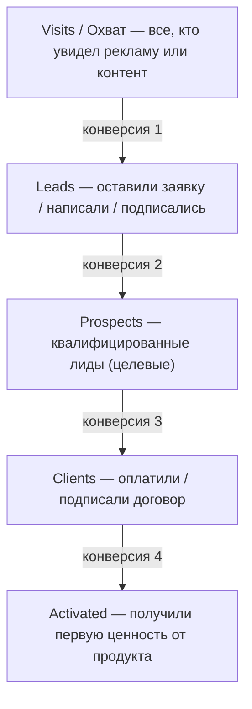
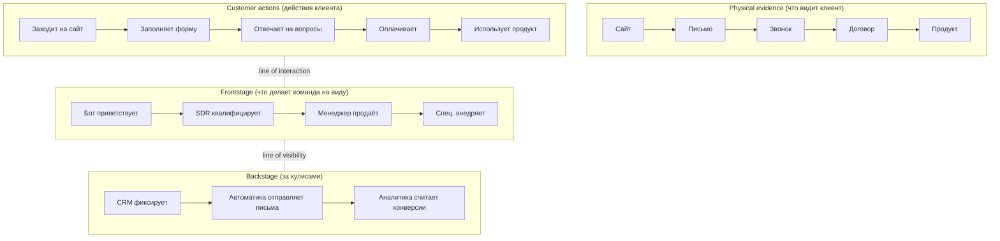

# 6.5 Стратегия активации и процессы работы с клиентом — Полная инструкция

## 🎯 Цель этой инструкции

Разработать **стратегию активации** — чёткий процесс, который превращает привлечённого потребителя в активного клиента. На выходе у тебя будет описание воронки активации с конкретными шагами, ролями, метриками и инструментами автоматизации.

**Время на выполнение:** 4–6 часов (для новичка: 8–12 часов)
**Уровень:** Средний — требует понимания своего продукта и типичного пути клиента
**После выполнения:** Карта воронки активации + описание процесса работы с клиентом + распределение ответственности по ролям + список инструментов автоматизации

---

## 📋 Что такое Стратегия активации?

### Простыми словами

**Активация** — это момент, когда привлечённый потребитель (тот, кто узнал о тебе через рекламу или рекомендацию) становится **клиентом**: платит деньги, начинает пользоваться продуктом и получает первую ценность.

Но между «заинтересовался» и «стал клиентом» — целая цепочка шагов. Кто-то узнаёт о продукте → оставляет заявку → созванивается с менеджером → получает коммерческое предложение → оплачивает → проходит онбординг → наконец-то видит результат. На каждом из этих шагов клиент может «выпасть» — уйти и не вернуться.

Стратегия активации — это твой план, как **не потерять клиента на пути** от первого контакта до первой реальной ценности.

### Аналогия

Представь, что ты продаёшь программу для похудения. Человек увидел рекламу, заинтересовался, оставил email. Что дальше?

- Если ты просто пришлёшь ему письмо «Добро пожаловать!» и будешь ждать — он, скорее всего, забудет о тебе через два дня.
- Если ты выстроишь процесс: встречаешь его тёплым welcome-письмом → потом звонит нутрициолог и делает первичный анализ → потом человек получает персональный план → потом ему напоминают в первый день — он с гораздо большей вероятностью дойдёт до первой тренировки и увидит результат.

Стратегия активации — это именно этот процесс: кто звонит, когда, что говорит, что автоматизировано, а что делается вручную.

### Ключевые термины

- **Воронка активации (Activation Funnel)** — последовательность этапов, через которые проходит потребитель на пути к статусу «клиент»
- **Конверсия (Conversion Rate)** — процент людей, перешедших с одного этапа воронки на следующий
- **Лид (Lead)** — контакт, проявивший интерес (оставил заявку, подписался, написал)
- **Проспект (Prospect)** — лид, который прошёл квалификацию и похож на целевого клиента
- **Онбординг (Onboarding)** — процесс «введения» нового клиента в продукт
- **Первая ценность (First Value / Aha-moment)** — момент, когда клиент впервые почувствовал реальную пользу от продукта

---

## 🎯 Зачем это нужно?

### 3 главные причины

**1. Потребители «вытекают» из воронки без чёткого процесса**
По данным PAF-методологии, большинство потерь происходит не на этапе привлечения, а на этапе активации. Люди оставляют заявки и исчезают. Причина — нет чёткого процесса, нет ответственного, нет скрипта следующего шага. Когда процесс описан — потери сокращаются в 2–3 раза.

**2. Разные роли должны передавать клиента друг другу без потери информации**
Маркетолог привлёк лида → менеджер по продажам провёл переговоры → специалист по внедрению настроил систему. Если между этими шагами нет чёткой «передачи дела», клиент объясняет свой контекст с нуля каждому следующему человеку. Это раздражает и разрушает доверие.

**3. Автоматизация снижает стоимость активации**
Часть шагов активации можно автоматизировать: welcome-письма, напоминания, онбординговые материалы. Это снижает нагрузку на команду и ускоряет путь клиента к первой ценности. Но сначала нужно описать процесс — автоматизировать хаос невозможно.

### Что будет плохо без этого шага

- Клиенты будут «зависать» на этапах воронки без движения — и уходить
- Разные сотрудники будут делать разное при работе с новым клиентом
- Невозможно понять, на каком именно этапе «ломается» воронка
- Активация будет дорогой и непредсказуемой

---

## 📊 Структура стратегии активации

Стратегия активации состоит из 4 блоков:

### Блок 1: Воронка активации
Описание этапов, метрик конверсии и времени пребывания клиента на каждом этапе

### Блок 2: Процессы работы с клиентом (Client Relationship Process)
Конкретные шаги на каждом этапе, их последовательность, ответственные роли

### Блок 3: Передача информации между ролями
Что именно и как передаётся от одного участника процесса другому

### Блок 4: Инструменты автоматизации
Что автоматизируем, какими инструментами, как это настраивается

---

## 🚀 Phase 0: Подготовка

### Что тебе понадобится

**Инструменты:**
- [ ] Miro / FigJam / Lucidchart (для визуализации воронки и Service Blueprint)
- [ ] Notion / Obsidian (для описания процессов)
- [ ] CRM-система (или план по её внедрению)
- [ ] Email-автоматизация (SendGrid, Unisender, GetCourse и т.п.)

**Артефакты с предыдущих шагов:**
- [ ] [[6.3 Стратегия привлечения: каналы и целевая аудитория]] — знаем, откуда приходят лиды
- [ ] [[6.4 Планирование маркетингового бюджета]] — знаем бюджет на активацию
- [ ] [[6.2 Уникальное торговое предложение и офферы]] — знаем, что мы обещаем клиенту
- [ ] Нексус Потребителя — понимаем боли, цели и контекст целевого клиента

**Вопросы, на которые ты ответишь в этом шаге:**
- Какие этапы проходит клиент от первого контакта до первой ценности?
- Кто отвечает за каждый этап?
- Что мешает клиенту двигаться вперёд?
- Что можно автоматизировать?

---

## 📝 Phase 1: Описание воронки активации

### Step 1.1: Нарисуй воронку активации

Воронка активации (Sales Funnel по PAF-методологии) — это последовательность этапов, через которые проходит потребитель. Каждый этап имеет своё название, метрику и время.

**Стандартные этапы воронки:**



**Шаблон: Воронка активации**

```markdown
## Воронка активации

| Этап       | Определение                              | Метрика           | Целевая конверсия | Время на этапе |
|------------|------------------------------------------|-------------------|-------------------|----------------|
| Visits     | Увидели рекламу / зашли на сайт          | Кол-во посещений  | —                 | 1–3 дня        |
| Leads      | Оставили контакт / заявку                | Кол-во лидов      | 3–10% от Visits   | 1–3 дня        |
| Prospects  | Квалифицированы как целевые              | Кол-во проспектов | 40–70% от Leads   | 3–7 дней       |
| Clients    | Оплатили / подписали договор             | Кол-во клиентов   | 30–60% от Prosp.  | 7–30 дней      |
| Activated  | Получили первую ценность                 | Кол-во активных   | 70–90% от Clients | 7–21 день      |
```

**Пример заполнения (AI-сервис для подбора репетиторов):**

```markdown
## Воронка активации — AI-репетитор

| Этап       | Определение                                     | Метрика | Целевая конверсия | Время  |
|------------|-------------------------------------------------|---------|-------------------|--------|
| Visits     | Зашли на сайт / увидели пост в соцсети          | 5 000/м | —                 | —      |
| Leads      | Оставили email через форму на сайте             | 350/м   | 7%                | 0–2 дн |
| Prospects  | Ответили на квалификационные вопросы в боте     | 200/м   | 57%               | 1–3 дн |
| Clients    | Оплатили подписку (тариф от 990 руб.)           | 40/м    | 20%               | 3–7 дн |
| Activated  | Провели первый урок + оставили отзыв репетитору | 34/м    | 85%               | 7–14 д |
```

### Step 1.2: Определи «First Value» — первую ценность

Это важнейший момент во всей воронке. Первая ценность — конкретное событие, после которого клиент думает: «Да, это работает, я не зря заплатил».

**Вопросы для определения First Value:**
1. Что именно клиент хотел получить, когда покупал продукт?
2. Какое минимальное действие покажет ему, что продукт работает?
3. Как быстро клиент может это получить?

**Примеры First Value:**
- Для сервиса аналитики: «Первый дашборд с реальными данными клиента»
- Для онлайн-курса: «Первый урок завершён, клиент применил навык»
- Для B2B-продукта: «Первый результат от пилотного проекта зафиксирован»
- Для маркетплейса: «Первая успешная сделка между продавцом и покупателем»

**Шаблон: Определение First Value**

```markdown
## First Value (Первая ценность)

### Что такое первая ценность для нашего клиента?
[Конкретное событие / результат]

### Как быстро клиент должен её получить?
Цель: не позже ___ дней / часов после оплаты

### Что мешает клиенту добраться до первой ценности?
- Барьер 1: ___
- Барьер 2: ___
- Барьер 3: ___

### Как мы убираем эти барьеры?
- Барьер 1 → решение: ___
- Барьер 2 → решение: ___
```

---

## 📝 Phase 2: Описание процессов работы с клиентом

### Step 2.1: Пропиши шаги процесса на каждом этапе воронки

Для каждого этапа воронки нужно ответить на вопросы: что происходит, кто делает, в какие сроки, что является результатом этого шага.

**Формат описания шага:**

```markdown
## Этап: [Название]

### Триггер (что запускает этот этап)
[Что произошло, чтобы клиент попал на этот этап]

### Действия
1. [Конкретное действие — кто делает и что именно]
2. [Следующее действие]
3. [...]

### Ответственный
[Роль: маркетолог / SDR / менеджер по продажам / специалист по внедрению / бот и т.п.]

### Срок выполнения
[В течение X часов / дней с момента триггера]

### Результат (что должно получиться)
[Конкретный артефакт: письмо отправлено / встреча назначена / договор подписан]

### Передача следующей роли
[Что именно передаётся и кому]
```

**Пример (этап Leads → Prospects для AI-репетитора):**

```markdown
## Этап: Leads → Prospects (Квалификация)

### Триггер
Человек оставил email через форму на сайте

### Действия
1. Автоматически отправляется welcome-письмо с описанием сервиса (бот)
2. Через 15 минут — автоматически отправляются 3 квалификационных вопроса (бот):
   - «Для кого ищете репетитора — для себя или ребёнка?»
   - «Какой предмет/направление?»
   - «Какой бюджет на урок в неделю?»
3. Ответ приходит в CRM — менеджер получает уведомление
4. Менеджер проверяет: попадает ли ответ под целевой профиль?
   - Если да → статус меняется на Prospect, назначается звонок
   - Если нет → автоматически отправляется письмо с отказом + рекомендацией

### Ответственный
Шаги 1–3: Автоматизация (CRM + email/бот)
Шаг 4: SDR / Менеджер по квалификации

### Срок
- Welcome-письмо: сразу
- Квалификационные вопросы: +15 минут
- Проверка менеджером: в течение 2 рабочих часов

### Результат
Лид получил статус Prospect ИЛИ отказ с объяснением

### Передача следующей роли
В CRM заполняется карточка Prospect:
- Имя, контакт, для кого, предмет, бюджет
- Метка «квалифицирован», дата, ответственный менеджер
```

### Step 2.2: Опиши процесс для каждого этапа воронки

Повтори описание из Step 2.1 для каждого перехода:
- Visits → Leads
- Leads → Prospects
- Prospects → Clients
- Clients → Activated

**Пример сводной таблицы процессов:**

```markdown
## Сводная таблица процессов активации

| Переход             | Триггер              | Ответственный       | Срок      | Автоматизировано? |
|---------------------|----------------------|---------------------|-----------|-------------------|
| Visit → Lead        | Посетитель на сайте  | Маркетинг / бот     | Мгновенно | Частично (форма)  |
| Lead → Prospect     | Заявка в форме       | SDR + бот           | 2 часа    | Частично          |
| Prospect → Client   | Квалификация пройдена| Менеджер продаж     | 3–7 дней  | Нет               |
| Client → Activated  | Оплата получена      | Спец. по внедрению  | 7–14 дней | Частично          |
```

### Step 2.3: Построй Service Blueprint

**Service Blueprint** — это схема, которая показывает действия клиента, сотрудников на переднем плане (Frontstage) и сотрудников за кулисами (Backstage) в одной таблице. Она помогает увидеть, где «ломается» опыт клиента.



**Шаблон Service Blueprint для заполнения:**

```markdown
## Service Blueprint — Воронка активации

### Этап 1: Осведомлённость (Awareness)
**Клиент:** видит рекламу / пост / статью
**Physical evidence:** объявление, пост, статья
**Frontstage:** маркетинг создаёт контент
**Backstage:** аналитика фиксирует охваты
**Метрика:** Visits, CTR

### Этап 2: Интерес (Interest)
**Клиент:** заходит на сайт, изучает
**Physical evidence:** лендинг, описание продукта
**Frontstage:** [автоматически — лендинг работает]
**Backstage:** аналитика фиксирует сессии
**Метрика:** Time on site, Bounce Rate

### Этап 3: Заявка (Lead)
**Клиент:** заполняет форму
**Physical evidence:** форма заявки, подтверждение
**Frontstage:** бот отправляет welcome
**Backstage:** CRM создаёт карточку лида
**Метрика:** Конверсия в лид (CR1)

### Этап 4: Квалификация (Prospect)
**Клиент:** отвечает на вопросы, назначает звонок
**Physical evidence:** письмо с вопросами, инвайт на встречу
**Frontstage:** SDR квалифицирует, назначает встречу
**Backstage:** CRM обновляется, задача менеджеру
**Метрика:** Конверсия лид → проспект (CR2)

### Этап 5: Переговоры и продажа (Client)
**Клиент:** слушает предложение, задаёт вопросы, оплачивает
**Physical evidence:** КП, договор, счёт
**Frontstage:** менеджер проводит встречу, обрабатывает возражения
**Backstage:** подготовка КП, выставление счёта
**Метрика:** Конверсия проспект → клиент (CR3)

### Этап 6: Онбординг (Activated)
**Клиент:** настраивает продукт, получает первую ценность
**Physical evidence:** онбординг-материалы, первый результат
**Frontstage:** специалист по внедрению проводит установочную сессию
**Backstage:** мониторинг прогресса, триггерные письма
**Метрика:** Конверсия клиент → активный (CR4), Time to First Value
```

---

## 📝 Phase 3: Распределение ролей и передача информации

### Step 3.1: Зафикси роли в процессе активации

По методологии PAF, каждый этап воронки активации имеет свою роль. Роли могут быть закреплены за разными людьми или совмещены в одном человеке.

**Шаблон: Ролевая матрица активации**

```markdown
## Ролевая матрица активации

| Роль                    | Этапы воронки         | Ответственность                          | Инструмент              |
|-------------------------|-----------------------|------------------------------------------|-------------------------|
| Маркетолог              | Visits → Leads        | Привлечение, запуск рекламы, контент     | Рекламные кабинеты, аналитика |
| SDR (Sales Dev. Rep.)   | Leads → Prospects     | Квалификация лидов, назначение встреч    | CRM, email, телефон     |
| Менеджер по продажам    | Prospects → Clients   | Переговоры, обработка возражений, продажа| CRM, скрипт продаж, КП  |
| Специалист по внедрению | Clients → Activated   | Онбординг, настройка, первая ценность    | Продукт, онбординг-чат  |
| Customer Success        | Activated → Retention | Поддержка, развитие отношений, upsell    | CRM, продукт, email     |
```

> Для небольших команд (1–3 человека) роли совмещаются. Важно не кто делает, а ЧТО делается на каждом этапе.

### Step 3.2: Опиши передачу информации между ролями

Это самое уязвимое место — «стыки» между этапами. Именно здесь клиенты теряются.

**Ключевое правило:** при передаче от одной роли к другой следующая роль должна знать всё, что нужно для продолжения работы с клиентом — без того, чтобы клиент повторял свой контекст.

**Шаблон: Карточка передачи клиента**

```markdown
## Карточка передачи клиента (Handoff Card)

### Передача: Маркетолог → SDR

**Когда происходит:** лид оставил заявку на сайте

**Что передаётся (минимальный набор):**
- [ ] Имя и контактные данные
- [ ] Канал привлечения (откуда пришёл)
- [ ] Какой оффер видел (какую рекламу / страницу)
- [ ] Дата и время заявки
- [ ] Ответы на квалификационные вопросы (если есть)

**Как передаётся:**
- Автоматически через CRM (карточка лида)
- Уведомление SDR в Telegram / email

**Срок реакции SDR:** 2 рабочих часа

---

### Передача: SDR → Менеджер по продажам

**Когда происходит:** лид квалифицирован как Prospect

**Что передаётся:**
- [ ] Результаты квалификации (ответы на вопросы)
- [ ] Потребность клиента (что хочет получить)
- [ ] Бюджет (если известен)
- [ ] Лицо, принимающее решение
- [ ] Сроки принятия решения
- [ ] Альтернативы, которые рассматривает клиент
- [ ] Назначенное время встречи

**Как передаётся:**
- Заполненная карточка Prospect в CRM
- Краткий брифинг в мессенджере команды

---

### Передача: Менеджер по продажам → Специалист по внедрению

**Когда происходит:** клиент оплатил / подписал договор

**Что передаётся:**
- [ ] Имя, контакты всех участников со стороны клиента
- [ ] Что именно купил (тариф, условия)
- [ ] Бизнес-контекст клиента (чем занимается, какая боль)
- [ ] Ожидания клиента (что он хочет получить)
- [ ] Особые договорённости (если были)
- [ ] Срок начала работы

**Как передаётся:**
- Welcome-бриф в CRM
- Вводный созвон Менеджер + Спец. по внедрению + Клиент (первый звонок)
```

---

## 📝 Phase 4: Инструменты автоматизации

### Step 4.1: Определи, что можно автоматизировать

Не всё в воронке активации нужно делать вручную. Определи, какие шаги можно автоматизировать без потери качества.

**Принцип автоматизации:** автоматизируй рутинные, повторяющиеся, чёткие шаги. Оставь людей там, где нужна эмпатия, нестандартное решение или переговоры.

**Что обычно автоматизируют:**

| Шаг                            | Инструмент автоматизации            |
|--------------------------------|-------------------------------------|
| Welcome-письмо при заявке      | Email-автоматизация (SendGrid, etc.)|
| Квалификационные вопросы       | Telegram-бот / форма / чат-бот      |
| Создание карточки в CRM        | CRM + вебхук с сайта                |
| Напоминание о встрече          | Calendly / CRM                      |
| Счёт и договор                 | CRM / DocuSign / ЭДО                |
| Welcome-онбординг-письма       | Email-последовательность (серия)    |
| Напоминание о следующем шаге   | CRM-задачи + триггерные письма      |
| Сбор обратной связи            | NPS-анкета автоматически            |

### Step 4.2: Составь карту автоматизации

**Шаблон:**

```markdown
## Карта автоматизации активации

| Триггер                       | Автоматическое действие                    | Инструмент          | Приоритет |
|-------------------------------|--------------------------------------------|---------------------|-----------|
| Новая заявка на сайте         | Welcome-письмо + уведомление SDR           | CRM + Email         | 🔴 Высокий |
| Лид не ответил 24 часа        | Напоминание «Вы оставили заявку»           | Email / SMS         | 🔴 Высокий |
| Лид квалифицирован            | Инвайт на встречу + напоминание            | Calendly + Email    | 🔴 Высокий |
| Оплата получена               | Welcome-онбординг письмо #1                | Email               | 🔴 Высокий |
| +3 дня после оплаты           | Онбординг-письмо #2 (чеклист)             | Email               | 🟡 Средний |
| +7 дней после оплаты          | Проверочный звонок / письмо от команды     | CRM-задача + email  | 🟡 Средний |
| +14 дней после оплаты         | NPS-опрос «Как первые впечатления?»        | Typeform + email    | 🟡 Средний |
| Клиент не активен 5 дней      | Письмо «Можем помочь?» + ссылка на helpdesk| Email               | 🟡 Средний |
```

### Step 4.3: Опиши онбординг-последовательность

Онбординг — самый важный момент после оплаты. Именно здесь клиент решает: «Я правильно выбрал» или «Я зря заплатил».

**Шаблон: Email-последовательность онбординга**

```markdown
## Онбординг-последовательность (первые 21 день)

### Письмо 1 — Сразу после оплаты
**Тема:** «Добро пожаловать! Вот с чего начать»
**Содержание:**
- Тёплое приветствие от команды
- Что именно человек только что получил
- 3 конкретных первых шага
- Контакт ответственного за внедрение
- Ссылка на онбординг-материалы

### Письмо 2 — День 3
**Тема:** «Как у вас дела с [первым шагом]?»
**Содержание:**
- Короткий чек-ин: «Успели попробовать?»
- Ссылка на инструкцию по первому шагу
- Приглашение на Zoom-сессию (если нужна помощь)

### Письмо 3 — День 7
**Тема:** «Чеклист недели — вы уже сделали это?»
**Содержание:**
- Чеклист из 5 пунктов (что должно быть готово за неделю)
- Один key win — что клиент уже мог получить
- Следующий шаг

### Письмо 4 — День 14
**Тема:** «[Имя], поделитесь первыми впечатлениями»
**Содержание:**
- NPS-вопрос + 2 открытых вопроса
- Предложение: «Есть что-то, с чем мы можем помочь?»

### Письмо 5 — День 21
**Тема:** «Итоги первого месяца»
**Содержание:**
- Напоминание о прогрессе клиента
- Следующие возможности (upsell или следующий этап)
- История успеха другого клиента (социальное доказательство)
```

---

## 📝 Phase 5: Метрики процесса активации

### Step 5.1: Зафикси целевые метрики воронки

**Шаблон: Метрики активации**

```markdown
## Целевые метрики воронки активации

| Метрика                | Формула                              | Цель     | Текущий факт |
|------------------------|--------------------------------------|----------|--------------|
| CR1 (Visit → Lead)     | Leads / Visits × 100%                | ≥ 5%     | —            |
| CR2 (Lead → Prospect)  | Prospects / Leads × 100%             | ≥ 40%    | —            |
| CR3 (Prospect → Client)| Clients / Prospects × 100%           | ≥ 25%    | —            |
| CR4 (Client → Active)  | Activated / Clients × 100%           | ≥ 80%    | —            |
| Time to First Value    | Дней от оплаты до первого результата | ≤ 14 дн. | —            |
| CAC активации          | Расходы на активацию / Клиентов      | ≤ 3 000₽ | —            |
| Retention M1           | % клиентов, продливших на 2-й месяц  | ≥ 75%    | —            |
```

### Step 5.2: Настрой мониторинг

```markdown
## Ритм мониторинга метрик активации

| Частота   | Что смотрим                                       | Кто смотрит          |
|-----------|---------------------------------------------------|----------------------|
| Ежедневно | Новые лиды, статусы в CRM, «застрявшие» клиенты  | SDR / Менеджер       |
| Еженедельно | CR2, CR3, количество встреч, количество оплат   | Руководитель продаж  |
| Ежемесячно  | CR4, Time to First Value, CAC активации, Retention| Продуктовый офис     |
```

---

## ✅ Success Criteria

После выполнения этого шага у тебя должно быть:

✅ Описана воронка активации с этапами, метриками и целевыми конверсиями
✅ Определена «первая ценность» (First Value) и срок её достижения
✅ Описаны конкретные шаги для каждого перехода в воронке
✅ Составлен Service Blueprint (действия клиента, Frontstage, Backstage)
✅ Определены роли и ответственность на каждом этапе
✅ Описаны Handoff Card'ы — что передаётся при переходе между ролями
✅ Составлена карта автоматизации
✅ Описана email-последовательность онбординга
✅ Зафиксированы целевые метрики и ритм мониторинга

**Context Ripeness:**

```markdown
## Context Ripeness — Стратегия активации

| Раздел                  | Зрелость | Комментарий                          |
|-------------------------|----------|--------------------------------------|
| Воронка активации       | 80%      | Описана, нужна калибровка по факту   |
| Процессы и роли         | 70%      | Описаны, будут уточняться на практике|
| Handoff Cards           | 75%      | Шаблоны готовы                       |
| Автоматизация           | 60%      | Карта есть, внедрение впереди        |
| Онбординг-последовательность | 80%  | Готова к запуску                    |
| Метрики                 | 70%      | Цели поставлены, факта ещё нет       |

**Общая зрелость: 73%**
```

---

## 🚨 Troubleshooting

### Problem 1: «Не знаю, какие этапы воронки подходят для нашего продукта»

**Solution:**
1. Пройди путь клиента самостоятельно: попробуй «купить» свой продукт с нуля — запиши все шаги
2. Поговори с 3–5 реальными клиентами: спроси, как они принимали решение о покупке, что помогло, что мешало
3. Начни со стандартной модели (Visits → Leads → Prospects → Clients → Activated) и адаптируй под свой продукт

### Problem 2: «Клиенты оплачивают, но не активируются (не используют продукт)»

**Solution:**
1. Найди конкретный барьер: где именно клиент «застревает»? — позвони 5 неактивным клиентам
2. Упрости первый шаг до абсурда: первое действие должно занимать не больше 5 минут
3. Добавь «ручной» онбординг: первое время проводи установочный звонок с каждым клиентом лично
4. Сократи время до первой ценности — если клиент не видит результат за 3 дня, он теряет интерес

### Problem 3: «Мы маленькая команда, некому выполнять все роли»

**Solution:**
1. Совмести роли: один человек может быть SDR + Менеджером по продажам
2. Максимизируй автоматизацию на ранних этапах — квалификация через бота, welcome-письма автоматически
3. Начни с ручного процесса для первых 20–30 клиентов, а потом автоматизируй то, что повторяется

### Problem 4: «CRM нет, непонятно с чего начать»

**Solution:**
1. Начни с Google Sheets — простая таблица «лиды с полями: имя, контакт, этап, последнее действие, дата» уже лучше, чем ничего
2. Для 10–50 клиентов в месяц достаточно Notion + Google Sheets
3. Для 50+ клиентов — внедри минимальную CRM: AmoCRM, HubSpot Free, Bitrix24 Free

### Problem 5: «Не понимаю, что писать в онбординговых письмах»

**Solution:**
1. Главный принцип: каждое письмо должно помочь клиенту сделать следующий шаг, а не рассказать о продукте
2. Поговори с 3–5 клиентами, которые хорошо стартовали — что им помогло в первые 2 недели?
3. Напиши письма так, как написал бы другу: «Привет, вот что тебе нужно сделать прямо сейчас...»

### Problem 6: «Слишком много этапов — клиенты устают»

**Solution:**
1. Объедини близкие этапы — 3–4 этапа лучше, чем 7–8
2. Сократи обязательные действия клиента до минимума
3. Переведи максимум действий на команду («мы сделаем за тебя»)

---

## 📚 Templates & Tools

### Шаблон: Полная воронка активации (копируй)

```markdown
# Воронка активации v0.1

## 1. Метрики воронки

| Этап        | Объём | Конверсия | Время | Ответственный |
|-------------|-------|-----------|-------|----------------|
| Visits      |       | —         |       | Маркетинг       |
| Leads       |       |           |       | SDR / Маркетинг |
| Prospects   |       |           |       | SDR             |
| Clients     |       |           |       | Менеджер продаж |
| Activated   |       |           |       | Спец. внедрения |

## 2. First Value
Событие: ___
Срок: ___ дней после оплаты
Барьеры: ___

## 3. Процессы по этапам

### Visit → Lead
Триггер: ___
Действия: ___
Ответственный: ___
Срок: ___
Результат: ___

### Lead → Prospect
...

### Prospect → Client
...

### Client → Activated
...

## 4. Handoff Cards
...

## 5. Карта автоматизации
...

## 6. Онбординг-последовательность
...

## 7. Целевые метрики
...
```

---

## 🎓 Further Reading

- **Product Architecture Framework (PAF)** — разделы «Activation Strategy Design» и «Client Relationship Process Definition»: https://productframework.ru/
- **«The Mom Test»** — Роб Фитцпатрик — как разговаривать с клиентами, чтобы понять их путь
- **«Intercom on Onboarding»** — бесплатная книга Intercom об онбординге SaaS-продуктов
- **«Customer Success»** — Gainsight — книга о построении процессов работы с клиентами
- **Service Blueprint Tool** — Miro шаблоны: поищи «Service Blueprint» в галерее шаблонов Miro

---

## ❓ FAQ

### Q: Чем воронка активации отличается от воронки продаж?
**A:** Воронка продаж фокусируется на конверсии потребителя в клиента (до оплаты). Воронка активации включает и этап после оплаты — доведение до первой ценности. В PAF они рассматриваются как единый процесс активации.

### Q: На каком этапе нужно строить Service Blueprint?
**A:** Service Blueprint полезен сразу, но особенно ценен, когда в воронке участвует больше одного человека. Начни с простой схемы, уточняй по мере роста команды.

### Q: Как понять, что онбординг «работает»?
**A:** Главный признак — клиент получил первую ценность в срок (Time to First Value) и остался на второй месяц (Retention M1). Если оба показателя растут — онбординг улучшается.

### Q: Нужно ли автоматизировать всё сразу?
**A:** Нет. Сначала делай всё вручную для первых 20–30 клиентов — это поможет понять, что реально работает. Потом автоматизируй только то, что повторяется без изменений.

### Q: Что делать, если клиент «завис» на этапе Prospects и не берёт трубку?
**A:** Используй «breakup email» — письмо в духе «Я вижу, что время сейчас неудачное. Напишу через месяц — или скажи, если не актуально». Это часто возвращает клиентов.

### Q: Когда нужно привлекать Customer Success?
**A:** В B2B с высоким средним чеком — с момента подписания договора. В B2C/SMB — автоматизированный Customer Success через 14–21 день после оплаты. Ключевой момент: до первой ценности клиент должен чувствовать поддержку.

---

**Version:** 1.0
**Last updated:** 2026-06-20
**Назад:** [[6.4 Планирование маркетингового бюджета]] · **Дальше:** [[6.6 Скрипты продаж и план продаж]]
