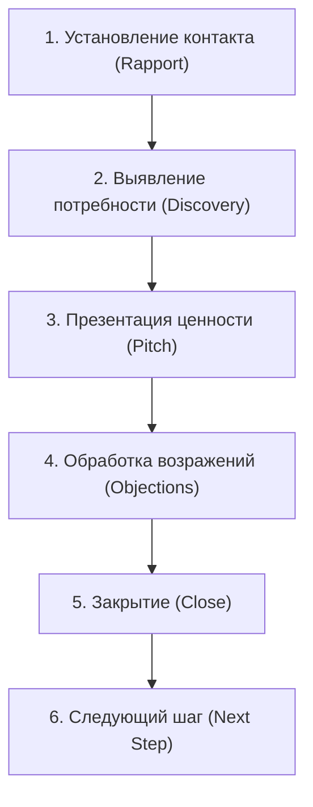

# 6.6 Скрипты продаж и план продаж — Полная инструкция

## 🎯 Цель этой инструкции

Создать **скрипт продаж** — структурированный сценарий диалога с потребителем, который помогает довести его до оплаты. И **план продаж** — финансово обоснованный прогноз того, сколько клиентов компания получит за период, синхронизированный с маркетинговым планом.

**Время на выполнение:** 4–8 часов (для новичка: 10–14 часов)
**Уровень:** Средний — требует понимания своего клиента, продукта и воронки
**После выполнения:** Скрипт продаж с обработкой возражений + план продаж по периодам, синхронизированный с маркетингом и экономикой

---

## 📋 Что такое Скрипт продаж и План продаж?

### Простыми словами

**Скрипт продаж (Sales Script)** — это заранее подготовленный сценарий разговора с потенциальным клиентом. Это не значит, что нужно читать по бумажке слово в слово. Это значит, что ты знаешь, какие вопросы задать, что ответить на типичные возражения, и когда делать предложение.

По методологии PAF, прямой диалог с потребителем — это «**человеческий интерфейс**» продуктовой компании. Как любой интерфейс, он должен иметь чёткие правила работы: что происходит, когда клиент нажимает «кнопку» (задаёт вопрос или возражает).

**План продаж (Sales Plan)** — это прогноз: сколько клиентов мы гарантируем получить за конкретный период. Он строится на основе воронки активации, маркетингового бюджета и исторических данных (или оценок, если компания новая).

### Аналогия

Представь, что ты учишь нового сотрудника кофейни принимать заказы.

**Без скрипта:** Каждый сотрудник ведёт диалог по-своему. Один забывает предложить десерт, другой — объяснить разницу между американо и эспрессо, третий теряется, когда клиент говорит «дорого». Результат: непредсказуемая конверсия и куча несостоявшихся продаж.

**Со скриптом:** У каждого сотрудника есть сценарий: как поздороваться → как выяснить, что хочет клиент → как рассказать о напитках → как ответить «это дорого» → как предложить что-то дополнительно → как завершить продажу. Результат: стабильная конверсия и управляемый чек.

**План продаж** — это когда управляющий говорит: «Из 100 посетителей в день 70% купят кофе, 30% добавят десерт. Это даёт нам Х рублей выручки в месяц». Не угадка, а расчёт.

---

## 🎯 Зачем это нужно?

### 3 главные причины

**1. Скрипт делает диалог управляемым и предсказуемым**
Без скрипта каждый продавец делает что-то своё — и нельзя понять, почему одни продают больше, а другие меньше. Со скриптом можно измерить каждый шаг: где клиент «соглашается», а где «отваливается». Это основа для улучшения.

**2. Обработка возражений — самое важное место**
По PAF, скрипт продаж — особенно с учётом обработки возражений — является описанием «правил работы интерфейса». Возражения клиентов предсказуемы: «дорого», «подумаю», «нам это не нужно». Если ты знаешь ответы заранее — ты не теряешься и не теряешь клиента.

**3. План продаж — это обязательства команды**
План продаж показывает, сколько клиентов мы «гарантируем» за период. Он связывает маркетинг (сколько лидов привлекаем) и продажи (сколько из них конвертируем). Без плана — нет ответственности, нет прогнозируемости, нет возможности заранее увидеть кассовый разрыв.

### Что будет плохо без этого шага

- Продажи зависят от «таланта» конкретного человека — не масштабируется
- Нельзя обучить нового продавца — нет системы
- Нет прогноза выручки — нельзя планировать бюджет и команду
- Компания не знает, сколько клиентов получит — нет основы для бизнес-решений

---

## 📊 Структура этого шага

Шаг 6.6 состоит из двух больших частей:

### Часть A: Скрипт продаж
- Структура разговора (этапы)
- Скрипт для каждого этапа (вопросы, фразы)
- Обработка возражений (список + ответы)
- Скрипты для разных форматов (звонок, письмо, встреча)

### Часть B: План продаж
- Модель воронки продаж
- Расчёт плановых показателей
- Синхронизация с маркетинговым планом
- Декомпозиция на команду

---

## 🚀 Phase 0: Подготовка

### Что тебе понадобится

**Инструменты:**
- [ ] Notion / Google Docs (для написания скрипта)
- [ ] Google Sheets (для плана продаж)
- [ ] CRM-система (для отслеживания выполнения плана)
- [ ] Инструмент для звонков (Zoom, телефон с записью)

**Артефакты с предыдущих шагов:**
- [ ] [[6.1 Стратегия позиционирования и точки дифференциации]] — знаем, на что опираемся в разговоре
- [ ] [[6.2 Уникальное торговое предложение и офферы]] — знаем офферы и их формулировки
- [ ] [[6.3 Стратегия привлечения: каналы и целевая аудитория]] — знаем, кто наш целевой клиент
- [ ] [[6.4 Планирование маркетингового бюджета]] — знаем плановый поток лидов
- [ ] [[6.5 Стратегия активации и процессы работы с клиентом]] — знаем воронку и конверсии

**Что нужно знать ДО написания скрипта:**
- Кто принимает решение о покупке?
- Какие типичные возражения мы уже слышали?
- Что мотивирует нашего клиента купить?
- Сколько времени обычно занимает сделка?

---

## 📝 Phase 1: Структура скрипта продаж

### Step 1.1: Пойми структуру идеального разговора с клиентом

Любой успешный продажный диалог проходит через 6 этапов. Это не жёсткий алгоритм — это ориентир.



**Описание этапов:**

| Этап                      | Цель                                      | Время       |
|---------------------------|-------------------------------------------|-------------|
| 1. Установление контакта  | Снять напряжение, создать доверие         | 2–5 мин     |
| 2. Выявление потребности  | Понять боль, цели и контекст клиента      | 10–20 мин   |
| 3. Презентация ценности   | Показать, как продукт решает боль клиента | 5–10 мин    |
| 4. Обработка возражений   | Снять сомнения и страхи клиента           | 5–15 мин    |
| 5. Закрытие               | Получить согласие на следующий шаг        | 2–5 мин     |
| 6. Следующий шаг          | Зафиксировать конкретные договорённости   | 2–3 мин     |

### Step 1.2: Напиши скрипт для каждого этапа

#### Этап 1: Установление контакта (Rapport)

**Задача:** Представиться, объяснить зачем звонишь, получить разрешение продолжить разговор.

**Правила:**
- Называй имя клиента
- Коротко объясни, кто ты
- Задай один простой вопрос, чтобы вовлечь
- Не начинай продавать сразу

**Шаблон фраз:**

```markdown
## Этап 1: Установление контакта

### Если звонок (холодный)
«Добрый день, [Имя]! Меня зовут [Имя менеджера], я из компании [Название].
Вы оставляли заявку на нашем сайте — вам удобно поговорить 10–15 минут прямо сейчас?»

[Если да → продолжаем]
[Если нет → «Когда вам удобнее? Запишу на [дата/время]»]

### Если звонок (тёплый, после заявки)
«Добрый день, [Имя]! Меня зовут [Имя], я менеджер [Название].
Вы оставили заявку на [название продукта/тема] — я хочел(а) убедиться, что отвечу на все ваши вопросы.
Есть несколько минут?»

### Если онлайн-встреча (Zoom)
«Отлично, рад(а) нас познакомиться! Я [Имя], работаю в [Название] — помогаю [целевой аудитории] с [проблемой].
Предлагаю так построить нашу встречу: сначала я задам несколько вопросов, чтобы понять ваш контекст, потом расскажу, как мы можем помочь — и если будет интересно, обсудим детали. Звучит разумно?»
```

#### Этап 2: Выявление потребности (Discovery)

**Задача:** Понять реальную ситуацию клиента — его боль, цели, текущие решения и мотивацию к покупке.

**Правила:**
- Больше слушай, меньше говори (правило 70/30: клиент говорит 70% времени)
- Используй открытые вопросы (начинаются с «Как», «Что», «Расскажите»)
- Уточняй, копай глубже («А почему это важно для вас?»)
- Фиксируй ответы — они помогут в презентации

**Шаблон вопросов (адаптируй под свой продукт):**

```markdown
## Этап 2: Вопросы для выявления потребности

### Ситуация (Situation)
— Расскажите, как сейчас устроен у вас [процесс/область]?
— Как давно вы работаете с [текущим решением / без решения]?
— Как выглядит ваша команда / кто занимается [задачей]?

### Проблема (Problem)
— С какими сложностями вы сейчас сталкиваетесь в [области]?
— Что вас не устраивает в текущем подходе?
— Что бы вы хотели изменить в первую очередь?

### Последствия (Implication)
— Как это влияет на [ваш бизнес / команду / результат]?
— Что происходит, если эта проблема остаётся нерешённой?
— Сколько времени / денег это стоит сейчас?

### Мотивация к изменению (Need-Payoff)
— Что изменится, если вы решите эту проблему?
— Как вы поймёте, что нашли нужное решение?
— Почему именно сейчас решили заняться этим?
```

**Пример заполнения (AI-репетитор):**

```markdown
## Вопросы для выявления — AI-репетитор

— Расскажите, как сейчас ваш ребёнок готовится к ОГЭ / ЕГЭ?
— С какими предметами сложнее всего?
— Сколько времени в неделю уходит на подготовку сейчас?
— Пробовали раньше работать с репетитором? Что понравилось / не понравилось?
— Что для вас самое важное при выборе репетитора?
— Как вы поймёте, что результат достигнут?
```

#### Этап 3: Презентация ценности (Pitch)

**Задача:** Показать, как конкретно продукт решает боль и достигает цели, которые клиент только что озвучил.

**Правила:**
- Опирайся на то, что клиент сказал на этапе Discovery — не на стандартный текст
- Используй формулу: «Вы сказали, что [проблема] → наш продукт делает [что именно] → это значит, что [результат для клиента]»
- Не перечисляй все функции — только те, что релевантны этому клиенту
- Используй истории успеха похожих клиентов

**Шаблон презентации:**

```markdown
## Этап 3: Презентация ценности

### Шаблон фразы-связки
«Вы сказали, что [проблема / цель клиента его словами].
Именно для этого мы создали [название продукта / функцию].
Вот как это работает: [конкретный механизм, 2–3 предложения].
Наши клиенты в похожей ситуации получают [конкретный результат: цифры, время, деньги].»

### Структура мини-презентации (3–5 минут)
1. Связка с проблемой клиента (его слова)
2. Суть решения (1 предложение)
3. Как это работает (2–3 шага, просто)
4. Конкретный результат (цифры или кейс)
5. Вопрос: «Звучит актуально для вашей ситуации?»
```

**Пример (AI-репетитор):**

```markdown
### Пример презентации

«Вы сказали, что ваш ребёнок не любит математику и репетиторы часто работают не по программе.
Именно это и решает наш сервис: AI адаптирует программу под уровень и темп каждого ученика,
а репетитор-куратор контролирует прогресс и подключается там, где AI недостаточно.
Это выглядит так: ребёнок заходит в приложение → проходит диагностику (15 минут) → 
получает персональный план → занимается в своём темпе → куратор следит за прогрессом 
и корректирует план раз в неделю.

Наши ученики в среднем закрывают пробелы по предмету за 6–8 недель.
Один из наших учеников в Москве поднял оценку по математике с 3 до 4 за 2 месяца.

Как вам такой подход — подходит для вашей ситуации?»
```

---

## 📝 Phase 2: Обработка возражений

### Step 2.1: Собери все типичные возражения

Возражения клиентов предсказуемы. Их можно разделить на несколько типов:

| Тип возражения    | Что стоит за ним                                    | Как распознать              |
|-------------------|-----------------------------------------------------|-----------------------------|
| Цена («дорого»)   | Не видит ценности / сравнивает с другим / нет денег | «Это дорого», «У других дешевле» |
| Время («подумаю») | Не хватает уверенности / нет срочности              | «Я подумаю», «Позвоните позже» |
| Компетентность    | Сомневается, что продукт работает именно для него   | «А у вас есть кейсы?», «Вы молодая компания» |
| Полномочия        | Нужно согласовать с кем-то ещё                      | «Мне надо поговорить с партнёром / директором» |
| Конкурент         | Уже использует или рассматривает другое             | «Мы уже работаем с X», «Рассматриваем Y» |
| Нет нужды         | Не видит проблемы, которую ты решаешь              | «Нам это пока не нужно» |

### Step 2.2: Напиши ответы на каждое возражение

**Формула обработки возражения (4 шага):**
1. Выслушай и признай («Понимаю вас»)
2. Уточни («Что именно имеете в виду?»)
3. Ответь по существу
4. Подтверди («Это отвечает на ваш вопрос?»)

**Шаблон: Банк возражений**

```markdown
## Банк возражений и ответов

---

### Возражение: «Это дорого»

**Что стоит за ним:** Не видит ценности, или сравнивает с чем-то более дешёвым

**Шаг 1 — Признание:**
«Да, я понимаю — вопрос стоимости важен.»

**Шаг 2 — Уточнение:**
«Можете сказать, с чем сравниваете? С другим сервисом или с тем, что сейчас тратите на [решение задачи]?»

**Шаг 3 — Ответ по существу:**
[Вариант А — сравнение с альтернативой]:
«Если сравнивать с репетитором за [X руб./час × Y часов в месяц], наш тариф выходит в [Z руб.] — это в 2 раза меньше при сопоставимом результате, потому что [объяснение]»

[Вариант Б — ценность против стоимости]:
«Давайте посчитаем: если результат — [конкретный результат], то сколько стоит этот результат для вас? Обычно наши клиенты говорят, что это инвестиция, которая окупается за [срок].»

**Шаг 4 — Подтверждение:**
«Это отвечает на ваш вопрос по стоимости?»

---

### Возражение: «Я подумаю» / «Позвоните позже»

**Что стоит за ним:** Нет уверенности, нет срочности, или хочет сравнить с другим

**Шаг 1 — Признание:**
«Конечно, это важное решение.»

**Шаг 2 — Уточнение:**
«Чтобы я мог(ла) быть полезен(на) — что именно вы хотите обдумать? Может, есть вопрос, на который я не ответил(а)?»

**Шаг 3 — Ответ:**
[Если нет конкретного вопроса]:
«Иногда "подумаю" означает, что нужно больше уверенности. Что могло бы её дать? Кейс похожего клиента? Пробный период?»

[Если нет срочности]:
«Понимаю. Скажите — есть ли у вас дедлайн по [проблеме]? Потому что наши клиенты, которые откладывали, потом говорили, что потеряли [время/деньги]. Хочу убедиться, что вы не окажетесь в такой ситуации.»

**Шаг 4 — Фиксация следующего шага:**
«Давайте тогда договоримся конкретно: когда именно вы вернётесь к этому вопросу? Поставлю напоминание и свяжусь с вами [дата].»

---

### Возражение: «У вас нет кейсов» / «Вы молодая компания»

**Шаг 1:** «Да, мы сравнительно новые — и именно поэтому мы очень внимательны к каждому клиенту.»

**Шаг 2:** «Что именно вас беспокоит — что продукт не работает, или что мы не справимся с поддержкой?»

**Шаг 3:** «Вот что я могу предложить: [пилотный период / бесплатный тест / история клиента из бета-теста / гарантия возврата]. Это позволит вам проверить без риска.»

**Шаг 4:** «Снимает ли это ваши опасения?»

---

### Возражение: «Нам нужно согласовать» / «Я не принимаю решение»

**Шаг 1:** «Понимаю, это нормально.»

**Шаг 2:** «Кто ещё участвует в принятии решения? Я могу подготовить материалы, которые помогут объяснить коллегам.»

**Шаг 3:** «Вот что я предлагаю: давайте я пришлю краткое резюме нашего разговора + описание решения — вы переадресуете коллеге. Или, если удобно, можем организовать короткую встречу с ним / ней.»

**Шаг 4:** «Как лучше организовать этот процесс?»

---

### Возражение: «Мы уже работаем с [конкурентом]»

**Шаг 1:** «Хорошо, значит задача у вас точно есть.»

**Шаг 2:** «Что именно вам нравится в текущем решении? А что хотели бы улучшить?»

**Шаг 3:** «Именно это мы и делаем лучше / по-другому: [точка дифференциации из шага 6.1]. Многие наши клиенты раньше использовали [конкурент], а потом перешли, потому что [причина].»

**Шаг 4:** «Хотите попробовать параллельно на одном небольшом проекте, чтобы сравнить?»

---

### Возражение: «Нам это не нужно сейчас»

**Шаг 1:** «Понимаю.»

**Шаг 2:** «Расскажите — как вы сейчас решаете [проблему]? Или она пока не приоритетна?»

**Шаг 3:**
[Если не приоритетна]: «Когда она станет приоритетной? Хочу убедиться, что мы будем у вас на радаре в нужный момент.»
[Если решают иначе]: «Интересно, как это работает у вас. А что, если бы [наше решение] позволило сэкономить [ресурс]? Это бы изменило приоритет?»

**Шаг 4:** «Давайте я свяжусь с вами через [срок] — когда ситуация может поменяться?»
```

### Step 2.3: Составь «карту возражений» для конкретного продукта

Возьми свои реальные разговоры с клиентами (или с потребителями из глубинных интервью) и добавь в банк возражений специфику своего продукта.

**Шаблон: Карта возражений (заполни для AI-KORTEX)**

```markdown
## Карта возражений — [Название продукта]

| Возражение                    | Частота (1–5) | Корень возражения          | Ключевой ответ                          |
|-------------------------------|---------------|----------------------------|-----------------------------------------|
| «Дорого»                      |               |                            |                                         |
| «Подумаю»                     |               |                            |                                         |
| «Нет кейсов»                  |               |                            |                                         |
| «Нужно согласовать»           |               |                            |                                         |
| «Уже работаем с X»            |               |                            |                                         |
| «Не нужно сейчас»             |               |                            |                                         |
| [Специфическое для продукта]  |               |                            |                                         |
```

---

## 📝 Phase 3: Скрипты для разных форматов

### Step 3.1: Скрипт первого звонка (15–20 минут)

```markdown
## Скрипт первого звонка

### Цель
Квалифицировать клиента и назначить следующий шаг (демо / встреча / КП)

### Структура (тайминг)
- 0:00–2:00 — Установление контакта (представление + повод звонка)
- 2:00–12:00 — Discovery: 5–7 вопросов о ситуации клиента
- 12:00–17:00 — Краткая презентация (только под боль клиента)
- 17:00–19:00 — Обработка возражений (если есть)
- 19:00–20:00 — Закрытие на следующий шаг

### Фраза закрытия
«Отлично, мне кажется, у вас есть [проблема] и наш продукт может помочь с [конкретным аспектом].
Предлагаю следующий шаг: [встреча с демо / КП / пилот / оплата].
Как вам такой план?»

### Если клиент сказал «нет» или «подумаю»
«Понимаю. Хочу убедиться, что мы с вами в контакте. Можно я свяжусь с вами через [срок]?
И пришлю пока [полезный материал / кейс / ответ на вопрос]?»
```

### Step 3.2: Скрипт встречи-демо (30–45 минут)

```markdown
## Скрипт встречи-демо

### Цель
Показать продукт в действии, закрыть на сделку или КП

### Структура
- 0:00–5:00 — Recap: «Вы рассказывали, что у вас [проблема]. Правильно понимаю?»
- 5:00–25:00 — Демо (только то, что решает боль клиента, не всё подряд)
- 25:00–35:00 — Вопросы клиента + обработка возражений
- 35:00–45:00 — Обсуждение условий, следующий шаг

### Правила демо
1. Показывай не функции, а результат: «Смотрите, что произойдёт, когда вы [действие]»
2. Вовлекай клиента: «Попробуйте сами / введите свои данные»
3. Каждые 5–7 минут задавай вопрос: «Как это выглядит с вашей точки зрения?»
4. Не перегружай — 3–4 ключевых момента лучше, чем 10 средних

### Фраза закрытия
«Мы посмотрели, как это работает. На ваш взгляд — это решает [проблему, которую вы описывали]?
[Если да:] Отлично! Тогда предлагаю двигаться дальше. Есть два варианта: [вариант A] или [вариант B]. Что больше подходит?»
```

### Step 3.3: Скрипт follow-up письма

```markdown
## Шаблон follow-up письма после звонка

**Тема:** «[Имя], итоги нашего разговора + следующий шаг»

«Добрый день, [Имя]!

Спасибо за разговор сегодня — было приятно пообщаться.

Как мы договорились, краткое резюме:

**Ваша ситуация:** [2–3 предложения — их словами, что они рассказали]

**Что мы предлагаем:** [1–2 предложения — конкретно под их боль]

**Следующий шаг:** [конкретное действие + дата]

Если захотите посмотреть детальнее — вот [ссылка на кейс / материал / демо].

Буду рад(а) ответить на вопросы.

[Подпись]»
```

---

## 📝 Phase 4: План продаж

### Step 4.1: Построй модель воронки продаж

Plan продаж строится сверху вниз: от числа лидов, которые обещает маркетинг, до числа клиентов, которых обещают продавцы.

**Шаблон: Модель воронки**

```markdown
## Модель воронки продаж

| Этап           | Месяц 1 | Месяц 2 | Месяц 3 | Q2  | Q3  |
|----------------|---------|---------|---------|-----|-----|
| Лиды (от маркетинга) |   |         |         |     |     |
| × CR2 (Lead→Prospect)|   |         |         |     |     |
| = Проспекты    |         |         |         |     |     |
| × CR3 (Prospect→Client)|  |        |         |     |     |
| = Новых клиентов|        |         |         |     |     |
| × ARPU (руб.)  |         |         |         |     |     |
| = Выручка (руб.)|        |         |         |     |     |
```

**Пример заполнения (AI-репетитор):**

```markdown
## Модель воронки продаж — AI-репетитор

| Этап                | М1     | М2     | М3     | Q2      | Q3      |
|---------------------|--------|--------|--------|---------|---------|
| Лиды (от маркетинга)| 100    | 150    | 200    | 900     | 1 500   |
| CR2: Lead → Prospect| 50%    | 55%    | 60%    | 65%     | 70%     |
| = Проспекты         | 50     | 83     | 120    | 585     | 1 050   |
| CR3: Prospect→Client| 20%    | 22%    | 25%    | 28%     | 30%     |
| = Новых клиентов    | 10     | 18     | 30     | 164     | 315     |
| ARPU (руб./мес)     | 1 990  | 1 990  | 1 990  | 2 490   | 2 490   |
| = Новая выручка     | 19 900 | 35 820 | 59 700 | 408 360 | 784 350 |
```

### Step 4.2: Добавь базу клиентов и Retention

В SaaS и подписочных моделях выручка строится из новых клиентов плюс базы существующих. Нужно учесть Churn (отток).

**Шаблон: Расчёт ARR/MRR с учётом базы**

```markdown
## Расчёт MRR с учётом базы и оттока

| Показатель                 | М1     | М2      | М3      | Q2 конец | Q3 конец |
|----------------------------|--------|---------|---------|----------|----------|
| База клиентов (начало)     | 0      | 10      | 27      | 55       | 210      |
| + Новых клиентов           | 10     | 18      | 30      | 164      | 315      |
| − Ушедших (Churn 5%/мес)   | 0      | 0.5 ≈1  | 1.4 ≈1  | 2.7 ≈ 3  | 10       |
| = База клиентов (конец)    | 10     | 27      | 56      | 216      | 515      |
| × ARPU (руб.)              | 1 990  | 1 990   | 1 990   | 2 490    | 2 490    |
| = MRR (руб.)               | 19 900 | 53 730  | 111 440 | 537 840  | 1 282 350|
```

### Step 4.3: Декомпозируй план на команду

План продаж должен быть реалистичным для конкретной команды.

**Ключевые параметры продавца:**
- Сколько встреч в день / в неделю может провести один менеджер?
- Какова его личная конверсия (CR3)?
- Сколько у него времени на работу с каждым клиентом?

**Шаблон: Декомпозиция плана на команду**

```markdown
## Декомпозиция плана продаж

### Производительность одного менеджера
- Встреч в день: 4–6
- Рабочих дней в месяц: 22
- Итого встреч в месяц: 88–132
- Личная CR3 (Prospect→Client): 20–25%
- Клиентов в месяц от 1 менеджера: 17–33

### Потребность в команде (Месяц 3, план 30 клиентов)
- Нужно клиентов: 30
- Клиентов от 1 менеджера: ~20
- Нужно менеджеров: 1.5 → округляем до 2

### Загрузка команды
| Менеджер | План (клиент./мес.) | Факт (клиент./мес.) | % выполнения |
|----------|---------------------|---------------------|--------------|
| Менеджер 1 | 15                |                     |              |
| Менеджер 2 | 15                |                     |              |
| **ИТОГО** | **30**            |                     |              |
```

### Step 4.4: Синхронизируй план продаж с маркетинговым планом

Маркетинг привлекает лидов → продажи конвертируют. Их планы должны совпадать.

**Шаблон синхронизации:**

```markdown
## Синхронизация маркетинга и продаж

| Месяц | Маркет. план (лиды) | Ожидаемые Prospects | План продаж (клиенты) | CAC маркет. | CAC сводный |
|-------|---------------------|---------------------|-----------------------|-------------|-------------|
| М1    | 100                 | 50 (CR2=50%)        | 10 (CR3=20%)          | 14 500      | 14 500      |
| М2    | 150                 | 83 (CR2=55%)        | 18 (CR3=22%)          | 9 444       | 9 444       |
| М3    | 200                 | 120 (CR2=60%)       | 30 (CR3=25%)          | 9 889       | 9 889       |

### Контрольные точки синхронизации
- Каждую неделю: сравнение факт. лидов с планом
- Каждые 2 недели: сравнение факт. проспектов с планом
- Ежемесячно: сравнение факт. клиентов с планом + корректировка

### Сигналы разбалансировки
⚠️ Лидов больше, чем ожидали → менеджеры перегружены → найм или квалификация лидов
⚠️ Лидов меньше, чем ожидали → маркетинг не выполняет план → корректировка каналов
⚠️ CR3 ниже плана → проблема в скрипте, оффере или качестве лидов → аудит звонков
```

---

## 📝 Phase 5: Ритуалы и управление планом продаж

### Step 5.1: Зафикси ритуалы управления продажами

```markdown
## Ритуалы управления продажами

### Ежедневно (10 минут, утром)
- Что в работе у каждого менеджера?
- Есть ли «горящие» клиенты (просроченные задачи)?
- Какой план на день?

### Еженедельно (30–60 минут, понедельник)
- Итоги прошлой недели: план vs факт (лиды, проспекты, клиенты)
- «Разбор полётов»: 1–2 потерянных сделки — что случилось?
- Прослушивание 1–2 звонков + обратная связь по скрипту
- Приоритеты на неделю

### Ежемесячно (2–3 часа, 1-й рабочий день)
- Итоги месяца: выполнение плана по всем показателям
- Что сработало, что не сработало
- Корректировка плана на следующий месяц
- Обновление банка возражений (новые возражения от клиентов)
```

### Step 5.2: Составь дашборд плана продаж

```markdown
## Дашборд плана продаж (обновляется еженедельно)

| Показатель             | План М3 | Факт M3 | % выполнения | Прогноз до конца месяца |
|------------------------|---------|---------|--------------|--------------------------|
| Новых лидов            | 200     |         |              |                          |
| Квалифицировано (Prosp)| 120     |         |              |                          |
| Встреч проведено       | 80      |         |              |                          |
| Новых клиентов         | 30      |         |              |                          |
| Новая выручка (руб.)   | 59 700  |         |              |                          |
| CAC (руб.)             | 9 889   |         |              |                          |
| CR2 (Lead→Prosp)       | 60%     |         |              |                          |
| CR3 (Prosp→Client)     | 25%     |         |              |                          |
```

---

## ✅ Success Criteria

После выполнения этого шага у тебя должно быть:

✅ Написан скрипт продаж со всеми 6 этапами диалога
✅ Составлен банк возражений (минимум 5–6 типов) с ответами
✅ Написаны скрипты для разных форматов (звонок, демо, follow-up письмо)
✅ Составлена воронка продаж с метриками по периодам
✅ Рассчитан план по клиентам и выручке с учётом базы и Churn
✅ Декомпозирован план на команду
✅ Синхронизирован план продаж с маркетинговым планом
✅ Зафиксированы ритуалы управления продажами
✅ Настроен дашборд плана продаж

**Context Ripeness:**

```markdown
## Context Ripeness — Скрипты и план продаж

| Раздел                  | Зрелость | Комментарий                          |
|-------------------------|----------|--------------------------------------|
| Структура скрипта       | 85%      | Написан, нужна калибровка на практике|
| Банк возражений         | 70%      | Первая версия, дополнится по мере работы |
| Скрипты форматов        | 80%      | Готовы к использованию               |
| Воронка продаж          | 75%      | Цифры — пока оценки                  |
| Синхронизация план/маркет| 80%     | Логика понятна, данные будут уточнены |
| Ритуалы управления      | 90%      | Описаны, нужно внедрить              |

**Общая зрелость: 80%**
```

---

## 🚨 Troubleshooting

### Problem 1: «Клиенты отвечают нестандартно — скрипт не помогает»

**Solution:**
1. Это нормально — скрипт не заменяет разговор, он даёт каркас. Гибкость важнее точного следования тексту.
2. После каждого нестандартного разговора — добавь паттерн в скрипт. Со временем он станет полнее.
3. Запиши несколько звонков (с согласия клиентов) и разбери, что сработало, а что нет.

### Problem 2: «Конверсия CR3 ниже плана»

**Solution:**
1. Прослушай 5–10 записей звонков — где именно клиенты «отваливаются»?
2. Проверь качество лидов (CR2): возможно, до встречи доходят нецелевые клиенты
3. Проверь оффер: возможно, презентация не попадает в боль клиента
4. Попробуй изменить структуру закрытия (предложи другой следующий шаг)

### Problem 3: «Менеджеры не хотят использовать скрипт»

**Solution:**
1. Не навязывай скрипт как «обязаловку» — объясни, зачем он нужен (управляемость, обучение)
2. Привлеки менеджеров к созданию скрипта — они знают клиентов лучше
3. Начни с базовых элементов: только Discovery-вопросы и банк возражений
4. Показывай результат: сравни показатели «по скрипту» vs «без скрипта»

### Problem 4: «Не выполняем план по лидам — продажи тоже падают»

**Solution:**
1. Это маркетинговая проблема, не продажная. Передай данные в [[6.4 Планирование маркетингового бюджета]] — нужна корректировка каналов.
2. Пока лидов мало — используй время на дополнительные касания с проспектами в работе
3. Рассмотри активные каналы генерации: холодные звонки, реферальная программа, исходящие письма

### Problem 5: «Конкуренты предлагают скидки — нас считают дорогими»

**Solution:**
1. Не снижай цену сразу — сначала убедись, что клиент понимает ценность
2. Предложи альтернативную упаковку: более дешёвый тариф с меньшим функционалом
3. Предложи пробный период или пилот — снизь риск для клиента, не снижая цену
4. Если скидку всё же даёшь — только в обмен на что-то: предоплату, отзыв, рекомендацию

### Problem 6: «План продаж не выполняется — непонятно почему»

**Solution:**
1. Разбери воронку по этапам: где падает конверсия?
2. Если лиды есть, но проспектов мало → проблема в квалификации (CR2) → уточни ICP
3. Если проспекты есть, но клиентов мало → проблема в скрипте или оффере (CR3)
4. Если клиенты есть, но выручка не та → ARPU ниже плана → пересмотри ценообразование

---

## 📚 Templates & Tools

### Шаблон: Полный скрипт продаж (копируй)

```markdown
# Скрипт продаж v0.1 — [Название продукта]

## 1. Установление контакта
[Текст]

## 2. Выявление потребности
**Ситуационные вопросы:**
1. [Вопрос]
2. [Вопрос]

**Проблемные вопросы:**
1. [Вопрос]
2. [Вопрос]

**Вопросы о последствиях:**
1. [Вопрос]

**Вопросы о выгоде:**
1. [Вопрос]

## 3. Презентация
[Шаблон фразы-связки]

## 4. Банк возражений
| Возражение | Ответ |
|------------|-------|
|            |       |

## 5. Закрытие
[Фраза закрытия]

## 6. Следующий шаг
[Что фиксируем]
```

### Шаблон: План продаж (копируй)

```markdown
# План продаж v0.1

## Воронка продаж

| Этап        | М1 | М2 | М3 | Q2 | Q3 |
|-------------|----|----|----|----|-----|
| Лиды        |    |    |    |    |    |
| CR2 (%)     |    |    |    |    |    |
| Проспекты   |    |    |    |    |    |
| CR3 (%)     |    |    |    |    |    |
| Новых клиентов|  |    |    |    |    |
| ARPU (руб.) |    |    |    |    |    |
| Новая выручка|   |    |    |    |    |

## База и MRR

| Показатель           | М1 | М2 | М3 | Q2 | Q3 |
|----------------------|----|----|----|----|-----|
| База клиентов (нач.) |    |    |    |    |    |
| + Новые              |    |    |    |    |    |
| − Ушедшие (Churn %)  |    |    |    |    |    |
| = База (конец)       |    |    |    |    |    |
| MRR (руб.)           |    |    |    |    |    |

## Декомпозиция на команду
...

## Синхронизация с маркетингом
...

## Ритуалы управления
...
```

---

## 🎓 Further Reading

- **Product Architecture Framework (PAF)** — разделы «Sales Scripts Definition» и «Sales Planning»: https://productframework.ru/
- **«SPIN Selling»** — Нил Рэкхем — классика выявления потребностей через вопросы (Situation, Problem, Implication, Need-Payoff)
- **«Never Split the Difference»** — Крис Восс — переговорная техника ФБР, применимая к продажам
- **«Predictable Revenue»** — Аарон Росс — как выстроить предсказуемый поток лидов и продаж
- **«The Sales Acceleration Formula»** — Марк Ройберг — система найма, обучения и управления командой продаж

---

## ❓ FAQ

### Q: Нужен ли скрипт продаж, если мы продаём через сайт без звонков?
**A:** Да, но в другой форме. Для продаж без звонков скрипт трансформируется в «скрипт лендинга» (последовательность блоков) и «скрипт email-воронки» (серия писем). Логика та же: Discovery (через форму или опрос), Pitch, Возражения (через FAQ и кейсы), Close (CTA).

### Q: Как часто нужно обновлять скрипт?
**A:** Первые 3 месяца — после каждого 5–10-го звонка. Потом — раз в месяц на основе ретроспективы команды. Скрипт — это живой документ, он должен отражать реальные разговоры, а не теорию.

### Q: Что делать, если план продаж оказался нереалистичным?
**A:** Разберись почему: проблема в лидах (маркетинг), в конверсии (скрипт/оффер) или в команде (ресурсы)? Скорректируй план, зафикси новые предположения и продолжай. Первый план всегда неточный — это нормально.

### Q: Нужно ли разрабатывать отдельный скрипт для каждого сегмента?
**A:** Если у тебя 2–3 сильно разных сегмента — да. Разные сегменты имеют разные боли и возражения. Начни с одного базового скрипта, потом адаптируй под каждый сегмент.

### Q: Как измерить эффективность скрипта?
**A:** Отслеживай CR3 (конверсию проспекта в клиента) как главную метрику. Дополнительно: средняя длина сделки, частота каждого возражения, «точка отвала» в разговоре (если записываешь звонки).

### Q: Можно ли автоматизировать часть скрипта продаж?
**A:** Да: квалификацию через бота, follow-up письма, напоминания о встречах — всё это автоматизируется. Но переговоры с возражениями и закрытие сделки — это человеческое взаимодействие, которое пока лучше делать вживую.

---

**Version:** 1.0
**Last updated:** 2026-06-20
**Назад:** [[6.5 Стратегия активации и процессы работы с клиентом]] · **Дальше:** [[7.1 Гипотезы решения и проектирование UX]]
