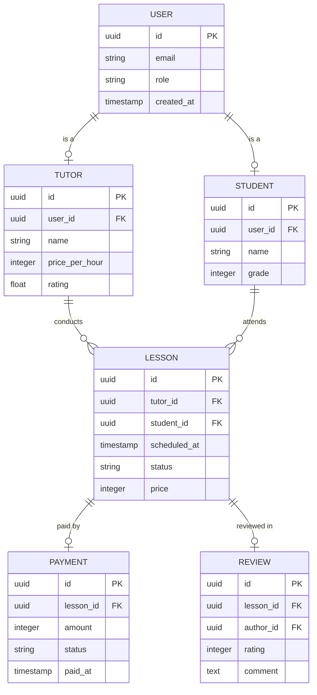
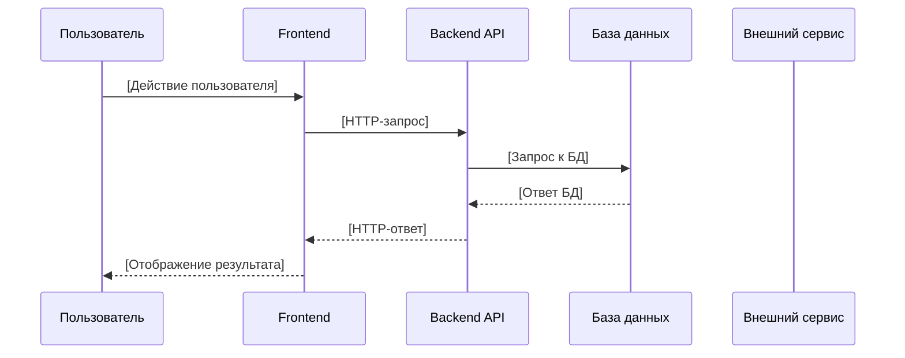
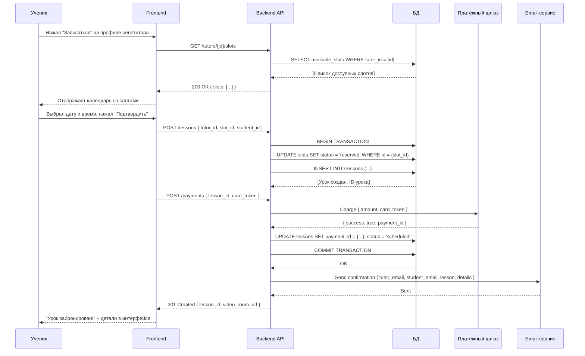
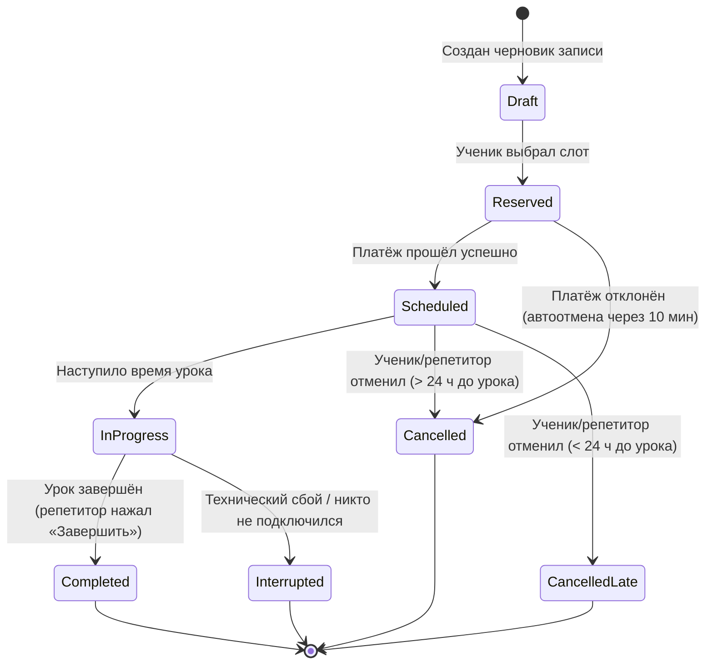

# 7.5 Бизнес-логика и разработка MVP — Полная инструкция

## 🎯 Цель этой инструкции

Спроектировать **бизнес-логику продукта** — масштабируемую, консистентную технологическую систему на основе сформированных требований — и **разработать MVP** по методологии, минимизирующей риски и time-to-market.

**Время на выполнение:** 8–12 часов на проектирование бизнес-логики (без учёта самой разработки); сроки разработки MVP зависят от команды.
**Уровень:** Средний — нужно чёткое понимание требований из [[7.4 Формирование требований]]
**После выполнения:** У тебя будет модель сущностей (Entity Model), диаграммы состояний и последовательностей, настроенный процесс разработки MVP и план управления проектом.

---

## 📋 Что такое Бизнес-логика и MVP?

### Простыми словами: Бизнес-логика

**Бизнес-логика (Business Logic)** — это «правила игры» внутри продукта: из каких объектов он состоит, как они связаны между собой, что может делать каждый объект и при каких условиях.

Ключевой вопрос бизнес-логики:
> «Из каких объектов, свойств, функций и взаимосвязей должен состоять продукт, чтобы с желаемым качеством удовлетворить потребности потребителей?»

**Аналогия:** Представь, что ты проектируешь систему документооборота в библиотеке. Есть Книга, Читатель, Абонемент, Выдача. У каждой сущности — свои атрибуты (у Книги: название, автор, ISBN, количество экземпляров) и правила: Читатель может взять не более 5 книг одновременно, выдача оформляется на 14 дней, за просрочку начисляется штраф. Это и есть бизнес-логика — правила, которые описывают, как устроен мир внутри продукта.

Непротиворечивость и полнота бизнес-логики продукта определяют его возможности по созданию, масштабированию и дистрибуции ценности до потребителя.

### Простыми словами: MVP

**MVP (Minimum Viable Product)** — это НЕ «продукт с минимальным набором функций». Это концепция разработки продукта на ранних этапах жизни компании, основанная на научной теории диверсификации рисков.

Понятие ввёл Фрэнк Робинсон из SyncDev в 2001 году под патронажем группы нобелевского лауреата по экономике Уильяма Шарпа. Популяризовали Стив Бланк и Боб Дорф в методологии Customer Development.

**Аналогия с инвестиционным портфелем:** Шарп доказал, что диверсифицированный портфель даёт лучший ROI при меньшем риске, чем ставка на одну акцию. Робинсон применил тот же принцип к разработке продукта: вместо того чтобы сделать большой продукт (= один большой риск), разрабатывай и верифицируй параллельно и синхронно (= диверсификация рисков).

---

## 🎯 Зачем это нужно?

### 3 главные причины

1. **Ясные требования → масштабируемая система (меньше технического долга)**
   Ясные и непротиворечивые функциональные и нефункциональные требования позволяют сформировать масштабируемую и консистентную технологическую систему. Это сокращает время для дальнейшего развития продукта и риски формирования технического долга (Technical Debt) — ситуации, когда каждое новое изменение в продукте становится всё дороже и дольше.

2. **Параллельная разработка + верификация = скорость + меньше потерь**
   Истинный смысл MVP — не «минимум фич», а одновременная (параллельная, синхронная) разработка продукта и верификация разработанного на реальных потребителях. Это позволяет получать обратную связь на каждом шаге, а не узнать в конце, что продукт не нужен рынку.

3. **Стартап ищет масштабируемую бизнес-модель — и MVP помогает найти её быстрее**
   По Бланку и Дорфу, стартап — это **временная организация, предназначенная для поиска масштабируемой бизнес-модели**. MVP — это способ разработки до момента, пока эта модель не найдена. Цель не создать «продукт с минимумом фич», а найти правильный баланс, который позволит достичь точки масштабируемости быстрее.

### Что будет плохо без этого шага?

- Продукт без проработанной бизнес-логики превращается в «спагетти-код» — его сложно масштабировать и поддерживать
- Попытка разработать «полный продукт» до верификации на рынке — самый распространённый способ потратить ресурсы и всё равно переделывать
- Неправильное понимание MVP приводит к тому, что команда либо делает слишком мало (продукт невозможно использовать), либо слишком много (теряется весь смысл быстрой итерации)

---

## 📊 Структура этого шага

| Блок | Артефакт | Для чего |
|---|---|---|
| Бизнес-логика | Entity Model (модель сущностей) | Основа архитектуры данных |
| Бизнес-логика | Sequence Diagrams | Описание взаимодействий |
| Бизнес-логика | State Modelling | Состояния ключевых сущностей |
| Бизнес-логика | Дизайн-система + глоссарий | Единый язык команды |
| MVP | Backlog + MoSCoW | Что именно разрабатываем |
| MVP | Sprint Plan | Когда и в каком порядке |
| MVP | Параллельная верификация | Схема обратной связи во время разработки |

---

## 🚀 Phase 0: Подготовка

### Что тебе понадобится

**Инструменты:**
- [ ] draw.io / Miro / Figma — для Entity Model и диаграмм
- [ ] Notion / Confluence — для документации бизнес-логики
- [ ] Linear / Jira — для backlog и sprint planning
- [ ] Figma — для дизайн-системы
- [ ] Mermaid / PlantUML — для Sequence и State диаграмм

**Артефакты с предыдущих шагов (вход):**
- [ ] Спецификация требований из [[7.4 Формирование требований]] — User Stories, Use Cases, NFR
- [ ] Screen Map — карта экранов и user flows
- [ ] Ценностные предложения и портреты сегментов из Stage 3–4
- [ ] Результаты скоринга решений из [[7.3 Валидация решения и скоринг]]

**Время:** Планируй 2 дня на проектирование бизнес-логики до начала разработки

---

## 📝 Phase 1: Entity Model — модель сущностей

### Что такое Entity Model?

**Entity Model (модель сущностей, Entities Analysis)** — модель описания бизнес-логики продукта, представленная в виде перечня главных объектов системы (сущностей), их взаимосвязей и атрибутов.

Правильный выбор сущностей и их взаимосвязей является ключевым фактором для построения масштабируемых, гибких и консистентных продуктов.

**Простыми словами:** Сущность — это «существительное» в описании твоего продукта. Пользователь, Урок, Платёж, Репетитор, Отзыв — всё это сущности. Entity Model описывает, как они связаны между собой.

**Типы связей между сущностями:**

| Тип связи | Что означает | Пример |
|---|---|---|
| Ассоциация | Объекты связаны, но не зависят друг от друга жёстко | Пользователь ↔ Сообщение |
| Генерализация (наследование) | Один объект является частным случаем другого | Ученик и Репетитор → Пользователь |
| Композиция | Часть не может существовать без целого | Адрес → Пользователь (адрес не бывает «бесхозным») |
| Агрегация | Часть может существовать независимо от целого | Репетитор ↔ Тег предмета (тег «Алгебра» существует отдельно) |

**Кратность (Cardinality):**
- 1:1 — один-к-одному (один пользователь — один профиль)
- 1:N — один-ко-многим (один репетитор — много уроков)
- N:M — многие-ко-многим (много учеников ↔ много репетиторов)

### Step 1.1: Выяви все сущности системы

**Действия:**
1. Возьми все User Stories и Use Cases
2. Выпиши все существительные, упомянутые как объекты системы
3. Убери дубли и абстракции — оставь только реальные объекты данных
4. Проверь: является ли это «вещью», у которой есть свойства и которая меняет состояние?

**Шаблон сущности:**

```markdown
## Сущность: [Название]

**Описание:** [Что это в продукте]

### Атрибуты
| Атрибут | Тип данных | Обязательный | Описание |
|---|---|---|---|
| id | UUID | Да | Уникальный идентификатор |
| created_at | Timestamp | Да | Дата создания |
| [атрибут] | [тип] | [Да/Нет] | [Описание] |

### Связи
| Связь с | Тип | Кратность | Описание |
|---|---|---|---|
| [Сущность] | [Ассоциация/Генерализация/...] | [1:1 / 1:N / N:M] | [Описание] |
```

**Пример: AI-сервис подбора репетиторов**

```markdown
## Сущность: User (Пользователь)

**Описание:** Базовая сущность любого зарегистрированного в системе участника

### Атрибуты
| Атрибут | Тип данных | Обязательный | Описание |
|---|---|---|---|
| id | UUID | Да | Уникальный идентификатор |
| email | String | Да | Логин (уникальный) |
| password_hash | String | Да | Хэш пароля (bcrypt) |
| role | Enum | Да | student / tutor / admin |
| created_at | Timestamp | Да | Дата регистрации |
| is_verified | Boolean | Да | Email подтверждён |

### Связи
| Связь с | Тип | Кратность | Описание |
|---|---|---|---|
| Student | Генерализация | 1:1 | Если role = student, имеет профиль ученика |
| Tutor | Генерализация | 1:1 | Если role = tutor, имеет профиль репетитора |

---

## Сущность: Tutor (Репетитор)

**Описание:** Профиль поставщика услуги — преподавателя

### Атрибуты
| Атрибут | Тип данных | Обязательный | Описание |
|---|---|---|---|
| id | UUID | Да | Уникальный идентификатор |
| user_id | UUID | Да | FK → User |
| name | String | Да | Имя для отображения |
| bio | Text | Нет | Описание опыта |
| price_per_hour | Integer | Да | Цена в рублях |
| subjects | Array[UUID] | Да | Теги предметов |
| rating | Float | Нет | Средний рейтинг (из Lesson Reviews) |
| is_approved | Boolean | Да | Проверен модератором |

### Связи
| Связь с | Тип | Кратность | Описание |
|---|---|---|---|
| User | Генерализация | 1:1 | Каждый репетитор — пользователь |
| Lesson | Ассоциация | 1:N | Один репетитор проводит много уроков |
| TimeSlot | Композиция | 1:N | Слоты не существуют без репетитора |
| Subject | Агрегация | N:M | Репетитор ведёт несколько предметов |

---

## Сущность: Lesson (Урок)

### Атрибуты
| Атрибут | Тип данных | Обязательный | Описание |
|---|---|---|---|
| id | UUID | Да | Уникальный идентификатор |
| tutor_id | UUID | Да | FK → Tutor |
| student_id | UUID | Да | FK → Student |
| scheduled_at | Timestamp | Да | Запланированное время начала (UTC) |
| duration_min | Integer | Да | Длительность в минутах |
| status | Enum | Да | scheduled / in_progress / completed / cancelled |
| price | Integer | Да | Стоимость в рублях (зафиксирована при бронировании) |
| payment_id | UUID | Нет | FK → Payment |
| video_room_url | String | Нет | Ссылка на видеозвонок |
```

---

### Step 1.2: Построй Entity Relationship Diagram

После описания всех сущностей — визуализируй их связи. Это главный артефакт для архитекторов и backend-разработчиков.

**Шаблон ERD (текстовый формат для Mermaid):**



---

## 📝 Phase 2: Sequence Diagrams — диаграммы последовательности

### Что такое Sequence Diagrams?

**Sequence Diagrams (диаграммы последовательности)** используются для отображения информации, которая передаётся между объектами или процессами системы при их взаимодействии во время выполнения сценария пользователя. Последовательность передачи сообщений реализована через временную шкалу (ось времени направлена сверху вниз).

**Когда использовать:** Для каждого ключевого Use Case или User Story, где важен порядок обмена данными между несколькими компонентами (frontend, backend, база данных, внешние сервисы).

### Step 2.1: Нарисуй Sequence Diagram для ключевого сценария

**Шаблон (текстовый формат для Mermaid):**



**Пример: Сценарий «Запись на урок»**



---

## 📝 Phase 3: State Modelling — моделирование состояний

### Что такое State Modelling?

**State Modelling (моделирование состояний)** описывает различные возможные состояния ключевых сущностей внутри системы, каким образом сущность меняется из одного состояния в другое, и что может случиться с сущностью при переходе.

**Когда использовать:** Для любой сущности, которая имеет жизненный цикл — меняет своё состояние под влиянием событий.

### Step 3.1: Задокументируй State Diagrams ключевых сущностей

**Пример: State Diagram сущности Lesson**



**Для каждого состояния документируй:**

```markdown
## Состояния Lesson

| Состояние | Описание | Разрешённые переходы |
|---|---|---|
| Draft | Временная запись создана, слот зарезервирован | → Reserved, → Cancelled |
| Reserved | Ожидается оплата (10 минут) | → Scheduled, → Cancelled |
| Scheduled | Урок оплачен и запланирован | → InProgress, → Cancelled, → CancelledLate |
| InProgress | Урок проводится сейчас | → Completed, → Interrupted |
| Completed | Урок успешно завершён | — |
| Cancelled | Отменён без штрафа | — |
| CancelledLate | Отменён с удержанием штрафа (50% стоимости) | — |
| Interrupted | Прерван по техническим причинам (полный возврат) | — |
```

---

## 📝 Phase 4: Истинная природа MVP и стратегия разработки

### Откуда берётся MVP и почему его все неправильно понимают

В 2001 году Фрэнк Робинсон из SyncDev под патронажем группы нобелевского лауреата Уильяма Шарпа сформулировал концепцию Minimum Viable Product. Шарп получил Нобелевскую премию за то, что доказал: связь между риском и доходностью портфеля определяется рынком, а диверсифицированный портфель даёт лучший ROI при меньших рисках.

Робинсон и команда применили ту же логику к разработке продуктов:
- Продукт без «подтверждённых» рынком фич провалится — будет никому не нужным
- Но продукт с огромным количеством фич значительно увеличивает риски компании
- Решение по Шарпу: **одновременная (параллельная, синхронная) разработка и верификация на рынке**

Термин MVP популяризовали Стив Бланк и Боб Дорф в Customer Development. Они прямым текстом написали: существует MVP с базовым функционалом и MVP с расширенным функционалом. **MVP — это концепция разработки, а не «продукт с минимальным набором фич».**

**Что такое стартап по Бланку и Дорфу:**
> Стартап — это **временная организация, предназначенная для поиска масштабируемой бизнес-модели**.

Это значит: MVP — это подход к разработке продукта до того момента, **пока компания не найдёт масштабируемую бизнес-модель**. На этом пути она может создать как продукт с «минимальным набором фич», так и продукт с «каким угодно набором фич». Главное — найти баланс, чтобы достичь точки масштабируемости быстрее.

**Частая ошибка:** Команды думают, что MVP — это «скейтборд вместо машины» (знаменитая картинка). Это иллюстрация **принципа итеративности** — каждая версия рабочая и используемая. Но это НЕ означает «всегда делай самое минимальное». Иногда для верификации нужен автомобиль, а не скейтборд — если проблема пользователя требует именно автомобиля.

### Step 4.1: Определи правильный уровень MVP для твоего продукта

**Задай себе 5 вопросов:**

```markdown
## Диагностика MVP

### Q1: Что является核心 core user flow?
[Описание единственного пути, который создаёт основную ценность]

### Q2: Без каких элементов этот flow невозможен?
[Минимальная инфраструктура: авторизация, ключевые функции, основные данные]

### Q3: Что мы хотим верифицировать в первую очередь?
[Гипотезы, которые нужно проверить до расширения функционала]

### Q4: Какой функционал ускорит верификацию?
[Иногда добавление «нелминимальной» фичи даёт быстрый ответ на ключевой вопрос]

### Q5: Что блокирует принятие продукта пользователем, если отсутствует?
[Всё это — Must Have]
```

**Пример диагностики MVP (AI-сервис подбора репетиторов):**

```markdown
## Диагностика MVP: TutorAI

### Core user flow
Родитель → описывает потребность → видит AI-подборку репетиторов → записывается → оплачивает → проводит урок

### Без чего flow невозможен
- Регистрация ученика и репетитора
- Заполнение профиля репетитора
- AI-подборка (хотя бы базовая фильтрация)
- Выбор слота в расписании
- Онлайн-оплата
- Видеозвонок

### Что верифицируем в первую очередь
- Гипотеза 1: Родители готовы использовать AI-подборку (а не искать сами)
- Гипотеза 2: Репетиторы готовы платить % комиссии
- Гипотеза 3: Конверсия «просмотр профиля → запись» выше 10%

### Что ускорит верификацию
- Система рейтингов и отзывов (даёт сигнал доверия) → добавляем в MVP
- Онбординг для репетитора с подсказками → добавляем в MVP

### Что блокирует принятие
- Если нет онлайн-оплаты → пользователи не доверяют платить наличными
- Если нет верификации репетитора → родители боятся привести незнакомца к ребёнку
→ Оба Must Have
```

---

### Step 4.2: Параллельная разработка и верификация

Это ключевое отличие правильной реализации MVP: ты **не ждёшь, пока всё будет готово**, а запускаешь верификацию на каждом шаге.

**Схема параллельной разработки:**

```
Sprint 1: [Разрабатываем Auth + Профиль репетитора]
          ↕ Верификация: Показываем профили 5 репетиторам → получаем фидбек по UX профиля

Sprint 2: [Разрабатываем поиск + подборку]
          ↕ Верификация: 10 родителей тестируют поиск → проверяем гипотезу AI-подборки

Sprint 3: [Разрабатываем запись + оплату]
          ↕ Верификация: Первые 3 реальные транзакции → проверяем платёжную воронку

Sprint 4: [Разрабатываем видеозвонок + завершение урока]
          ↕ Верификация: 5 первых уроков → проверяем experience занятия
```

**Шаблон плана верификации:**

```markdown
## Plan параллельной верификации

| Sprint | Что разрабатываем | Что верифицируем | Метод | Кто участвует | Метрика успеха |
|---|---|---|---|---|---|
| 1 | Auth + Профили | UX профиля репетитора | Usability test | 5 репетиторов | Завершение заполнения профиля > 80% |
| 2 | Поиск + AI-подборка | Релевантность подборки | Тест подборки | 10 родителей | Match Score > 7/10 у ≥ 60% |
| 3 | Запись + Оплата | Конверсия в оплату | A/B, реальные платежи | Первые 20 пользователей | Конверсия > 15% |
| 4 | Видеозвонок + Завершение | Качество опыта урока | NPS-опрос | Первые 10 пар | NPS > 40 |
```

---

## 📝 Phase 5: Управление проектом и time-to-market

### Step 5.1: Составь backlog и план спринтов

Процесс разработки MVP по сложности не уступает процессам валидации гипотез. Правильное управление проектом позволяет сократить риски и время вывода продукта на рынок (time-to-market).

**Шаблон backlog для MVP:**

```markdown
# MVP Backlog

## Sprint 1 (Дата: ДД.ММ – ДД.ММ)
**Цель спринта:** Рабочая авторизация + базовые профили

| ID | User Story | Story Points | Исполнитель | Статус |
|---|---|---|---|---|
| US-001 | Регистрация ученика | 3 | [Разработчик] | To Do |
| US-002 | Авторизация (email + пароль) | 3 | [Разработчик] | To Do |
| US-003 | Создание профиля репетитора | 5 | [Разработчик] | To Do |
| US-004 | Загрузка фото профиля | 2 | [Разработчик] | To Do |
| **Итого SP:** | | **13** | | |

## Sprint 2 (Дата: ДД.ММ – ДД.ММ)
**Цель спринта:** AI-подборка + просмотр профилей

| ID | User Story | Story Points | Исполнитель | Статус |
|---|---|---|---|---|
| US-007 | AI-подборка по запросу | 8 | [Разработчик] | To Do |
| US-008 | Просмотр профиля репетитора | 3 | [Разработчик] | To Do |
| US-009 | Фильтрация результатов | 5 | [Разработчик] | To Do |
| **Итого SP:** | | **16** | | |
```

### Step 5.2: Используй инструменты снижения рисков time-to-market

**Практики сокращения time-to-market:**

| Практика | Что даёт | Как применить |
|---|---|---|
| Feature Flags | Можно включать/выключать фичи без деплоя | Оборачивай новые фичи в if(featureEnabled) |
| CI/CD pipeline | Автоматический деплой каждого коммита на staging | Настрой GitHub Actions / GitLab CI |
| Готовые компоненты | Не изобретай колесо для типовых задач | Используй UI-библиотеки, готовые платёжные SDK |
| Definition of Done | Нет споров «готово или нет» | Согласован заранее (из [[7.4 Формирование требований]]) |
| Timeboxing | Спринты фиксированной длины | 1–2 недели на спринт |

### Step 5.3: Определи дизайн-систему и глоссарий

**Дизайн-система** — формализация предметной области продукта при помощи элементов пользовательского интерфейса. Определяет атомарные единицы интерфейса (кнопки, цветовая палитра, шрифты, расстояния) и паттерны взаимодействия.

**Зачем нужна до начала разработки:**
- Разработчики используют одни и те же компоненты — нет разброса в реализации
- Дизайнер не рисует каждый экран с нуля — берёт готовые компоненты
- Продукт выглядит единообразно без дополнительного согласования

**Минимальный стек дизайн-системы для MVP:**

```markdown
# Дизайн-система: [Название продукта] v0.1

## Цветовая палитра
| Роль | Код | Использование |
|---|---|---|
| Primary | #3B82F6 | Основные кнопки, акценты |
| Secondary | #6366F1 | Вторичные элементы |
| Success | #10B981 | Успешные состояния |
| Error | #EF4444 | Ошибки, предупреждения |
| Neutral 50 | #F9FAFB | Фоновые поверхности |
| Neutral 900 | #111827 | Основной текст |

## Типографика
| Стиль | Шрифт | Размер | Вес |
|---|---|---|---|
| H1 | Inter | 32px | 700 |
| H2 | Inter | 24px | 600 |
| Body | Inter | 16px | 400 |
| Caption | Inter | 12px | 400 |

## Компоненты (ссылка на Figma)
[https://figma.com/...]

## Сетка
- Мобильная: 4 колонки, 16px gap
- Десктоп: 12 колонок, 24px gap, max-width: 1280px
```

---

## ✅ Success Criteria

После выполнения этой инструкции ты должен иметь:

✅ **Entity Model** описана: все ключевые сущности с атрибутами и связями задокументированы
✅ **ERD (Entity Relationship Diagram)** построен и согласован с командой разработки
✅ **Sequence Diagrams** нарисованы для всех Must Have Use Cases
✅ **State Diagrams** созданы для всех сущностей с жизненным циклом
✅ **Стратегия MVP** определена: зафиксировано, что входит в первый релиз и ПОЧЕМУ
✅ **Backlog** сформирован и приоритизирован по спринтам
✅ **Схема параллельной верификации** задокументирована: что верифицируем в каждом спринте
✅ **Дизайн-система v0.1** готова: палитра, типографика, базовые компоненты в Figma
✅ **Глоссарий** согласован: единые определения для ключевых сущностей

**Context Ripeness:** достигается при ≥ 75% выполнения чеклиста.

---

## 🚨 Troubleshooting

### Problem 1: «Не знаем, какие сущности нужны для начала»

**Solution:**
Начни с одного core user flow и выпиши все существительные. Только те объекты, которые нужны для прохождения этого flow — это стартовый набор сущностей. Добавляй по мере появления новых Use Cases.

### Problem 2: «Разработчики говорят, что Entity Model неправильная — придётся переделывать»

**Solution:**
Entity Model — это всегда гипотеза. Важно: сделать её достаточно гибкой, чтобы поддерживала Known unknowns (известные неизвестные). Конкретная проблема чаще всего в выборе типа связи (1:N vs N:M). Проведи воркшоп с командой по 2–3 спорным связям. Используй реальные сценарии: «Может ли один ученик иметь несколько активных репетиторов?» — если да, это N:M.

### Problem 3: «Команда постоянно спорит, что входит в MVP, а что нет»

**Solution:**
Применяй строгий критерий: «Можно ли использовать продукт по core user flow без этой фичи?» Если ДА — это не Must Have. Спор о MVP — обычно следствие отсутствия чётко зафиксированных гипотез, которые проверяет MVP. Зафиксируй 3–5 гипотез письменно. Всё, что не помогает проверить эти гипотезы, — за пределами MVP.

### Problem 4: «Мы не делаем верификацию параллельно с разработкой — некогда»

**Solution:**
Это риск потратить ресурсы на то, что не нужно рынку. Выдели минимальный ресурс: PM тратит 2–3 часа в неделю на звонки с 2–3 пользователями, которые смотрят на текущий staging. Этого достаточно, чтобы поймать крупные проблемы до финала разработки.

### Problem 5: «Не знаем, как правильно оценить Story Points»

**Solution:**
Story Points — это относительная оценка сложности, не часы. Используй Planning Poker: каждый в команде одновременно называет оценку (1, 2, 3, 5, 8, 13, 21), затем обсуждаете расхождения. За baseline берите «простую задачу» (например, «добавить поле в форму» = 1 SP). Со временем команда откалибрует собственную шкалу.

### Problem 6: «Технический долг накапливается уже в первом спринте»

**Solution:**
Это нормально на старте, но важно контролировать. Выдели 15–20% capacity каждого спринта на рефакторинг. Задокументируй технический долг (tech debt backlog) с пометками о критичности. Полностью избежать tech debt на старте нельзя, но избегать его осознания — опасно.

---

## 📚 Templates & Tools

### Шаблон полной документации бизнес-логики

```markdown
# Бизнес-логика: [Название продукта] v[Версия]

**Дата:** [YYYY-MM-DD]
**Статус:** [Draft / Review / Approved]

---

## 1. Модель сущностей
### 1.1 Перечень сущностей
[Таблица: Сущность | Описание | Ключевые атрибуты]

### 1.2 Описание сущностей
[Подробное описание каждой сущности по шаблону]

### 1.3 ERD
[Mermaid-диаграмма или ссылка на draw.io]

## 2. Диаграммы последовательности
### 2.1 [Название Use Case 1]
[Mermaid sequenceDiagram]

### 2.2 [Название Use Case 2]
[...]

## 3. Диаграммы состояний
### 3.1 [Название сущности 1] — жизненный цикл
[Mermaid stateDiagram-v2]

## 4. Нефункциональные требования
[Из [[7.4 Формирование требований]]]

## 5. Глоссарий
[Таблица терминов и определений]

## 6. Дизайн-система
[Ссылка на Figma]
```

### Шаблон MVP Decision Log

Документируй ключевые решения по MVP, чтобы не переспорить одно и то же несколько раз:

```markdown
# MVP Decision Log

| Дата | Решение | Альтернатива | Обоснование | Кто принял |
|---|---|---|---|---|
| 2026-06-20 | Включить рейтинги в MVP | Отложить до v1.1 | Без рейтингов конверсия упадёт — родители не доверяют незнакомым | PM + CTO |
| 2026-06-21 | Видеозвонок через Jitsi (open source) | Строить свой | Экономия 3 спринтов. Jitsi покрывает наши NFR по надёжности | CTO |
```

---

## 🎓 Further Reading

### Первоисточники
- **PAF Business Logic Design** — https://productframework.ru/activities/business_logic_design — канонический источник по проектированию бизнес-логики в PAF
- **Frank Robinson, SyncDev** — «Release 1.0», 2001 — оригинальная статья о MVP (поиск: «Frank Robinson MVP SyncDev»)
- **Steve Blank, Bob Dorf** — «Стартап: настольная книга основателя» — Customer Development и правильное понимание MVP
- **William F. Sharpe** — «Capital Asset Prices: A Theory of Market Equilibrium» (1964) — теоретическая основа диверсификации рисков, на которой базируется концепция MVP

### Моделирование
- **Martin Fowler** — «Patterns of Enterprise Application Architecture» — классика Entity Modeling и паттернов бизнес-логики
- **Domain-Driven Design (DDD)** — Eric Evans — глубокий подход к описанию бизнес-логики через домены
- **UML Distilled** — Martin Fowler — краткий практичный гайд по UML (Sequence, State, Class диаграммы)

### Управление проектом
- **Scrum Guide** — https://scrumguides.org — официальный гайд по Scrum
- **Agile Manifesto** — https://agilemanifesto.org — принципы гибкой разработки
- **Shape Up** — Basecamp (Ryan Singer) — альтернативный подход к MVP-разработке без спринтов

---

## ❓ FAQ

### Q: В чём разница между Entity Model и базой данных?
**A:** Entity Model — это концептуальная модель: «что существует в нашем мире и как связано». База данных — это физическая реализация: таблицы, индексы, ключи. Сначала делается Entity Model (на уровне бизнеса), затем на её основе проектируется схема базы данных (на уровне техники). Они похожи, но не идентичны — в БД нередко добавляются технические таблицы (например, для аудит-лога), которых нет в Entity Model.

### Q: Сколько времени занимает разработка MVP?
**A:** Зависит от команды и объёма. Типичные сроки: команда 3–5 человек (2 backend, 1 frontend, 1 дизайнер, PM) — MVP за 2–4 месяца. Команда 1–2 человека (fullstack) — 4–8 месяцев. Признак неправильно выбранного MVP: если оценка больше 6 месяцев, скорее всего в него попало слишком много.

### Q: Нужно ли документировать бизнес-логику, если команда маленькая?
**A:** Да, и чем меньше команда, тем важнее. В маленькой команде знания концентрируются в головах одного-двух людей. Документация страхует от «автобусного фактора» (bus factor) — риска, что ключевой человек уйдёт и унесёт с собой всё понимание системы.

### Q: Как работать с MVP, если инвесторы требуют «полный продукт»?
**A:** MVP — это не «сырой» продукт. Это продукт, полностью покрывающий core user flow, надёжный и качественный — просто без вторичного функционала. Инвесторам объясняй так: «Мы не срезаем углы, мы фокусируемся: делаем одно качественно и проверяем, прежде чем строить следующее».

### Q: Когда заканчивается MVP и начинается «настоящий продукт»?
**A:** Когда найдена масштабируемая бизнес-модель. По Бланку и Дорфу — это момент, когда метрики подтверждают воспроизводимый и масштабируемый способ привлечения и удержания клиентов. На практике: когда ты перестаёшь ставить под сомнение базовую модель и начинаешь масштабировать то, что работает. Это и есть переход к Product Growth — следующему большому этапу после PMF.

---

**Version:** 1.0
**Last updated:** 2026-06-20
**Назад:** [[7.4 Формирование требований]] · **Дальше:** [[7.6 Внедрение аналитики и критерии PMF]]
