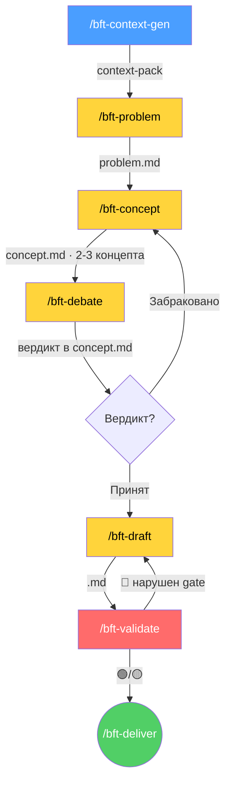

<p align="center">
  <strong>PO-Helper</strong><br>
  <em>AI-Native продуктовая операционка: multi-step пайплайны для ИИ-агентов (OKR · БФТ · Blueprint) + методология PAF (Нексус / Кортекс / Product Sprint) и Product Discovery от Идеи до PCF</em>
</p>

---

> **Принцип сквозной:** структурируй известное, фиксируй неизвестное. Каждый факт ← источник (трекер / PO / wiki / roadmap / `[S1]–[S7]`). Нет источника → `[УТОЧНИТЬ]`. Нулевой допуск к галлюцинациям.
>
> Архитектура пайплайнов — зеркало [sa-helper](https://gitlab.com/boboden541/sa-helper) FNR-pipeline, адаптированное под forward-looking планирование: якорь смещён с `code:line` на трекер / решения PO / wiki / roadmap. Каждая стадия — **отдельная команда, отдельная роль, STOP-пауза для ревью**.

Репозиторий объединяет два слоя:

1. **Инструменты (`.claude/`)** — исполняемые Claude-команды, навыки и агенты: пайплайны OKR, БФТ, Blueprint, контекст-брокер и операционка PAF (GROUND Vault).
2. **Знание-база (методология)** — `AI-PROCESSES/`, `AI-TRANSFORMATION/`, `TRADITIONAL/`, `RL/`: исполняемый Product Discovery, принципы PAF, raw-раннбуки и Research Library.

---

## 🧰 Пайплайны и команды

| Пайплайн | Команды | Что генерирует |
|:---|:---|:---|
| **OKR** | `/okr-context-gen → /okr-objectives → /okr-key-results → /okr-debate → /okr-enrich → /okr-validate → /okr-deliver` | Квартальный OKR (OBJ + KR + IMP + образ результата/действия + метрики/риски) |
| **БФТ** | `/bft-context-gen → /bft-problem → /bft-concept → /bft-debate → /bft-draft → /bft-validate` (+ `/bft-deliver`, `/bft-context-gen-deep`) | Бизнес-Функциональные Требования по эпику |
| **Blueprint** | `/blueprint-context → (/blueprint-extract \| /blueprint-discover) → /blueprint-model → /blueprint-render` | Scope Model → Grid-таблица + Mermaid-диаграмма продукта |
| **Контекст** | `/po-research` | Контекст-пак уровня Deep Research по топику (sprint/epic/risk/decision/bft) |
| **Операционка PAF** | `/paf-init`, `/paf-nexus-create` | GROUND Vault: config + каталог Нексусов под продукт |

---

## ⚡ Установка

```bash
# в корне проекта:
curl -ksSL https://raw.githubusercontent.com/kibarik/po-helper/main/install.sh | bash
```

Или из клона:
- `bash install.sh` — установка (существующие файлы не трогаются)
- `bash install.sh --update` — обновление generic-слоя (framework-файлы перезаписываются)

В любом режиме `.claude/domain-profile.md` проекта и доменные данные (`GROUND/`) **не трогаются** — обновляется только фреймворк.

### Доменный профиль (адаптация под проект)

po-helper — generic-фреймворк. Предметная область выносится в **доменный профиль**:

```bash
cp .claude/domain-profile.template.md .claude/domain-profile.md
# заполнить: пути планирования, команды, трекер, wiki, глоссарий, стейкхолдеры
```

Команды читают профиль и подставляют пути (`{planning_root}`, `{okr_workspace}`, `<workspace>`…) и доменные термины. Примеры в навыках (`examples/`) — иллюстративные; универсальна структура, а не домен.

### MCP-серверы (`.mcp.json`)

| Сервер | Назначение |
|:---|:---|
| `ruflo` | Память, swarm, hooks-интеллект (агентная оркестрация) |
| `excalidraw` | Рендер диаграмм/схем (MustHave для Blueprint/визуализаций) |

---

## 📊 OKR — квартальное планирование

**7 стадий, каждая = отдельный запуск + STOP-пауза:**

| Стадия | Команда | Роль | Артефакт |
|:---|:---|:---|:---|
| Контекст | `/okr-context-gen` | Context Builder | `context-pack.md` |
| Цели | `/okr-objectives` | Strategy Analyst (3-5 OBJ) | `objectives.md` |
| Key Results | `/okr-key-results` | KR Designer (KR + IMP) | `key-results.md` |
| Дебаты | `/okr-debate` | Devil's Advocate (SMART, 3 раунда) | вердикт в `key-results.md` |
| Обогащение | `/okr-enrich` | PO + Architect (образ действия + метрики) | `enriched-okr.md` |
| Валидация | `/okr-validate` | Validator (12 hard gates + Светофор) | `validation.md` |
| Отгрузка | `/okr-deliver` | Deliverer (публикация в roadmap/INDEX/KR-EPIC-MAP) | финальный OKR |

Итоговый артефакт — таблица `OBJ | KR | IMP | Название | Образ результата | Образ действия | Метрики&риски&зависимости` с тегами `[RESEARCH]/[POC]/[BUG]/[ACTIVITY]`, IMP-шкалой 1–9 и БЫЛО→СТАЛО для технических KR.

---

## 📊 БФТ — Бизнес-Функциональные Требования (multi-step, как sa-helper)



**Стадии, каждая = отдельный запуск + STOP-пауза:**

| Стадия | Команда | Роль | Артефакт |
|:---|:---|:---|:---|
| Контекст | `/bft-context-gen` (быстрый) · `/bft-context-gen-deep` (полный) | Context Builder (Кортексы + Нексусы) | `artefacts/bft-context-pack.md` |
| Проблема | `/bft-problem` | Problem Analyst (диагноз, без решения) | `artefacts/problem.md` |
| Концепты | `/bft-concept` | Solution Designer (2-3 варианта) | `artefacts/concept.md` |
| Дебаты | `/bft-debate` | Architect vs Devil's Advocate | вердикт в `artefacts/concept.md` |
| Требования | `/bft-draft` | Requirements Writer | `<epic>.md` (финальный БФТ) |
| Валидация | `/bft-validate` | Validator (15 hard gates + Светофор) | `artefacts/validation.md` |
| Отгрузка | `/bft-deliver` | Deliverer (JIRA Эпик + Confluence + связи) | `delivery.md` |

**Раскладка эпика:** финальный БФТ — в корне `<workspace>/<epic>/<epic>.md`; промежуточные артефакты — в `<workspace>/<epic>/artefacts/`.

**Циклы:** дебаты забракованы → `/bft-concept`; валидация 🔴 → `/bft-draft`.

---

## 🗺️ Blueprint — карта объёма продукта (Scope Model)

Из готового БФТ или с нуля строит **Scope Model** (journey × слои, scope-маркеры) и рендерит Grid-таблицу + Mermaid-диаграмму с блокирующим render-гейтом.

```
/blueprint-context  → выбор режима (ENRICH | SCRATCH)
   ├─ [enrich]  /blueprint-extract   → Scope Model из БФТ (grounded, trace к разделам)
   └─ [scratch] /blueprint-discover  → Scope Model исследованием (context-gen, scouting, problem-analyst, Nexus)
/blueprint-model    → нормализация + self-review гейт (omissions + hallucinations)
/blueprint-render   → Grid + Mermaid + render-гейт → GROUND/BLUEPRINT/<task>/blueprint.md
```

- Каноническая модель: `GROUND/BLUEPRINT/<task>/scope-model.yaml` (схема — `sa_documentation/blueprint_schema.md`).
- Валидатор: `sa_documentation/validate_scope_model.py`; рендер-гейт: `sa_documentation/blueprint_render.py` (mmdc → npx → блок).
- Мост к экосистеме: после `bft-writer`; верхнеуровневая связь с `/arch-gen` (C4) и `/data-trace` (dataflow).

---

## 🌱 PAF — операционка AI-Native команды (GROUND Vault)

**GROUND Vault** — персонализированный продуктовый контекст: Кортекс цифровизует контекст продукта в насыщенный **Нексус** (граф узлов знаний), вокруг которого крутится продуктовый процесс по PAF.

**Онбординг:**
1. `/paf-init` — `config.yaml` + скелет GROUND + дефолтный каталог Нексусов (one-shot после `git clone`).
2. `/paf-nexus-create` *(опц.)* — кастомные Нексусы под продукт (`sellers`, `buyers`, …) и каталожные типы: `team` (People Graph, засев из `team.roster`), `ops-model`, `company`.

**Структура Vault:**
```
GROUND/
├── config.yaml          ← конфиг клиента (создаётся /paf-init)
├── _intake/             ← документы для онбординга
├── NEXUS/               ← узлы знаний (market / customer / product / growth / team)
│   ├── _index.md        ← MOC всех Нексусов
│   └── _registry.yaml   ← реестр Нексусов (дефолт + кастом)
├── PULSE/               ← Progress Pulse (динамика продукта)
├── BUNCH/               ← Банчи (связки инициатив/экспериментов)
└── RESULTS/             ← Harvesting (урожай: результаты и инсайты)
```

**Агенты PAF (`.claude/agents/`)** — аугментация фаз Product Sprint:

| Агент | Фаза | Что делает |
|:---|:---|:---|
| `scouting` | SCOUT | Скаутинг возможностей/угроз через 3 Линзы PAF (Strategy/Business/Product) |
| `bunch-former` | BUNCH | Формирует черновой Банч из текущего состояния Нексуса |
| `pitching-opponent` | PITCH | Red-team Банча (Pitching of Trust) — «валит» слабые аргументы |
| `cp-scorer` | — | Оценивает Confidence Point узлов/гипотез (колесо Гилада, ICE/RICE) |
| `nexus-builder` | — | Создаёт/обновляет узлы Нексуса (отказывается без `sources[]`) |
| `wilting-detector` | PULSE | Пересчитывает ripeness узлов (fresh/ripening/wilting) по `updated + ttl_days` |

---

## 📚 Методология (знание-база)

| Каталог | Что внутри |
|:---|:---|
| `AI-PROCESSES/` | Исполняемый StepByStep-фреймворк: 9 вех Product Discovery (Step 0…8, от Идеи до **PCF**) × движок **Product Sprint** (`PULSE → SCOUT → BUNCH → PITCH → EXECUTE → HARVEST`) + опер-модель и fit-точки (Stage-Gate по Confidence Point) |
| `AI-TRANSFORMATION/` | Принципы построения AI-Native команды по PAF (Тихомиров С.); каждое утверждение маркировано источником `[S1]–[S7]` |
| `TRADITIONAL/` | Raw-раннбуки классического Product Discovery (`RB-STEP-1…8`) — ground truth для AI-PROCESSES |
| `RL/` | Research Library — заметки-исследования (рост, A/B, метрики и пр.) |
| `sa_documentation/` | Схемы (`ground_schema`, `nexus_schema`, `blueprint_schema`), Python-валидаторы (`validate_ground.py`, `validate_scope_model.py`, `nexus_index.py`), `naming_conventions.md`, `nexus_catalog.md`, тесты |
| `docs/superpowers/` | Планы, спеки и compliance-gap анализ |

---

## 🧠 За счёт чего качество

| # | Механизм | Что даёт |
|:--|:--------|:---------|
| 1 | **Разные роли = разные «мозги»** | Нет смешения «диагноз+решение+требование» |
| 2 | **STOP-паузы human-in-the-loop** | PO ревьюит между стадиями, ловит ошибки рано |
| 3 | **Adversarial отдельным запуском** (`/bft-debate`, `pitching-opponent`) | Ломает confirmation bias — другой агент критикует |
| 4 | **Concept-стадия** (2-3 варианта) | Не фиксируем первый пришедший вариант |
| 5 | **Hard Gates** (БФТ — 15 🔴, OKR — 12 🔴) | Валидация = pass/fail, не «постарайся» |
| 6 | **Self-валидация «Светофор»** (🟢/🟡/🔴) | Многопроходная проверка свежим взглядом |
| 7 | **Anchor Ranks** (R1 код As-Is / R2 трекер-wiki-BR-ADR / R3 PO) | Нулевой допуск к галлюцинациям; код-якорь — только для As-Is |
| 8 | **CATWOE** (W→БТ, O→Ревью, E→НФТ) | Структурирует ценность/владельца/ограничения |
| 9 | **Rich picture + worldviews** (SSM) | Конкурирующие взгляды в напряжении, не схлопываются |
| 10 | **Type-distinction gate** (ПТ≠ФТ≠НФТ) | Ловит частую ошибку смешения типов |
| 11 | **Реестр замечаний ревью** (`review_feedback.md`, гейт 15) | Lessons Learned — одну ошибку не повторять дважды |
| 12 | **Confidence Point + ripeness** | Stage-Gate по доверию; протухший контекст подсвечивается |
| 13 | **Артефакты-передачи** | Каждый шаг проверяем, откатываем, переиспользуем |

> ⚠️ **Главное:** НЕ генерируй документ за один промт. STOP после каждой стадии. Только так pipeline эквивалентен sa-helper по качеству.

---

## 📂 Структура

```
.claude/
├── commands/         bft-* (8), okr-* (7), po-research
├── skills/
│   ├── bft-writer/         роли + pipeline + принципы; resources/ (hard_gates 15 🔴, anchor_rules, bft_standards, catwoe, debate_rules, review_feedback, writing_style); examples/ (ideal_bft, golden_bft_example)
│   ├── okr-planner/         OKR-стандарты + hard_gates + ideal_okr
│   ├── po-research/         контекст-брокер (domains, source-registry, pack-template)
│   ├── blueprint-*/         context · discover · extract · model · render
│   ├── paf-init/            настройка GROUND Vault
│   └── paf-nexus-create/    кастомные Нексусы
├── agents/           bunch-former, cp-scorer, nexus-builder, pitching-opponent, scouting, wilting-detector
├── workflows/        po-context-research.js
└── CORTEX.md         статичный фон знаний

GROUND/               PAF Vault (контекст клиента — отслеживается в git)
AI-PROCESSES/         9 шагов Product Discovery × Product Sprint
AI-TRANSFORMATION/    принципы PAF [S1]–[S7]
TRADITIONAL/          raw-раннбуки RB-STEP-1…8
RL/                   Research Library
sa_documentation/     схемы + валидаторы (Python) + тесты
docs/superpowers/     планы / спеки / compliance
.mcp.json             ruflo + excalidraw
install.sh · domain-profile.template.md
```

---

## 🔗 Связь с sa-helper

| sa-helper (reverse-engineering) | po-helper (forward-looking) |
|:---|:---|
| `/context-gen` → repomix (код) | `/bft-context-gen` → Кортексы + Нексусы |
| `/fnr-new-task` → task.md | `/bft-problem` → problem.md |
| `/fnr-concept` → concept.md | `/bft-concept` → concept.md |
| `/fnr-debate` → вердикт | `/bft-debate` → вердикт |
| `/fnr-system-requirements` → BR/FR/NFR | `/bft-draft` → БТ/ПТ/ИТ/ФТ/НФТ |
| `/validate-doc` → аудит | `/bft-validate` → Светофор |
| `/arch-gen` (C4), `/data-trace` | `/blueprint-render` (Scope Model) |
| якорь `code:line` | якорь трекер/PO/wiki/roadmap |

Механика качества идентична; отличается источник «якорей истины».

---

## Лицензия

MIT — используйте, форкайте, адаптируйте под свой домен. Методология PAF (`AI-TRANSFORMATION/`) — CC BY-SA 4.0 (Тихомиров Сергей).
