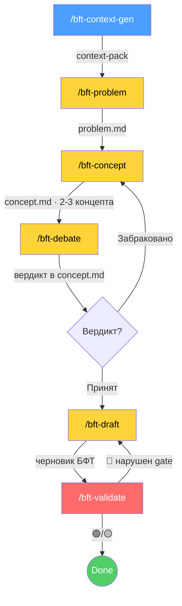

<p align="center">
  <strong>PO-Helper: BFT-Writer</strong><br>
  <em>Multi-step pipeline для ИИ-агентов: генерация БФТ (Бизнес-Функциональные Требования) уровня enterprise</em>
</p>

---

> **БФТ** — структурируй известное, фиксируй неизвестное. Каждый факт ← источник (трекер / PO / ТЗ).
>
> Архитектура — зеркало [sa-helper](https://gitlab.com/boboden541/sa-helper) FNR-pipeline, адаптированная под forward-looking требования: якорь смещён с `code:line` на трекер / решения PO / wiki / СА. Каждая стадия — **отдельная команда, отдельная роль, STOP-пауза для ревью**.

---

## ⚡ Установка

```bash
# в корне проекта:
curl -ksSL https://raw.githubusercontent.com/kibarik/po-helper/main/install.sh | bash
```

Или из клона: `bash install.sh`. Копирует `.claude/{skills/bft-writer,commands}`. Существующие файлы не удаляются.

---

## 📊 Процесс генерации БФТ (multi-step, как sa-helper)



**6 стадий, каждая = отдельный запуск + STOP-пауза:**

| Стадия | Команда | Роль | Артефакт |
|:---|:---|:---|:---|
| Контекст | `/bft-context-gen` | Context Builder | `context-pack.md` |
| Проблема | `/bft-problem` | Problem Analyst (диагноз, без решения) | `problem.md` |
| Концепты | `/bft-concept` | Solution Designer (2-3 варианта) | `concept.md` |
| Дебаты | `/bft-debate` | Architect vs Devil's Advocate | вердикт в `concept.md` |
| Требования | `/bft-draft` | Requirements Writer | черновик БФТ |
| Валидация | `/bft-validate` | Validator (свежий взгляд) | `validation.md` |

**Циклы:** дебаты забракованы → `/bft-concept`; валидация 🔴 → `/bft-draft`.

---

## 🧠 За счёт чего качество

| # | Механизм | Что даёт |
|:--|:--------|:---------|
| 1 | **Разные роли = разные «мозги»** | Нет смешения «диагноз+решение+требование» |
| 2 | **STOP-паузы human-in-the-loop** | PO ревьюит между стадиями, ловит ошибки рано |
| 3 | **Adversarial отдельным запуском** (`/bft-debate`) | Ломает confirmation bias — другой агент критикует |
| 4 | **Concept-стадия** (2-3 варианта) | Не фиксируем первый пришедший вариант |
| 5 | **Hard Gates** (10 бинарных 🔴) | Валидация = pass/fail, не «постарайся» |
| 6 | **Self-валидация «Светофор»** (🟢/🟡/🔴) | Многопроходная проверка свежим взглядом |
| 7 | **Truth Anchors** (якорь на трекер/PO/wiki) | Нулевой допуск к галлюцинациям |
| 8 | **Артефакты-передачи** | Каждый шаг проверяем, откатываем, переиспользуем |

> ⚠️ **Главное:** НЕ генерируй БФТ за один промт. STOP после каждой стадии. Только так pipeline эквивалентен sa-helper по качеству.

---

## 📂 Структура

```
.claude/
├── commands/
│   ├── bft-context-gen.md   ← контекст-пак
│   ├── bft-problem.md       ← диагноз As-Is/Gap
│   ├── bft-concept.md       ← 2-3 концепта
│   ├── bft-debate.md        ← красная команда
│   ├── bft-draft.md         ← черновик требований
│   └── bft-validate.md      ← hard gates + Светофор
└── skills/
    └── bft-writer/
        ├── SKILL.md                      ← роли + pipeline + 10 принципов
        ├── resources/
        │   ├── bft_standards.md
        │   ├── hard_gates.md             ← 10 🔴 + чек-лист + Светофор
        │   └── debate_rules.md           ← протокол adversarial
        └── examples/
            ├── ideal_bft.md
            └── golden_bft_example.md
```

Артефакты эпика: `<workspace>/<epic>/{context-pack,problem,concept,draft,validation}.md`.

---

## 🔗 Связь с sa-helper

| sa-helper (reverse-engineering) | po-helper (forward-looking) |
|:---|:---|
| `/context-gen` → repomix (код) | `/bft-context-gen` → Кортексы + Нексусы |
| `/fnr-new-task` → task.md | `/bft-problem` → problem.md |
| `/fnr-concept` → concept.md | `/bft-concept` → concept.md |
| `/fnr-debate` → вердикт | `/bft-debate` → вердикт |
| `/fnr-system-requirements` → BR/FR/NFR | `/bft-draft` → БТ/ПТ/ИТ/ФТ/НФТ |
| `/validate-doc` → аудит | `/bft-validate` → Светофор |
| якорь `code:line` | якорь трекер/PO/wiki |

Механика качества идентична; отличается источник «якорей истины».

---

## Лицензия

MIT — используйте, форкайте, адаптируйте под свой домен.
