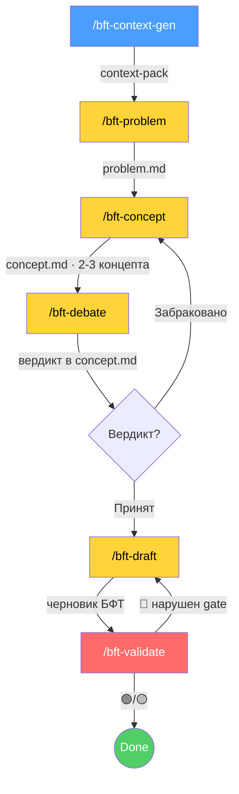

<p align="center">
  <strong>PO-Helper</strong><br>
  <em>Multi-step pipeline'ы для ИИ-агентов: квартальный OKR и БФТ (Бизнес-Функциональные Требования) уровня enterprise</em>
</p>

---

> **Принцип:** структурируй известное, фиксируй неизвестное. Каждый факт ← источник (трекер / PO / wiki / roadmap). Нет источника → `[УТОЧНИТЬ]`.
>
> Архитектура — зеркало [sa-helper](https://gitlab.com/boboden541/sa-helper) FNR-pipeline, адаптированная под forward-looking планирование: якорь смещён с `code:line` на трекер / решения PO / wiki / roadmap. Каждая стадия — **отдельная команда, отдельная роль, STOP-пауза для ревью**.

**Пайплайны:**

| Пайплайн | Команды | Что генерирует |
|:---|:---|:---|
| **OKR** | `/okr-context-gen → /okr-objectives → /okr-key-results → /okr-debate → /okr-enrich → /okr-validate → /okr-deliver` | Квартальный OKR (OBJ + KR + IMP + образ результата/действия + метрики/риски) |
| **БФТ** | `/bft-context-gen → /bft-problem → /bft-concept → /bft-debate → /bft-draft → /bft-validate` | Бизнес-Функциональные Требования по эпику |
| **Контекст** | `/po-research` | Контекст-пак по топику (sprint/epic/risk/decision/bft) |

---

## ⚡ Установка

```bash
# в корне проекта:
curl -ksSL https://raw.githubusercontent.com/kibarik/po-helper/main/install.sh | bash
```

Или из клона:
- `bash install.sh` — установка (существующие файлы не трогаются)
- `bash install.sh --update` — обновление generic-слоя (framework-файлы перезаписываются)

В любом режиме `.claude/domain-profile.md` проекта и доменные данные **не трогаются** — обновляется только фреймворк.

### Доменный профиль (адаптация под проект)

po-helper — generic-фреймворк. Предметная область выносится в **доменный профиль**:

```bash
cp .claude/domain-profile.template.md .claude/domain-profile.md
# заполнить: пути планирования, команды, трекер, wiki, глоссарий, стейкхолдеры
```

Команды читают профиль и подставляют пути (`{planning_root}`, `{okr_workspace}`, …) и доменные термины. Примеры в навыках (`examples/`) — иллюстративные; универсальна структура, а не домен.

---

## 📊 Процесс генерации OKR (квартальное планирование)

**6 стадий, каждая = отдельный запуск + STOP-пауза:**

| Стадия | Команда | Роль | Артефакт |
|:---|:---|:---|:---|
| Контекст | `/okr-context-gen` | Context Builder | `context-pack.md` |
| Цели | `/okr-objectives` | Strategy Analyst (3-5 OBJ) | `objectives.md` |
| Key Results | `/okr-key-results` | KR Designer (KR + IMP) | `key-results.md` |
| Дебаты | `/okr-debate` | Devil's Advocate (SMART, 3 раунда) | вердикт в `key-results.md` |
| Обогащение | `/okr-enrich` | PO + Architect (образ действия + метрики) | `enriched-okr.md` |
| Валидация | `/okr-validate` | Validator (12 hard gates + Светофор) | `validation.md` |
| Отгрузка | `/okr-deliver` | Deliverer (публикация в roadmap/INDEX/KR-EPIC-MAP) | финальный OKR |

Итоговый артефакт — таблица `OBJ | KR | IMP | Название | Образ результата | Образ действия | Метрики&риски&зависимости` с тегами `[RESEARCH]/[POC]/[BUG]/[ACTIVITY]`, IMP-шкалой 1–9 и БЫЛО→СТАЛО для технических KR.

---

## 📊 Процесс генерации БФТ (multi-step, как sa-helper)



**6 стадий, каждая = отдельный запуск + STOP-пауза:**

| Стадия | Команда | Роль | Артефакт |
|:---|:---|:---|:---|
| Контекст | `/bft-context-gen` | Context Builder | `context-pack.md` |
| Проблема | `/bft-problem` | Problem Analyst (диагноз, без решения) | `problem.md` |
| Концепты | `/bft-concept` | Solution Designer (2-3 варианта) | `concept.md` |
| Дебаты | `/bft-debate` | Architect vs Devil's Advocate | вердикт в `concept.md` |
| Требования | `/bft-draft` | Requirements Writer | черновик БФТ |
| Валидация | `/bft-validate` | Validator (свежий взгляд) | `validation.md` |

**Циклы:** дебаты забракованы → `/bft-concept`; валидация 🔴 → `/bft-draft`.

---

## 🧠 За счёт чего качество

| # | Механизм | Что даёт |
|:--|:--------|:---------|
| 1 | **Разные роли = разные «мозги»** | Нет смешения «диагноз+решение+требование» |
| 2 | **STOP-паузы human-in-the-loop** | PO ревьюит между стадиями, ловит ошибки рано |
| 3 | **Adversarial отдельным запуском** (`/bft-debate`) | Ломает confirmation bias — другой агент критикует |
| 4 | **Concept-стадия** (2-3 варианта) | Не фиксируем первый пришедший вариант |
| 5 | **Hard Gates** (12 бинарных 🔴) | Валидация = pass/fail, не «постарайся» |
| 6 | **Self-валидация «Светофор»** (🟢/🟡/🔴) | Многопроходная проверка свежим взглядом |
| 7 | **Anchor Ranks** (R1 код As-Is / R2 трекер-wiki-BR-ADR / R3 PO) | Нулевой допуск к галлюцинациям; код-якорь — только для As-Is |
| 8 | **CATWOE** (W→БТ, O→Ревью, E→НФТ) | Структурирует ценность/владельца/ограничения |
| 9 | **Rich picture + worldviews** (SSM) | Конкурирующие взгляды в напряжении, не схлопываются |
| 10 | **Type-distinction gate** (ПТ≠ФТ≠НФТ) | Ловит частую ошибку смешения типов |
| 11 | **Артефакты-передачи** | Каждый шаг проверяем, откатываем, переиспользуем |

> ⚠️ **Главное:** НЕ генерируй БФТ за один промт. STOP после каждой стадии. Только так pipeline эквивалентен sa-helper по качеству.

---

## 📂 Структура

```
.claude/
├── commands/
│   ├── bft-context-gen.md   ← контекст-пак (Кортексы + Нексусы)
│   ├── bft-problem.md       ← rich picture + диагноз As-Is/Gap
│   ├── bft-concept.md       ← 2-3 концепта + CATWOE
│   ├── bft-debate.md        ← красная команда (Адвокат Дьявола)
│   ├── bft-draft.md         ← черновик требований (БТ/ПТ/ИТ/ФТ/НФТ)
│   └── bft-validate.md      ← 12 hard gates + Светофор
└── skills/
    └── bft-writer/
        ├── SKILL.md                      ← роли + pipeline + 13 принципов
        ├── resources/
        │   ├── bft_standards.md          ← идентификаторы, типы (ПТ≠ФТ≠НФТ), НФТ-набор, NFR-реестр
        │   ├── hard_gates.md             ← 12 🔴 + чек-лист + Светофор
        │   ├── anchor_rules.md           ← ранги якорей R1/R2/R3 (код — только As-Is)
        │   ├── catwoe.md                 ← SSM CATWOE (W→БТ, O→Ревью, E→НФТ)
        │   └── debate_rules.md           ← протокол adversarial
        └── examples/
            ├── ideal_bft.md              ← пустой шаблон
            └── golden_bft_example.md     ← аннотированный эталон
```

Артефакты эпика: `<workspace>/<epic>/{context-pack,problem,concept,draft,validation}.md`.

---

## 🔗 Связь с sa-helper

| sa-helper (reverse-engineering) | po-helper (forward-looking) |
|:---|:---|
| `/context-gen` → repomix (код) | `/bft-context-gen` → Кортексы + Нексусы |
| `/fnr-new-task` → task.md | `/bft-problem` → problem.md |
| `/fnr-concept` → concept.md | `/bft-concept` → concept.md |
| `/fnr-debate` → вердикт | `/bft-debate` → вердикт |
| `/fnr-system-requirements` → BR/FR/NFR | `/bft-draft` → БТ/ПТ/ИТ/ФТ/НФТ |
| `/validate-doc` → аудит | `/bft-validate` → Светофор |
| якорь `code:line` | якорь трекер/PO/wiki |

Механика качества идентична; отличается источник «якорей истины».

---

## Лицензия

MIT — используйте, форкайте, адаптируйте под свой домен.
