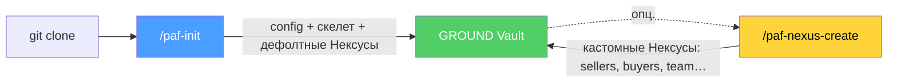
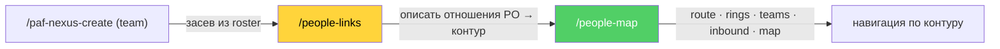
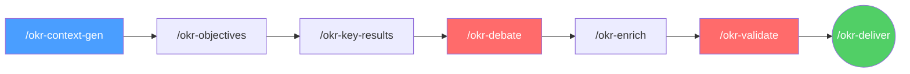
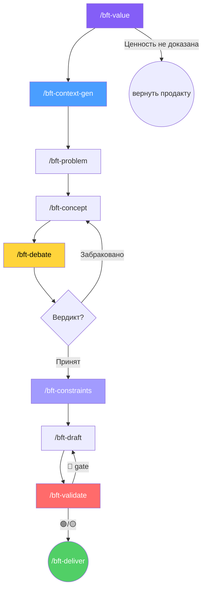

<p align="center">
  <strong>PO-Helper</strong><br>
  <em>AI-Native продуктовая операционка: multi-step пайплайны для ИИ-агентов (OKR · БФТ), онбординг PAF (GROUND Vault) и методология Product Discovery от Идеи до PCF</em>
</p>

---

> **Принцип сквозной:** структурируй известное, фиксируй неизвестное. Каждый факт ← источник (трекер / PO / wiki / roadmap). Нет источника → `[УТОЧНИТЬ]`. Нулевой допуск к галлюцинациям.
>
> Архитектура — зеркало [sa-helper](https://gitlab.com/boboden541/sa-helper) FNR-pipeline, адаптированное под forward-looking планирование. Каждая стадия — **отдельная команда, отдельная роль, STOP-пауза для ревью**.

## 🧰 Что внутри

| Сценарий | Команды | Результат | Детально |
|:---|:---|:---|:---|
| **OKR** | `/okr-context-gen … /okr-deliver` (7 стадий) | Квартальный OKR (OBJ + KR + IMP) | [↓ OKR](#-okr--квартальное-планирование) |
| **Спринт** | `/sprint-roadmap` · `/sprint-sync … /sprint-deliver` | Roadmap KR×спринт + детальный план спринта (Sprint Goal + capacity + N+1) | [SKILL](.claude/skills/sprint-planner/SKILL.md) |
| **БФТ** | `/bft-value … /bft-deliver` (9 стадий) | Бизнес-Функциональные Требования по эпику | [↓ БФТ](#-бфт--бизнес-функциональные-требования) |
| **Внешние запросы** | `/req-context … /req-handoff` (7 стадий) | Скоринг внешнего запроса → SMART-задача + routing (front door перед БФТ) | [SKILL](.claude/skills/request-intake/SKILL.md) |
| **Инфо-каналы** | `/channel-map` · `/channel-list` · `/channel-route` | Реестр каналов поступления информации + разметка входящего (источник → стейкхолдеры/тема/участок/цель → роутинг) | [SKILL](.claude/skills/info-channels/SKILL.md) |
| **Контекст** | `/po-research` | Контекст-пак уровня Deep Research | [SKILL](.claude/skills/po-research/SKILL.md) |
| **Релизы** | `/release-frame` · `/release-baseline` · `/release-sync` ⏰ · `/release-gate` | Управление обязательством и дрейфом объёма ≥ 2 спринтов | [SKILL](.claude/skills/release-guard/SKILL.md) |
| **Визуализация** | `/diagram-view` | Рендер PlantUML inline в чат | [skill](.claude/skills/diagram-view/) |
| **Карта людей** | `/people-links` · `/people-map` | Описание отношений PO с сотрудниками (контур) → навигатор: кто ближе/дальше, кто с чем приходит, у кого уточнить, кто согласовывает | [links](.claude/skills/people-links/SKILL.md) · [map](.claude/skills/people-map/SKILL.md) |
| **Калибровка нексуса людей** | `/radar-graph` · `/radar-calibrate` · `/radar-review` | Диаграмма связей команды + проверка качества People Graph: ситуационные вопросы → сверка с реальностью → correction-Prompt, цикл до 10/10 (short) или 50/50 (long) | [SKILL](.claude/skills/nexus-calibration/SKILL.md) |
| **Онбординг** | `/paf-init`, `/paf-nexus-create` | GROUND Vault под продукт | [↓ Онбординг](#-онбординг-paf) |

---

## 📖 Теория

Инструмент построен на методологии **AI-Native Product Discovery** (PAF). Качество достигается за счёт разделения ролей, STOP-пауз human-in-the-loop, adversarial-стадий и hard gates — подробно в [«За счёт чего качество»](#-за-счёт-чего-качество).

| Слой | Что внутри | Ссылка |
|:---|:---|:---|
| Процесс | 9 вех Product Discovery (Step 0…8) × движок Product Sprint | [docs/AI-PROCESSES](docs/AI-PROCESSES/README.md) |
| Принципы | AI-Native команда по PAF, источники `[S1]–[S7]` | [docs/AI-TRANSFORMATION](docs/AI-TRANSFORMATION/index.md) |
| Первоисточники | Raw-раннбуки `RB-STEP-1…8` + Research Library | [docs/README](docs/README.md) |

---

## ⚡ Установка

```bash
# в корне проекта:
curl -ksSL https://raw.githubusercontent.com/kibarik/po-helper/main/install.sh | bash
```

| Команда | Что делает |
|:---|:---|
| `bash install.sh` | Установка (существующие файлы не трогаются) |
| `bash install.sh --update` | Обновление generic-слоя (framework-файлы перезаписываются) |

Доменный профиль и данные (`GROUND/`) при обновлении **не трогаются**. po-helper — generic-каркас; предметная область выносится в доменный профиль:

```bash
cp .claude/domain-profile.template.md .claude/domain-profile.md
# заполнить: пути планирования, трекер, wiki, глоссарий, стейкхолдеры
```

> **MCP `ruflo`** (опционально, память для онбординга) — глобальный CLI: `npm i -g ruflo@latest` (нужна ≥ 3.14.4). Коробка работает и без него.

Подробнее — [install.sh](install.sh) · [domain-profile.template.md](domain-profile.template.md).

---

## 🌱 Онбординг PAF

Создаёт **GROUND Vault** — персонализированный продуктовый контекст (Кортекс → Нексус → продуктовый процесс), который питает стадии `*-context-gen`.



| Команда | Когда | Результат |
|:---|:---|:---|
| `/paf-init` | один раз после `git clone` | `config.yaml` + скелет GROUND + дефолтный каталог Нексусов |
| `/paf-nexus-create` | по необходимости | кастомные Нексусы (`sellers`, `buyers`, `team`…) + запись в реестр |

Нексус `team` — **People Graph**: люди в пяти слоях. Отношения PO с людьми и навигация по ним — раздел [↓ Карта людей](#-карта-людей--контур-po-и-навигация).

Схемы и валидатор Vault — [sa_documentation/](sa_documentation/) (`ground_schema`, `nexus_schema`, `nexus_catalog`, `validate_ground.py`).

---

## 🧭 Карта людей — контур PO и навигация

Нексус `team` фиксирует не только людей, но и **как PO с ними взаимодействует**. People Graph строится в пяти слоях; главный для навигации — **PO Navigation** (рёбра «я-как-PO ↔ человек»).

| Слой | Поля | Зачем |
|:---|:---|:---|
| Org Chart | `reports_to`, `manages` | иерархия |
| Social | `collaborates_with` | связи вне иерархии |
| Team Grouping | `team_unit`, `team_role`, `team_mission` | группировка по командам, зоны ответственности |
| Expertise | `expertise_topics`, `contact_for`, `influence_zones` | роутинг по теме |
| **PO Navigation** | `proximity`, `inbound_topics`, `clarify_with`, `approves`, `escalate_via` | **кто ближе/дальше · кто с чем приходит · у кого уточнить · кто согласовывает** |

Две команды — захват и навигация:



| Команда | Режим | Что делает |
|:---|:---|:---|
| `/people-links` | write | Интервью PO по каждому сотруднику → наполняет PO Navigation Layer → собирает **контур** (кольца близости `core/close/extended/peripheral`) |
| `/people-map` | read-only | Навигация по контуру: `route` (кто по вопросу X, различая «согласовать / уточнить / обратиться») · `rings` (кто ближе/дальше) · `teams` (срез по командам) · `inbound` (что ко мне приходит) · `map` (рендер карты через `/diagram-view`) |

Принцип коробки соблюдён: рёбра пишутся только со слов PO (`sources: onboarding:interview`), пустое поле → `[УТОЧНИТЬ]`, эксперт по теме ≠ право согласования. Детально — [links](.claude/skills/people-links/SKILL.md) · [map](.claude/skills/people-map/SKILL.md).

---

## 🎯 OKR — квартальное планирование

7 стадий, каждая = отдельный запуск + STOP-пауза. Передавай результат стадии дальше после ревью.



| Стадия | Команда | Роль |
|:---|:---|:---|
| Контекст → Цели → KR | `/okr-context-gen` · `/okr-objectives` · `/okr-key-results` | Context Builder · Strategy Analyst · KR Designer |
| Дебаты → Обогащение | `/okr-debate` · `/okr-enrich` | Devil's Advocate (3 раунда) · PO + Architect |
| Валидация → Отгрузка | `/okr-validate` (12 gates) · `/okr-deliver` | Validator · Deliverer (roadmap/INDEX) |

Итог — таблица `OBJ \| KR \| IMP \| Образ результата \| Образ действия \| Метрики&риски` с IMP-шкалой 1–9. Детально — [okr-planner/SKILL.md](.claude/skills/okr-planner/SKILL.md).

---

## 📋 БФТ — Бизнес-Функциональные Требования

Навык **`bft-writer`**: один эпик трекера → готовый документ БТ/ПТ/ИТ/ФТ/НФТ. Не «генерация за один промт», а конвейер из 9 команд со STOP-паузой после каждой. Первая стадия — `/bft-value`: зачем инвестировать ресурсы (ценность ← KR/стратегия), до контекста и требований.



**Рабочий цикл по эпику** (пример: код БФТ `EPIC-10`, эпик трекера `PROJ-101`):

| Шаг | Команда | Что на STOP-паузе |
|:--|:--|:--|
| 0. Ценность | `/bft-value EPIC-10 PROJ-101` | Зачем инвестировать: ценность ← KR/стратегия. Не доказана → вернуть продакту |
| 1. Контекст | `/bft-context-gen EPIC-10 PROJ-101` | Дозаполни `[УТОЧНИТЬ]`; незнакомый эпик → `/bft-context-gen-deep` |
| 2. Проблема | `/bft-problem EPIC-10` | Проверь: это диагноз, не решение |
| 3. Концепты | `/bft-concept EPIC-10` | Сравни 2-3 варианта |
| 4. Дебаты | `/bft-debate EPIC-10` | Забраковано → шаг 3; Принят → дальше |
| 5. Ограничения | `/bft-constraints EPIC-10` | Совместно с PO: подтверди факты (Ф), проверь гипотезы (Г) с владельцами |
| 6. Черновик | `/bft-draft EPIC-10` | Появляется `<epic>.md`; вычитай типы/НФТ/границы/ограничения |
| 7. Валидация | `/bft-validate EPIC-10` | 🔴 → шаг 6; 🟢/🟡 → готов к ревью |
| 8. Отгрузка | `/bft-deliver EPIC-10` | Сухой прогон → ок PO → JIRA + 2×Confluence |

**Раскладка:** финальный БФТ — `bft_documentation/<epic>/<epic>.md`; промежуточные артефакты — `bft_documentation/<epic>/artefacts/`. Везде передавай один и тот же `<epic_code>`. Детально — [bft-writer/SKILL.md](.claude/skills/bft-writer/SKILL.md).

### Стадия 5 — ограничения релиза (`/bft-constraints`)

Отдельная стадия перед черновиком собирает **рамки среды, которые релиз обязан соблюсти**, иначе он не состоится или навредит смежникам. Проблема, которую она закрывает: побочные требования внешних стейкхолдеров всплывают в момент выката, когда закладывать их в требования уже поздно. Совместное исследование LLM + PO: **repowise** (blast-radius затронутых компонентов) + **People Graph** / Нексус `team` (ответственный PO компонента и эффекта) + подтверждение человеком.

Ключевое — разделение на два класса (смешивать запрещено, гейт 19):

- **Ф — фактологически-ограничивающее:** доказанный негативный бизнес-эффект, есть якорь. Blocking, проецируется в НФТ / Границы / Зависимости.
- **Г — гипотетически-ограничивающее:** гипотеза blast-radius «если не учесть X, где-то может пойти так», эффект не доказан. Живёт в «Открытых вопросах» до проверки с владельцем; перевод Г → Ф — только с новым якорем-подтверждением. Гипотеза не выдаётся за факт.

Пример `artefacts/constraints.md` (домены/имена — иллюстративные):

```markdown
## Фактологически-ограничивающие (Ф)

| ОГР | Класс | Ограничение | Затронутый компонент | Ответственный | Эффект при нарушении | Как проверить | Статус |
| --- | --- | --- | --- | --- | --- | --- | --- |
| ОГР-1 | Ф | Имена и формат мета-полей заказа неизменны; сервис не переименовывает их | vendor-orders (repowise) | Ким, PO мультивендора | Витрина вендора видит пустые поля, ошибочная выдача | Диф ключей до/после релиза | Требует согласования |
| ОГР-2 | Ф | Компонент без автотестов (churn 79%) → обязателен ручной регресс до выката | vendor-orders (repowise get_risk: test_gap) | Ким | Регресс уходит в прод незамеченным | Чек-лист регресса приложен к релизу | Требует согласования |

## Гипотетически-ограничивающие (Г)

| ОГР | Класс | Ограничение (гипотеза) | Затронутый компонент | Ответственный | Предполагаемый эффект | Как проверить | Статус |
| --- | --- | --- | --- | --- | --- | --- | --- |
| ОГР-3 | Г | Блокировка операции не рассинхронизирует счётчик корзины | cart-counter (blast-radius) | Соколова, PO витрины | Счётчик показывает недобавленный товар | Проверить порядок обновления с владельцем | Гипотеза (не проверена) |
```

Каждое ограничение измеримо (число / порог / дата / инвариант), не «не сломать смежников». Ответственный ищется в People Graph по зонам влияния; нет совпадения → `[УТОЧНИТЬ у {кого}]`. Модель — [constraint_rules.md](.claude/skills/bft-writer/resources/constraint_rules.md).

---

## 📡 Инфо-каналы — разметка входящей информации

PO получает информацию из множества каналов (рабочие чаты, Email, Telegram-каналы, созвоны). Навык **`info-channels`** ведёт реестр каналов как Нексус `channels` (Information Channels Graph, зеркало People Graph `team`) и размечает входящее.

| Команда | Роль | Результат |
|:---|:---|:---|
| `/channel-map <slug>` | Channel Curator | channel-узел: для чего канал, темы, стейкхолдеры (→ `NEXUS/team`), участки системы (→ CORTEX), цели (→ OKR) |
| `/channel-list` | Inventory Reporter | инвентарь + матрица покрытия (пробелы → `[УТОЧНИТЬ]`) |
| `/channel-route [текст]` | Intake Dispatcher | запросить/определить источник → протегировать meta → рекомендовать роутинг (front door перед `request-intake`) |

Ключевой образ: структурированное знание для ИИ, **как обрабатывать входящую информацию** и к каким стейкхолдерам / участкам системы / целям её привязать. Источник неизвестен → агент спрашивает PO, не выдумывает. Данные — `GROUND/NEXUS/channels/`, спецификация — [nexus_catalog §4.2](sa_documentation/nexus_catalog.md). Детально — [info-channels/SKILL.md](.claude/skills/info-channels/SKILL.md).

---

## 🧠 За счёт чего качество

| Механизм | Что даёт |
|:--|:--|
| **Разные роли = разные «мозги»** | Нет смешения «диагноз + решение + требование» |
| **STOP-паузы human-in-the-loop** | PO ревьюит между стадиями, ловит ошибки рано |
| **Adversarial отдельным запуском** | Ломает confirmation bias — другой агент критикует |
| **Concept-стадия (2-3 варианта)** | Не фиксируем первый пришедший вариант |
| **Hard Gates** (БФТ — 19, OKR — 12) | Валидация = pass/fail, не «постарайся» |
| **Светофор 🟢/🟡/🔴** | Многопроходная самопроверка свежим взглядом |
| **Anchor Ranks** (R1 код / R2 трекер-wiki / R3 PO) | Нулевой допуск к галлюцинациям |
| **Артефакты-передачи** | Каждый шаг проверяем, откатываем, переиспользуем |

> ⚠️ **Главное:** НЕ генерируй документ за один промт. STOP после каждой стадии — только так pipeline эквивалентен sa-helper по качеству.

---

## ❓ FAQ

**Это инструмент конкретной компании?**
Нет. po-helper — настраиваемый каркас для любого PO. Домен выносится в `.claude/domain-profile.md`; примеры в навыках иллюстративны.

**С чего начать?**
`install.sh` → заполни `domain-profile.md` → `/paf-init` для контекста → первый `/okr-*` или `/bft-*` пайплайн.

**Обязателен ли онбординг PAF?**
Нет, но без GROUND Vault стадии `*-context-gen` работают на общих эвристиках, а не на реальном контексте продукта.

**Можно прогнать весь пайплайн за один промт?**
Нет — это убивает качество. Каждая стадия = отдельный запуск + ревью PO. В этом вся суть.

**Что если дебаты забраковали концепт / валидация дала 🔴?**
Возврат назад с тем же кодом эпика: дебаты → `/bft-concept`, валидация 🔴 → `/bft-draft`. Артефакты сохраняются. Циклы — норма.

**Быстрый или глубокий контекст для БФТ?**
`/bft-context-gen` — домен знаком, нужно быстро. `/bft-context-gen-deep` — новый эпик, много зависимостей, нужна доказательная база без дыр.

**Нужен ли `ruflo`?**
Нет, опционально (память при онбординге). Коробка работает и без MCP.

---

## 🔗 Связь с sa-helper

| sa-helper (reverse-engineering) | po-helper (forward-looking) |
|:---|:---|
| `/context-gen` → repomix (код) | `/bft-context-gen` → Кортексы + Нексусы |
| `/fnr-concept` → concept.md | `/bft-concept` → concept.md |
| `/fnr-system-requirements` → BR/FR/NFR | `/bft-draft` → БТ/ПТ/ИТ/ФТ/НФТ |
| якорь `code:line` | якорь трекер/PO/wiki/roadmap |

Механика качества идентична; отличается источник «якорей истины».

---

## Лицензия

MIT — используйте, форкайте, адаптируйте под свой домен. Методология PAF (`docs/AI-TRANSFORMATION/`) — CC BY-SA 4.0 (Тихомиров Сергей).
