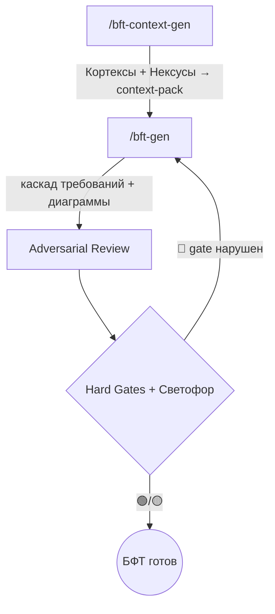

<p align="center">
  <strong>PO-Helper: BFT-Writer</strong><br>
  <em>Фреймворк для ИИ-агентов: генерация БФТ (Бизнес-Функциональные Требования) уровня enterprise</em>
</p>

---

> **БФТ** — структурируй известное, фиксируй неизвестное. Каждый факт ← источник (трекер / PO / ТЗ).
>
> Ключевой принцип — **нулевой допуск к галлюцинациям**: адаптация методологии [sa-helper](https://gitlab.com/boboden541/sa-helper) (где якорь — `code:line`) под forward-looking требования (где якорь смещён на трекер / решения PO / wiki / СА).

---

## ⚡ Установка

Разверните po-helper в проекте одной командой (в корне проекта):

```bash
curl -ksSL https://raw.githubusercontent.com/kibarik/po-helper/main/install.sh | bash
```

Или локально из клона:

```bash
bash install.sh
```

Скрипт скопирует `.claude/skills/bft-writer/` и `.claude/commands/{bft-gen,bft-context-gen}.md` в текущий проект. Существующие файлы не удаляются.

> Поддерживается Claude Code (`.claude/`). Для других агентов (Codex `.agents/`, Cline `.cline/` и т.п.) — адаптируйте пути по аналогии.

---

## 📊 Процесс генерации БФТ



**Два этапа:**

1. **`/bft-context-gen {epic} {key}`** — сборка контекст-пака: статичный фон (Кортексы: архитектура/регуляторика/бизнес-правила/решения) + живые факты эпика (Нексусы: трекер/wiki/PO/код).
2. **`/bft-gen {epic}`** — генерация БФТ (10 стадий: якоря → каркас → open-questions → каскад требований → диаграммы → зависимости → adversarial → hard gates → Светофор → сборка).

---

## 🛠 Команды

| Команда | Описание | Результат |
|:--------|:---------|:----------|
| `/bft-context-gen` | Сборка контекст-пака | `bft-context-pack.md` (Кортексы + Нексусы + матрица покрытия) |
| `/bft-gen` | Генерация БФТ | документ БФТ + отчёт «Светофор» |

---

## 🧠 За счёт чего качество (механизмы sa-helper, перенесённые на БФТ)

| # | Механизм | Что даёт |
|:--|:--------|:---------|
| 1 | **Каскад ролей** (context → gen → validate) | Нет смешения «диагноз+решение+требование» |
| 2 | **Adversarial Review** (3 раунда, Адвокат Дьявола) | Red-teaming требований: нагрузка/отказ/идемпотентность/безопасность/зависимости |
| 3 | **Hard Gates** (10 бинарных 🔴) | Валидация = конечный список pass/fail, не «постарайся» |
| 4 | **Self-валидация «Светофор»** (🟢/🟡/🔴 по слоям) | Многопроходная проверка |
| 5 | **Truth Anchors** (якорь на трекер/PO/wiki вместо `code:line`) | Нулевой допуск к галлюцинациям |
| 6 | **Few-shot эталоны** (ideal + golden) | Копирование формата/глубины примера |
| 7 | **No Silent Skip** | Неизвестное → «Открытые вопросы» / `[УТОЧНИТЬ]`, а не выдумка |

---

## 📂 Структура

```
.claude/
├── commands/
│   ├── bft-context-gen.md   ← сборка контекст-пака
│   └── bft-gen.md           ← генерация БФТ
└── skills/
    └── bft-writer/
        ├── SKILL.md                      ← роль + 10 принципов + pipeline
        ├── resources/
        │   ├── bft_standards.md          ← идентификаторы, НФТ-набор, frontmatter
        │   ├── hard_gates.md             ← 10 🔴 + чек-лист + Светофор
        │   └── debate_rules.md           ← протокол adversarial
        └── examples/
            ├── ideal_bft.md              ← пустой шаблон
            └── golden_bft_example.md     ← аннотированный эталон
```

Каждый навык содержит **SKILL.md** (роль), **resources/** (чек-листы, стандарты), **examples/** (эталоны) — по архитектуре sa-helper.

---

## 🔗 Связь с sa-helper

sa-helper превращает **код в документацию** (reverse-engineering, якорь `file:line`).
po-helper превращает **постановку PO в требования** (forward-looking, якорь на трекер/PO/wiki).

Механика качества идентична; отличается только источник «якорей истины».

---

## Лицензия

MIT — используйте, форкайте, адаптируйте под свой домен.
