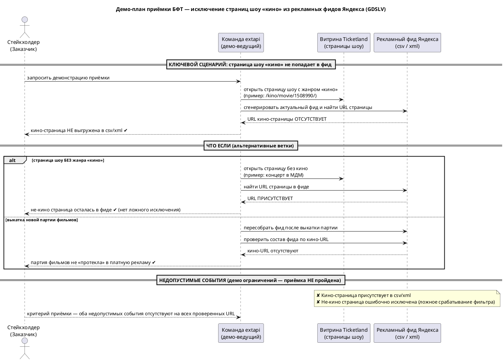

# БФТ — Исключение страниц шоу «кино» из платных рекламных фидов Яндекса (эпик GDSLV)

## Оглавление

- [1. О задаче](#1-о-задаче)
  - [1.1 As-Is → Gap → To-Be](#11-as-is--gap--to-be)
  - [1.2 Контекст обращения](#12-контекст-обращения)
  - [1.3 Стейкхолдеры](#13-стейкхолдеры)
- [2. План демо для стейкхолдера](#2-план-демо-для-стейкхолдера)
  - [2.1 Ключевой сценарий](#21-ключевой-сценарий)
  - [2.2 Альтернативные ветки (ЧТО ЕСЛИ)](#22-альтернативные-ветки-что-если)
  - [2.3 Недопустимые события (демо ограничений)](#23-недопустимые-события-демо-ограничений)
  - [2.4 Диаграмма демо](#24-диаграмма-демо)
- [3. Критерии успеха](#3-критерии-успеха)
  - [3.1 Бизнес-требования](#31-бизнес-требования)
  - [3.2 Пользовательские требования](#32-пользовательские-требования)
  - [3.3 Требования к интерфейсам](#33-требования-к-интерфейсам)
  - [3.4 Функциональные требования](#34-функциональные-требования)
  - [3.5 Нефункциональные требования](#35-нефункциональные-требования)
- [4. Риски и зависимости](#4-риски-и-зависимости)
- [5. Открытые вопросы](#5-открытые-вопросы)

---

## 1. О задаче

Короткое погружение в контекст. Эпик **GDSLV**: страницы шоу жанра «кино» не должны попадать в платные рекламные фиды Яндекса (csv/xml). Единица выгрузки — **страница шоу (карточка показа)**, не событие/сеанс. Область изменения целиком у команды extapi (Исполнитель).

### 1.1 As-Is → Gap → To-Be

| Срез | Содержание |
| --- | --- |
| **As-Is** | • Страницы шоу жанра «кино» выгружаются в платные рекламные фиды Яндекса (форматы csv и xml) наравне с остальными шоу.   • Генератор фида не содержит критерия, отделяющего кино-страницы от прочих.   • Пример кино-страницы, которая сейчас может попасть в фид: `https://www.ticketland.ru/kino/movie/1508990/`. |
| **Gap** | • Отсутствует фильтр, исключающий страницы шоу жанра «кино» на этапе генерации фида → кино попадает в платную рекламу вопреки правилу эпика GDSLV.   • Нет контроля состава фида при выкатке партии фильмов — кино может «протечь» в рекламу незаметно. |
| **To-Be** | • Страница шоу с жанром «кино» **не выгружается** в платные рекламные фиды Яндекса (csv/xml).   • Страницы шоу без кино продолжают выгружаться без изменений (пример допустимого попадания: `https://www.ticketland.ru/koncertnye-zaly/moskovskiy-dvorec-molodezhi/nichego-ne-boysya-ya-s-toboy/`).   • При выкатке партии фильмов состав фида не содержит кино-страниц; проверяется на приёмке по конкретным URL. |

> Требование атомарное: один критерий фильтрации на стороне генерации фида. Расширение на другие категории-исключения в скоуп не входит.

### 1.2 Контекст обращения

- **Причина запрета** кино в платной рекламе (договор / лицензия правообладателей / рекламная политика) уточняется у Заказчика — влияет на приоритет, но не на сам критерий.
- Ключ эпика GDSLV и связанные задачи уточняются: на момент составления доступ к JIRA отсутствовал, требование восстановлено из переписки (Заказчик, Постановщик).

### 1.3 Стейкхолдеры

| Роль | Кто | Интерес |
| --- | --- | --- |
| Заказчик / приёмка | Заказчик | Кино не попадает в платную рекламу; знает причину запрета |
| Исполнитель (extapi) | Исполнитель | Ведёт рекламные фиды, вносит фильтр на генерации |
| Постановщик | Постановщик | Формулирует требование и критерии приёмки |

---

## 2. План демо для стейкхолдера

Раздел фиксирует, **как команда презентует БФТ на демо**, чтобы стейкхолдер принял результат и посчитал его достаточным. Все три блока показываются всегда: ключевой сценарий, развилки «что если», отработка ограничений. Цель — договорённость команды о едином образе приёмки.

### 2.1 Ключевой сценарий

| Шаг | Действие ведущего | Ожидаемый результат |
| --- | --- | --- |
| 1 | Открыть страницу шоу с жанром «кино» (`/kino/movie/1508990/`) | Стейкхолдер видит эталонную кино-страницу |
| 2 | Сгенерировать актуальный фид и найти в нём URL этой страницы | URL кино-страницы **отсутствует** в csv и в xml |
| 3 | Зафиксировать вывод | Кино-страница не выгружена в платную рекламу ✔ |

### 2.2 Альтернативные ветки (ЧТО ЕСЛИ)

| Ветка | Действие | Ожидаемый результат | Что доказывает |
| --- | --- | --- | --- |
| Страница шоу без кино | Открыть не-кино страницу (концерт в МДМ), найти URL в фиде | URL **присутствует** | Фильтр не выкидывает лишнее (нет ложных срабатываний) |
| Выкатка новой партии фильмов | Пересобрать фид после выкатки, проверить состав по кино-URL | Кино-URL **отсутствуют** | Правило держится на регулярной выкатке, а не только на разовой проверке |

### 2.3 Недопустимые события (демо ограничений)

Приёмка **НЕ пройдена**, если на любом из проверенных URL наблюдается хотя бы одно событие:

| # | Недопустимое событие | Почему это провал приёмки |
| --- | --- | --- |
| ✘ 1 | Кино-страница присутствует в csv или xml | Нарушено правило эпика GDSLV — кино в платной рекламе |
| ✘ 2 | Не-кино страница ошибочно исключена из фида | Ложное срабатывание фильтра — потеря легального платного трафика |

Оба события должны отсутствовать на всех проверенных URL — это формальный критерий приёмки на демо.

### 2.4 Диаграмма демо

Последовательная (actor-level, black-box) диаграмма демо — источник: [`GDSLV-demo-scenario.puml`](GDSLV-demo-scenario.puml), рендер: [`GDSLV-demo-scenario.svg`](GDSLV-demo-scenario.svg).

**Акторы демо:**

| Актор | Роль на демо |
| --- | --- |
| Стейкхолдер (Заказчик) | Принимает результат, задаёт критерий достаточности |
| Команда extapi (демо-ведущий) | Показывает страницы и состав фида, ведёт сценарий |
| Витрина Ticketland | Источник страниц шоу (кино / не-кино) — как есть, не меняется |
| Рекламный фид Яндекса (csv/xml) | Артефакт выгрузки, состав которого проверяется |

---

## 3. Критерии успеха

Требования сгруппированы по уровням: бизнес → пользователь → интерфейсы → функциональные → нефункциональные. Каждый уровень фиксирует **результат и признак приёмки**, без внутреннего устройства системы (высота БФТ).

### 3.1 Бизнес-требования

| ID | Требование | Признак приёмки |
| --- | --- | --- |
| БТ-1 | Страницы шоу жанра «кино» не выгружаются в платные рекламные фиды Яндекса (csv/xml) | При выкатке партии фильмов состав фида не содержит кино-страниц (проверка по конкретным URL) |
| БТ-2 | Не-кино страницы шоу продолжают выгружаться без изменений | Легальный платный трафик по не-кино шоу не теряется — не-кино URL присутствуют в фиде |

### 3.2 Пользовательские требования

| ID | Роль | Требование (US) | Признак приёмки |
| --- | --- | --- | --- |
| ПТ-1 | Владелец рекламных фидов Ticketland | Как владелец рекламной выгрузки, я хочу, чтобы кино-страницы не попадали в платные фиды Яндекса, чтобы соблюсти правило эпика GDSLV | На проверенных URL кино отсутствует в csv и xml |
| ПТ-2 | Владелец рекламных фидов Ticketland | Как владелец выгрузки, я хочу, чтобы фильтр не затрагивал не-кино страницы, чтобы не терять платные показы | Не-кино URL остаются в фиде (нет ложного срабатывания) |

### 3.3 Требования к интерфейсам

| ID | Требование | Признак приёмки |
| --- | --- | --- |
| ИТ-1 | Правило исключения кино применяется к обоим форматам рекламного фида — csv и xml | В обоих форматах кино-страницы отсутствуют, не-кино присутствуют |
| ИТ-2 | Витрина Ticketland (источник страниц шоу и жанровой разметки) не изменяется | Разметка и страницы витрины остаются как есть; изменение — только на стороне генерации фида (extapi) |

> Атрибутивный состав строк csv/xml, схема данных web_db, имена полей и эндпоинты — вне БФТ (зона СА / системных требований).

### 3.4 Функциональные требования

> ⚠ **Вставить из исходного БФТ.** Текст текущих ФТ в постановке не был передан. Замените плейсхолдер на актуальную таблицу ФТ (формат: `Идентификатор | Наименование | Приоритет | Функциональные требования | Параметры, ограничения | Связанные требования`). Ядро — один атомарный критерий фильтрации страниц шоу жанра «кино» на этапе генерации фида.

### 3.5 Нефункциональные требования

> ⚠ **Вставить из исходного БФТ.** Текст текущих НФТ не был передан. Замените плейсхолдер на актуальную таблицу НФТ.

---

## 4. Риски и зависимости

Любая внешняя зависимость — это форма риска: она влияет на сроки и ресурсы, поэтому зависимости и риски ведутся единым списком.

| # | Тип | Описание | Влияние | Митигация / владелец |
| --- | --- | --- | --- | --- |
| R1 | Зависимость | Вся зона изменения — у команды extapi (Исполнитель); своими силами задача не выполняется | Сроки зависят от приоритизации чужой команды | Согласовать приоритет и слот с Исполнителем; зафиксировать критерии приёмки в этом БФТ |
| R2 | Зависимость / риск | Механика распознавания «жанр кино» на уровне страницы шоу знается на стороне extapi и не зафиксирована | Риск неверной фильтрации (пропуск кино или ложное исключение) | Проверять на приёмке по конкретным URL (см. п. 2), а не описывать реализацию в БФТ |
| R3 | Риск | Причина запрета кино в рекламе (договор / лицензия правообладателей / рекламная политика) не подтверждена Заказчиком | Определяет цену нарушения и приоритет, но не сам критерий | Уточнить у Заказчика; на критерий фильтрации не влияет |
| R4 | Риск | На момент составления отсутствовал доступ к JIRA; ключ эпика GDSLV и связанные задачи уточняются, требование восстановлено из переписки (Заказчик, Постановщик) | Риск расхождения с трекером | Сверить с эпиком GDSLV после восстановления доступа |
| R5 | Риск | Ложное срабатывание фильтра — исключение не-кино страниц | Потеря платного трафика по легальным шоу | Обязательная проверка не-кино ветки на демо (п. 2.2) |

---

## 5. Открытые вопросы

- Механика распознавания «жанр кино» на уровне страницы шоу (выносится в СА, проверяется на приёмке по URL).
- Причина запрета кино в рекламе (уточняется у Заказчика).
- Ключ эпика GDSLV и связанные задачи в трекере (уточняются после восстановления доступа к JIRA).
