# 🎨 notation — гибридная и проволочная нотация: символы, цвета, стрелки, рендер

> Как **рисовать** Blueprint. Опирается на проволочную (wire) нотацию Шапиро [SB1][SB2] и вид референса `Blueprint 24h` [SB4]. Куда что кладётся по смыслу — в [[anatomy]].

---

## Проволочная (wire) нотация — базовая идея

По Шапиро [SB1] карта в «проволочном» формате — это **точки, соединённые ломаной линией**, где каждая точка контакта подписана. Автор ценит этот формат за **гибкость и пластичность**: его легко рисовать на бумаге, доске или в любом диаграммере, и он не ломается при переносе шагов.

**Практический вывод для навыка:** сначала собираем Blueprint в «проволоке» (текст/таблица/наброски связей), и только на стадии DELIVER рендерим в аккуратную сетку. Не полируем картинку, пока не сшита логика.

---

## Сетка и блоки

- **Столбец** = шаг клиента (ось времени). Заголовок столбца — короткий глагол.
- **Ячейка** = блок в дорожке на этом шаге. Прямоугольник с подписью на русском (тех. имя системы — в скобках).
- **Пустая ячейка** — норма: не на каждом шаге есть свидетельство/бэк-процесс.
- **Слева** — колонка-легенда с названиями дорожек (`Physical Evidence`, `Customer Actions`, …) и подписанными линиями (`Line of Interaction`, `Line of Visibility`, `Line of Internal Interaction`), как в `Blueprint 24h`.

---

## Цвет — кодирует сценарии и статусы

В `Blueprint 24h` цветные полосы в `Customer Actions` — это **параллельные ветки одного пути** (первый заезд / повтор / оплата картой / наличными). Цвет = семантика, а не украшение:

| Цвет | Смысл |
|---|---|
| Нейтральный (серый/белый) | основной (happy) путь |
| Тёплый набор (синий/жёлтый/розовый) | **альтернативные сценарии** — разные сегменты/ветки |
| Красная рамка/маркер | **fail-point** — где сервис ломается (для to-be) |
| ⭐ / жирная рамка | **момент истины** (moment of truth) |

> Правило: **не более одного смыслового измерения на цвет.** Если цветом кодируешь сценарий — не кодируй им же статус.

---

## Стрелки — соединение опыта (ядро метода)

Стрелки — то, что превращает пять списков в **единую систему**. Типы:

| Стрелка | Смысл | Направление |
|---|---|---|
| `─→` последовательность | следующий шаг клиента | горизонтальная, вправо |
| `↓` обслуживание | шаг клиента → фронт-сцена, которая его обслуживает | вниз через Line of Interaction/Visibility |
| `↑` опора | фронт ← бэк ← поддержка (кто на кого опирается) | вверх через Line of Internal Interaction |
| `⇄` двусторонний обмен | диалог/запрос-ответ (клиент ↔ оператор, фронт ↔ система) | двунаправленная |
| `⤍` пунктир | внешняя зависимость / необязательная ветка (подрядчик, регулятор) | любая |

**Правило висячих стрелок:** стрелка не может упираться в пустоту. Каждая фронт-сцена дотянута до бэк-опоры; каждый бэк-процесс — до системы. Проверяется на [[STEPS/5.validate]].

---

## Эмоции

В дорожке `Customer Actions` (или отдельной тонкой полосой над ней) — **кривая настроения** или смайлы по шагам. Провал кривой на шаге с плотной вертикалью = приоритетная зона улучшения. Эмоция — обязательный элемент (отличает опыт от чистого процесса).

---

## As-Is / To-Be

Одна нотация, два режима:
- **As-Is** — как есть сейчас; fail-points красным; фиксирует ограничения.
- **To-Be** — как спроектировано; изменённые блоки выделены (напр. рамкой или префиксом `[NEW]`).

Строим **всегда от As-Is** — иначе проектируем в вакууме (см. [[principles]] §2).

---

## Рендер: PlantUML (канон репозитория)

Диаграммы в этом репозитории — **только PlantUML** (Mermaid запрещён; ср. `bft-writer`). Надписи на русском, тех. имена — в скобках. Готовый `.puml` рендерится в чат через [[diagram-view]].

Service Blueprint в PlantUML удобно собирать на «дорожках» — либо таблицей (`salt`), либо as-is через связанные компоненты по слоям. Минимальный каркас-таблица:

```plantuml
@startuml
' Service Blueprint — каркас дорожек (wire-режим)
salt
{#
  .            | Шаг 1        | Шаг 2         | Шаг 3
  Физ. свидет. | Талон        | .             | Чек
  == Line of Interaction ==
  Клиент       | Заезжает     | Оплачивает    | Забирает талон
  == Line of Visibility ==
  Фронт-сцена  | Шлагбаум     | Паркомат      | .
  == Line of Internal Interaction ==
  Бэк-сцена    | .            | Инкассация    | .
  Поддержка    | Расписание   | Роутинг оплат | Отчётность
}
@enduml
```

> `salt`-таблица — для быстрого «проволочного» вида и ревью логики. Для финальной презентабельной диаграммы со стрелками-опорами и цветами используем компонентную раскладку по слоям (шаблон — в будущем `resources/` навыка). Главное на стадии DELIVER — чтобы **вертикальные опоры и моменты истины были видны**, а не эстетика.

---

**Version:** 0.1 · **Last updated:** 2026-07-12 · **См. также:** [[anatomy]] · [[STEPS/4.weave]] · [[diagram-view]]
