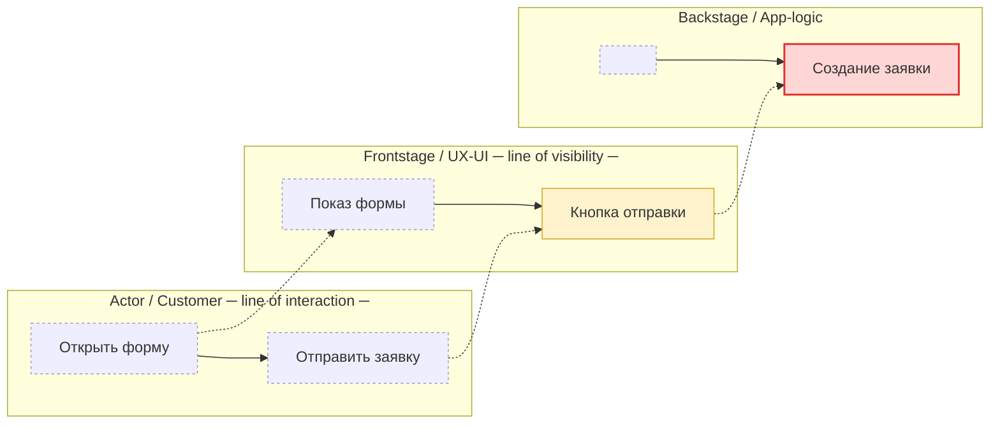

# Blueprint Pipeline Implementation Plan

> **For agentic workers:** REQUIRED SUB-SKILL: Use superpowers:subagent-driven-development (recommended) or superpowers:executing-plans to implement this plan task-by-task. Steps use checkbox (`- [ ]`) syntax for tracking.

**Goal:** Построить pipeline из 5 `/blueprint-*` скиллов, который собирает каноническую Scope Model (ENRICH из БФТ | SCRATCH через исследование) и рендерит её в BluePrint-диаграмму (Grid-таблица + Mermaid) с блокирующим render-гейтом.

**Architecture:** Детерминированное ядро на Python (схема Scope Model + валидатор + render-check) покрыто TDD-тестами по образцу `validate_ground.py`. Поверх — 5 markdown SKILL.md (LLM-инструкции пайплайна), проверяемых структурным тестом frontmatter. Выход pipeline пишется в `GROUND/BLUEPRINT/<task>/`.

**Tech Stack:** Python 3 + pytest + PyYAML (как в `sa_documentation/`), Mermaid CLI (`mmdc` / `npx @mermaid-js/mermaid-cli`), Claude Code Skills (markdown + YAML frontmatter).

---

## File Structure

**Детерминированное ядро (Python, TDD):**
- `sa_documentation/blueprint_schema.md` — схема `scope-model.yaml` + frontmatter `blueprint.md` (документ-источник истины).
- `sa_documentation/validate_scope_model.py` — валидатор Scope Model. Возвращает список ошибок (пустой = OK). Образец: `validate_ground.py`.
- `sa_documentation/blueprint_render.py` — выбор Mermaid-рендерера + render-check (ok, log).
- `sa_documentation/tests/test_validate_scope_model.py` — тесты валидатора.
- `sa_documentation/tests/test_blueprint_render.py` — тесты выбора рендерера.
- `sa_documentation/tests/test_blueprint_skills.py` — структурный тест всех SKILL.md (валидный frontmatter).
- `sa_documentation/tests/fixtures/scope_model_ok/scope-model.yaml` — валидная модель.
- `sa_documentation/tests/fixtures/scope_model_bad/scope-model.yaml` — невалидная (узел без source).

**Pipeline-скиллы (markdown, LLM-инструкции):**
- `.claude/skills/blueprint-context/SKILL.md`
- `.claude/skills/blueprint-extract/SKILL.md`
- `.claude/skills/blueprint-discover/SKILL.md`
- `.claude/skills/blueprint-model/SKILL.md`
- `.claude/skills/blueprint-render/SKILL.md`
- `.claude/skills/blueprint-render/references/mermaid-template.md` — гибрид-шаблон journey × слои + легенда.

**Выход pipeline (создаётся в рантайме, не в репо):**
- `GROUND/BLUEPRINT/<task>/scope-model.yaml`
- `GROUND/BLUEPRINT/<task>/blueprint.md`

Все pytest-команды запускаются из корня репо.

---

## Task 1: Scope Model schema doc

**Files:**
- Create: `sa_documentation/blueprint_schema.md`

- [ ] **Step 1: Написать схему**

Содержимое файла `sa_documentation/blueprint_schema.md`:

````markdown
# Blueprint Scope Model — schema

Каноническая промежуточная модель pipeline `/blueprint-*`. Общая для режимов
ENRICH (из БФТ) и SCRATCH (исследование). Хранится в
`GROUND/BLUEPRINT/<task>/scope-model.yaml`. Валидатор: `validate_scope_model.py`.

## Правила (валидатор требует)

1. `task` — ascii-slug `[a-z0-9][a-z0-9-]*`.
2. `mode` — `enrich` | `scratch`.
3. `sources` — непустой список; каждый: `{id, kind, ref}`; `kind ∈ {bft,nexus,web,interview}`; `id` уникален.
4. `trigger`, `end_state` — обязательны, у каждого `source`, ссылающийся на существующий `sources[].id`.
5. `journey` — непустой список шагов `{step:int, name, actor?, source}`; `step` уникален; каждый `source` существует.
6. `layers` — непустой список `{id, name}`; `id` уникален.
7. `cells` — список `{step, layer, action, scope, source}`; `scope ∈ {changed,affected,context}`;
   `step` существует в `journey`; `layer` существует в `layers`; `source` существует.
8. **Zero-hallucination:** любой ссылочный `source` ОБЯЗАН существовать в `sources`. Узел без источника недопустим — он уходит в `gaps`.
9. `gaps` — список `{about, note}` (может быть пустым).

## YAML-структура

```yaml
task: <slug>
title: <строка>
mode: enrich | scratch
created: <YYYY-MM-DD>
confidence: <0..1>
sources:
  - {id: S1, kind: bft, ref: "БФТ §2.1"}
trigger: {actor: <строка>, event: <строка>, source: S1}
end_state: {outcome: <строка>, source: S1}
actors:
  - {id: A1, name: <строка>, source: S1}
journey:
  - {step: 1, name: <строка>, actor: A1, source: S1}
layers:
  - {id: L_actor, name: "Actor / Customer"}
  - {id: L_frontstage, name: "Frontstage / UX-UI"}
  - {id: L_backstage, name: "Backstage / App-logic"}
  - {id: L_integration, name: "Integrations / Services"}
  - {id: L_data, name: "Data"}
  - {id: L_external, name: "External / Support"}
cells:
  - {step: 1, layer: L_frontstage, action: <строка>, scope: changed, source: S1}
scope_of_change:
  - {layer: L_backstage, summary: <строка>, marker: changed, source: S1}
gaps:
  - {about: <строка>, note: <строка>}
```

## Frontmatter `blueprint.md` (облегчённый, blueprint-специфичный)

```yaml
---
artifact: blueprint
task: <slug>
mode: enrich | scratch
confidence: <0..1>
sources: [<ref>, ...]   # человекочитаемые refs из scope-model.sources
created: <YYYY-MM-DD>
tags: [blueprint, scope]
---
```
````

- [ ] **Step 2: Commit**

```bash
git add sa_documentation/blueprint_schema.md
git commit -m "docs(blueprint): Scope Model schema"
```

---

## Task 2: Scope Model validator (TDD)

**Files:**
- Create: `sa_documentation/validate_scope_model.py`
- Test: `sa_documentation/tests/test_validate_scope_model.py`
- Fixtures: `sa_documentation/tests/fixtures/scope_model_ok/scope-model.yaml`, `sa_documentation/tests/fixtures/scope_model_bad/scope-model.yaml`

- [ ] **Step 1: Создать валидную фикстуру**

`sa_documentation/tests/fixtures/scope_model_ok/scope-model.yaml`:

```yaml
task: sample-task
title: Sample task
mode: enrich
created: 2026-06-25
confidence: 0.7
sources:
  - {id: S1, kind: bft, ref: "БФТ §1"}
  - {id: S2, kind: nexus, ref: "product/feature-x"}
trigger: {actor: "Клиент", event: "Открыл форму", source: S1}
end_state: {outcome: "Заявка создана", source: S1}
actors:
  - {id: A1, name: "Клиент", source: S1}
journey:
  - {step: 1, name: "Открыть форму", actor: A1, source: S1}
  - {step: 2, name: "Отправить заявку", actor: A1, source: S2}
layers:
  - {id: L_actor, name: "Actor / Customer"}
  - {id: L_frontstage, name: "Frontstage / UX-UI"}
  - {id: L_backstage, name: "Backstage / App-logic"}
cells:
  - {step: 1, layer: L_frontstage, action: "Показ формы", scope: context, source: S1}
  - {step: 2, layer: L_backstage, action: "Создание заявки", scope: changed, source: S2}
scope_of_change:
  - {layer: L_backstage, summary: "Новый обработчик заявки", marker: changed, source: S2}
gaps: []
```

- [ ] **Step 2: Создать невалидную фикстуру**

`sa_documentation/tests/fixtures/scope_model_bad/scope-model.yaml` (cell ссылается на несуществующий source S9; scope невалиден):

```yaml
task: sample-task
title: Bad sample
mode: enrich
created: 2026-06-25
confidence: 0.5
sources:
  - {id: S1, kind: bft, ref: "БФТ §1"}
trigger: {actor: "Клиент", event: "Старт", source: S1}
end_state: {outcome: "Готово", source: S1}
actors:
  - {id: A1, name: "Клиент", source: S1}
journey:
  - {step: 1, name: "Шаг", actor: A1, source: S1}
layers:
  - {id: L_actor, name: "Actor / Customer"}
cells:
  - {step: 1, layer: L_actor, action: "Действие", scope: wrong, source: S9}
gaps: []
```

- [ ] **Step 3: Написать падающие тесты**

`sa_documentation/tests/test_validate_scope_model.py`:

```python
import pathlib
from sa_documentation.validate_scope_model import validate_scope_model

ROOT = pathlib.Path(__file__).parent


def test_ok():
    errs = validate_scope_model(ROOT / "fixtures/scope_model_ok/scope-model.yaml")
    assert errs == [], f"unexpected errors: {errs}"


def test_bad_unknown_source():
    errs = validate_scope_model(ROOT / "fixtures/scope_model_bad/scope-model.yaml")
    assert any("source" in e.lower() and "S9" in e for e in errs), errs


def test_bad_scope_value():
    errs = validate_scope_model(ROOT / "fixtures/scope_model_bad/scope-model.yaml")
    assert any("scope" in e.lower() for e in errs), errs


def test_missing_file():
    errs = validate_scope_model(ROOT / "fixtures/nope/scope-model.yaml")
    assert errs and "missing" in errs[0]
```

- [ ] **Step 4: Запустить тесты — убедиться, что падают**

Run: `python3 -m pytest sa_documentation/tests/test_validate_scope_model.py -q`
Expected: FAIL (ModuleNotFoundError: validate_scope_model).

- [ ] **Step 5: Реализовать валидатор**

`sa_documentation/validate_scope_model.py`:

```python
"""Валидатор Blueprint Scope Model (scope-model.yaml).

См. sa_documentation/blueprint_schema.md и spec
docs/superpowers/specs/2026-06-25-blueprint-pipeline-design.md (§4).
"""
import pathlib
import re
import yaml

_SCOPE = {"changed", "affected", "context"}
_KINDS = {"bft", "nexus", "web", "interview"}


def validate_scope_model(path):
    """Проверить scope-model.yaml. Возвращает список строк-ошибок (пустой = OK)."""
    errs = []
    path = pathlib.Path(path)
    if not path.exists():
        return [f"missing {path}"]

    m = yaml.safe_load(path.read_text()) or {}

    if not re.fullmatch(r"[a-z0-9][a-z0-9-]*", str(m.get("task", ""))):
        errs.append(f"task invalid ascii-slug: {m.get('task')!r}")
    if m.get("mode") not in ("enrich", "scratch"):
        errs.append(f"mode must be enrich|scratch: {m.get('mode')!r}")

    # sources
    sources = m.get("sources") or []
    if not sources:
        errs.append("sources is required and non-empty")
    src_ids = set()
    for s in sources:
        sid = s.get("id")
        if sid in src_ids:
            errs.append(f"duplicate source id: {sid!r}")
        src_ids.add(sid)
        if s.get("kind") not in _KINDS:
            errs.append(f"source {sid!r} kind invalid: {s.get('kind')!r}")

    def _check_src(holder, where):
        ref = (holder or {}).get("source")
        if ref not in src_ids:
            errs.append(f"{where} source unknown: {ref!r}")

    _check_src(m.get("trigger"), "trigger")
    _check_src(m.get("end_state"), "end_state")

    # journey
    journey = m.get("journey") or []
    if not journey:
        errs.append("journey is required and non-empty")
    steps = set()
    for j in journey:
        st = j.get("step")
        if st in steps:
            errs.append(f"duplicate journey step: {st!r}")
        steps.add(st)
        _check_src(j, f"journey step {st}")

    # layers
    layers = m.get("layers") or []
    if not layers:
        errs.append("layers is required and non-empty")
    layer_ids = set()
    for l in layers:
        lid = l.get("id")
        if lid in layer_ids:
            errs.append(f"duplicate layer id: {lid!r}")
        layer_ids.add(lid)

    # cells
    for c in m.get("cells") or []:
        if c.get("scope") not in _SCOPE:
            errs.append(f"cell scope invalid: {c.get('scope')!r}")
        if c.get("step") not in steps:
            errs.append(f"cell step unknown: {c.get('step')!r}")
        if c.get("layer") not in layer_ids:
            errs.append(f"cell layer unknown: {c.get('layer')!r}")
        _check_src(c, f"cell step={c.get('step')} layer={c.get('layer')}")

    return errs


if __name__ == "__main__":
    import sys
    e = validate_scope_model(sys.argv[1])
    print("\n".join(e) or "OK")
```

- [ ] **Step 6: Запустить тесты — убедиться, что проходят**

Run: `python3 -m pytest sa_documentation/tests/test_validate_scope_model.py -q`
Expected: PASS (4 passed).

- [ ] **Step 7: Commit**

```bash
git add sa_documentation/validate_scope_model.py sa_documentation/tests/test_validate_scope_model.py sa_documentation/tests/fixtures/scope_model_ok sa_documentation/tests/fixtures/scope_model_bad
git commit -m "feat(blueprint): Scope Model validator (TDD)"
```

---

## Task 3: Mermaid render-check helper (TDD)

**Files:**
- Create: `sa_documentation/blueprint_render.py`
- Test: `sa_documentation/tests/test_blueprint_render.py`

- [ ] **Step 1: Написать падающие тесты**

`sa_documentation/tests/test_blueprint_render.py`:

```python
import shutil
from sa_documentation import blueprint_render


def test_pick_renderer_prefers_mmdc(monkeypatch):
    monkeypatch.setattr(shutil, "which", lambda c: "/bin/mmdc" if c == "mmdc" else None)
    cmd = blueprint_render.pick_renderer()
    assert cmd is not None and cmd[0] == "mmdc"


def test_pick_renderer_falls_back_to_npx(monkeypatch):
    monkeypatch.setattr(shutil, "which", lambda c: "/bin/npx" if c == "npx" else None)
    cmd = blueprint_render.pick_renderer()
    assert cmd is not None and cmd[0] == "npx" and "@mermaid-js/mermaid-cli" in cmd


def test_pick_renderer_none_available(monkeypatch):
    monkeypatch.setattr(shutil, "which", lambda c: None)
    assert blueprint_render.pick_renderer() is None


def test_block_message_contains_marker():
    msg = blueprint_render.block_message("syntax error at line 4")
    assert "Не могу продолжить" in msg and "syntax error at line 4" in msg
```

- [ ] **Step 2: Запустить — убедиться, что падают**

Run: `python3 -m pytest sa_documentation/tests/test_blueprint_render.py -q`
Expected: FAIL (ModuleNotFoundError: blueprint_render).

- [ ] **Step 3: Реализовать helper**

`sa_documentation/blueprint_render.py`:

```python
"""Render-check для Mermaid-блока Blueprint. Блокирующий гейт.

Выбор рендерера: mmdc → npx @mermaid-js/mermaid-cli → None.
Если None или рендер падает после N попыток — задача блокируется (см. block_message).
"""
import shutil
import subprocess
import tempfile
import pathlib

NPX_CMD = ["npx", "-y", "@mermaid-js/mermaid-cli", "-i"]


def pick_renderer():
    """Вернуть базовую команду рендерера или None, если ни один недоступен."""
    if shutil.which("mmdc"):
        return ["mmdc", "-i"]
    if shutil.which("npx"):
        return list(NPX_CMD)
    return None


def render_check(mermaid_code, timeout=120):
    """Отрендерить mermaid_code во временный SVG.

    Возвращает (ok: bool, log: str). ok=False, если рендерера нет или рендер упал.
    """
    cmd = pick_renderer()
    if cmd is None:
        return False, "no Mermaid renderer available (install mmdc or Node/npx)"
    with tempfile.TemporaryDirectory() as d:
        src = pathlib.Path(d) / "in.mmd"
        out = pathlib.Path(d) / "out.svg"
        src.write_text(mermaid_code)
        try:
            r = subprocess.run(
                cmd + [str(src), "-o", str(out)],
                capture_output=True, text=True, timeout=timeout,
            )
        except (subprocess.TimeoutExpired, OSError) as e:
            return False, f"renderer failed to run: {e}"
        if r.returncode != 0 or not out.exists():
            return False, (r.stderr or r.stdout or "render failed").strip()
        return True, "OK"


def block_message(log):
    """Текст блокировки для пользователя (жёсткий гейт)."""
    return (
        "⛔ Не могу продолжить: ошибка рендера Mermaid.\n"
        "Для успешного завершения задачи нужно исправить:\n"
        f"{log}\n"
        "Задача НЕ завершена, пока Mermaid не рендерится чисто."
    )


if __name__ == "__main__":
    import sys
    ok, log = render_check(pathlib.Path(sys.argv[1]).read_text())
    print("OK" if ok else block_message(log))
    sys.exit(0 if ok else 1)
```

- [ ] **Step 4: Запустить — убедиться, что проходят**

Run: `python3 -m pytest sa_documentation/tests/test_blueprint_render.py -q`
Expected: PASS (4 passed).

- [ ] **Step 5: Commit**

```bash
git add sa_documentation/blueprint_render.py sa_documentation/tests/test_blueprint_render.py
git commit -m "feat(blueprint): Mermaid render-check helper (TDD)"
```

---

## Task 4: Mermaid hybrid template + legend (reference)

**Files:**
- Create: `.claude/skills/blueprint-render/references/mermaid-template.md`

- [ ] **Step 1: Написать шаблон**

Содержимое `.claude/skills/blueprint-render/references/mermaid-template.md`:

````markdown
# Mermaid-шаблон: гибрид Journey × Слои

Принцип: `flowchart LR`, один `subgraph` на слой (lane), узлы внутри = шаги journey
по порядку. Scope-маркеры через `class`. Линии visibility/interaction — как метки слоёв.

## Классы scope

```
classDef changed fill:#ffd6d6,stroke:#d33,stroke-width:2px;
classDef affected fill:#fff3cd,stroke:#d4a017,stroke-width:1px;
classDef context fill:#eef,stroke:#99c,stroke-width:1px,stroke-dasharray:3 3;
```

## Раскладка (пример на 2 шага)



## Правила генерации из Scope Model

- Один `subgraph` на каждый `layers[]` в порядке схемы (сверху вниз = слева в легенде слоёв).
- Узел `<LayerShort>_<step>` для каждой `cells[]`. Пустая ячейка слоя на шаге → узел `[" "]:::context` (для выравнивания) либо пропуск.
- `:::changed|affected|context` по `cells[].scope`.
- Вертикальные пунктирные связи `-.->` между слоями на одном шаге = поток взаимодействия.
- Метки «line of interaction» (после Actor) и «line of visibility» (после Frontstage) — в title соответствующего subgraph.

## Легенда (вставляется в blueprint.md под диаграммой)

| Маркер | Значение |
|---|---|
| 🔴 changed | слой/шаг меняется в рамках задачи |
| 🟡 affected | затрагивается, но не основное изменение |
| ⚪ context | контекст, не меняется |
| `(?) GAP` | нет источника в БФТ/Nexus — открытый вопрос |
````

- [ ] **Step 2: Проверить, что пример рендерится (если рендерер доступен)**

Run: `python3 - <<'PY'`
```python
import re, pathlib
from sa_documentation.blueprint_render import render_check, pick_renderer
txt = pathlib.Path(".claude/skills/blueprint-render/references/mermaid-template.md").read_text()
code = re.search(r"```mermaid\n(.*?)```", txt, re.S).group(1)
if pick_renderer() is None:
    print("renderer unavailable — skip render check")
else:
    ok, log = render_check(code)
    print("RENDER OK" if ok else "RENDER FAIL:\n" + log)
PY
```
Expected: `RENDER OK` (или `renderer unavailable — skip render check`, если в окружении нет mmdc/npx). Если `RENDER FAIL` — исправить шаблон до перехода дальше.

- [ ] **Step 3: Commit**

```bash
git add .claude/skills/blueprint-render/references/mermaid-template.md
git commit -m "feat(blueprint): Mermaid hybrid template + legend"
```

---

## Task 5: Skill `/blueprint-context`

**Files:**
- Create: `.claude/skills/blueprint-context/SKILL.md`

- [ ] **Step 1: Написать SKILL.md**

`.claude/skills/blueprint-context/SKILL.md` (frontmatter + тело):

````markdown
---
name: blueprint-context
description: "Старт Blueprint-pipeline: подготовка контекста (БФТ? Nexus? config) и выбор режима ENRICH|SCRATCH. Создаёт GROUND/BLUEPRINT/<task>/."
---

# /blueprint-context — старт Blueprint-pipeline

Первый шаг pipeline `/blueprint-*`. Готовит контекст и выбирает режим. Не рисует диаграмму.

> Пошаговый план для LLM. Читай файлы перед записью. Ноль выдуманной PAF-терминологии
> (`sa_documentation/naming_conventions.md`).

## 0. Контекст (прочитать)
- `sa_documentation/blueprint_schema.md` — схема Scope Model.
- `GROUND/config.yaml` — slug продукта, roster (если есть).
- `sa_documentation/naming_conventions.md` — термины PAF.

## 1. Вход
- Спроси/определи: путь к БФТ-файлу задачи (если есть) и slug задачи (`[a-z0-9][a-z0-9-]*`).

## 2. Детект режима
- БФТ-файл найден/указан → `mode: enrich`.
- БФТ нет → `mode: scratch`.

## 3. Скан источников
- ENRICH: зафиксируй разделы БФТ как кандидаты в `sources` (kind: bft).
- Проверь доступность Nexus: `mcp__ruflo__memory_search` или `GROUND/NEXUS/_registry.yaml` (kind: nexus).

## 4. Создать каталог + skeleton
- `GROUND/BLUEPRINT/<task>/scope-model.yaml` с шапкой (task, title, mode, created=сегодня,
  confidence: 0.3, пустые sources/journey/cells/gaps), по `blueprint_schema.md`.

## 5. Выход (readiness-строка)
```
Blueprint-pipeline инициализирован: task=<slug>, mode=<enrich|scratch>.
Источники: БФТ=<да/нет>, Nexus=<да/нет>.
→ mode=enrich:  /blueprint-extract
→ mode=scratch: /blueprint-discover
```

## Guardrails
- Idempotent: существующий `scope-model.yaml` не затирать без подтверждения.
- slug валиден `[a-z0-9][a-z0-9-]*`.
````

- [ ] **Step 2: Commit**

```bash
git add .claude/skills/blueprint-context/SKILL.md
git commit -m "feat(blueprint): /blueprint-context skill"
```

---

## Task 6: Skill `/blueprint-extract` (ENRICH)

**Files:**
- Create: `.claude/skills/blueprint-extract/SKILL.md`

- [ ] **Step 1: Написать SKILL.md**

`.claude/skills/blueprint-extract/SKILL.md`:

````markdown
---
name: blueprint-extract
description: "Режим ENRICH Blueprint-pipeline: вытащить Scope Model из готового БФТ (grounded, trace к разделам). Пробелы → Nexus или gaps."
---

# /blueprint-extract — Scope Model из БФТ (ENRICH)

Шаг pipeline после `/blueprint-context` при `mode: enrich`. Заполняет `scope-model.yaml`
из БФТ. Каждый элемент трассируется к разделу БФТ.

> Читай `sa_documentation/blueprint_schema.md` перед записью.

## 1. Прочитать
- БФТ-файл задачи.
- `GROUND/BLUEPRINT/<task>/scope-model.yaml` (skeleton).
- `sa_documentation/blueprint_schema.md`.

## 2. Извлечь (каждый элемент → source = раздел БФТ)
- `trigger` — точка старта взаимодействия (актёр + событие).
- `end_state` — финальная точка (результат).
- `actors` — участники.
- `journey` — шаги happy-path по порядку.
- `cells` — что происходит на каждом шаге по слоям (см. слои в схеме). `scope`:
  `changed` только если БФТ явно говорит об изменении; иначе `context`/`affected`.
- `scope_of_change` — сводка областей изменения.

## 3. Пробелы
- Нет элемента в БФТ → добери из Nexus (`mcp__ruflo__memory_search`, source kind: nexus).
- Нет и в Nexus → НЕ выдумывай. Запиши в `gaps: {about, note}`.

## 4. Записать `scope-model.yaml` и провалидировать
```bash
python3 sa_documentation/validate_scope_model.py GROUND/BLUEPRINT/<task>/scope-model.yaml
```
Ожидается `OK`. Ошибки → исправь, перезапусти.

## 5. Выход
```
Scope Model собрана из БФТ: <N> шагов, <M> ячеек, gaps=<K>.
→ /blueprint-model
```

## Guardrails
- Zero-hallucination: узел без source недопустим — только в gaps.
- `scope: changed` только при явном указании в БФТ.
- Не углубляйся в реализацию — верхнеуровнево (детали → /arch-gen, /data-trace).
````

- [ ] **Step 2: Commit**

```bash
git add .claude/skills/blueprint-extract/SKILL.md
git commit -m "feat(blueprint): /blueprint-extract skill (ENRICH)"
```

---

## Task 7: Skill `/blueprint-discover` (SCRATCH)

**Files:**
- Create: `.claude/skills/blueprint-discover/SKILL.md`

- [ ] **Step 1: Написать SKILL.md**

`.claude/skills/blueprint-discover/SKILL.md`:

````markdown
---
name: blueprint-discover
description: "Режим SCRATCH Blueprint-pipeline: собрать Scope Model с нуля через исследование. Делегирует в /context-gen, scouting-агент, problem-analyst, Nexus."
---

# /blueprint-discover — Scope Model с нуля (SCRATCH)

Шаг pipeline после `/blueprint-context` при `mode: scratch` (БФТ нет). Собирает контекст
исследованием, **переиспользуя существующие скиллы** — не дублирует их логику.

> Читай `sa_documentation/blueprint_schema.md` перед записью.

## 1. Делегировать discovery (каждый факт → source)
- `/context-gen` — подготовка контекста кодовой базы/домена.
- scouting-агент (Task tool, subagent_type `scouting`) — актёры, системы, возможности (3 Линзы PAF), source kind: nexus/web.
- problem-analyst (Skill) — структура проблемы и journey.
- `mcp__ruflo__memory_search` / `GROUND/NEXUS/` — контекст продукта (source kind: nexus).
- При внешнем поиске — WebSearch (source kind: web, ref = URL).

## 2. Собрать из результатов Scope Model
- Маппинг: актёры → `actors`; путь → `journey`; затронутые системы/слои → `cells`;
  явные изменения → `scope_of_change` (scope: changed).
- Каждый элемент = с источником (интервью-ответ kind: interview / Nexus-узел / web-URL).

## 3. Пробелы
- Нет источника у факта → НЕ в модель. В `gaps`.

## 4. Записать `scope-model.yaml` и провалидировать
```bash
python3 sa_documentation/validate_scope_model.py GROUND/BLUEPRINT/<task>/scope-model.yaml
```
Ожидается `OK`. Ошибки → исправь.

## 5. Выход
```
Scope Model собрана исследованием: <N> шагов, источники=<типы>, gaps=<K>.
→ /blueprint-model
```

## Guardrails
- Zero-hallucination: факт без источника → gaps, не в модель.
- Не дублируй логику scouting/problem-analyst — вызывай их.
- Верхнеуровнево (детали → /arch-gen, /data-trace).
````

- [ ] **Step 2: Commit**

```bash
git add .claude/skills/blueprint-discover/SKILL.md
git commit -m "feat(blueprint): /blueprint-discover skill (SCRATCH)"
```

---

## Task 8: Skill `/blueprint-model` (точка слияния + валидация)

**Files:**
- Create: `.claude/skills/blueprint-model/SKILL.md`

- [ ] **Step 1: Написать SKILL.md**

`.claude/skills/blueprint-model/SKILL.md`:

````markdown
---
name: blueprint-model
description: "Точка слияния Blueprint-pipeline: нормализовать Scope Model (journey × слои, scope-маркеры), self-review гейт omissions+hallucinations."
---

# /blueprint-model — нормализация + валидация Scope Model

Шаг pipeline после extract/discover. Приводит `scope-model.yaml` к финальному виду и
проверяет его перед рендером. Общий для обоих режимов.

> Читай `sa_documentation/blueprint_schema.md`.

## 1. Нормализовать
- Упорядочить `journey` по `step`.
- Разложить `cells` по сетке journey × layers; проставить `scope`-маркеры.
- Сжать `scope_of_change` (одна строка на меняемый слой).

## 2. Гейт self-review (omissions + hallucinations)
Проверь и исправь:
- Все `journey`-шаги имеют хотя бы одну `cell`? (нет пропусков)
- Все слои с реальным изменением отражены в `scope_of_change`?
- Каждая `cell` имеет существующий `source`? Нет выдуманных систем/актёров?
- Спорное без источника → в `gaps`, не оставлять в модели.

## 3. Машинная валидация (блокирующая)
```bash
python3 sa_documentation/validate_scope_model.py GROUND/BLUEPRINT/<task>/scope-model.yaml
```
Не `OK` → исправь и перезапусти. Не продолжать с ошибками.

## 4. Выход
```
Scope Model валидна: OK. Шагов=<N>, меняемых слоёв=<M>, gaps=<K>.
→ /blueprint-render
```

## Guardrails
- Не завершать шаг, пока валидатор не вернёт `OK`.
- Не добавлять элементы без источника.
````

- [ ] **Step 2: Commit**

```bash
git add .claude/skills/blueprint-model/SKILL.md
git commit -m "feat(blueprint): /blueprint-model skill (merge + validate)"
```

---

## Task 9: Skill `/blueprint-render` (Grid + Mermaid + жёсткий гейт)

**Files:**
- Create: `.claude/skills/blueprint-render/SKILL.md`

- [ ] **Step 1: Написать SKILL.md**

`.claude/skills/blueprint-render/SKILL.md`:

````markdown
---
name: blueprint-render
description: "Финал Blueprint-pipeline: из Scope Model рендерит Grid-таблицу + Mermaid в blueprint.md. Блокирующий Mermaid render-гейт (СТОП при ошибке)."
---

# /blueprint-render — финальный BluePrint

Последний шаг pipeline. Из валидной `scope-model.yaml` строит два синхронных артефакта и
пишет `GROUND/BLUEPRINT/<task>/blueprint.md`.

> Читай `references/mermaid-template.md` и `sa_documentation/blueprint_schema.md`.

## 1. Grid-таблица (детерминированный план)
- Строки = `layers`, колонки = `journey`-шаги. Ячейка = `cells[].action` + маркер scope (🔴/🟡/⚪).
- Пустая ячейка → пусто. Элемент из `gaps` → `(?) GAP`.

## 2. Mermaid (по шаблону)
- Сгенерируй `flowchart LR` по `references/mermaid-template.md` (subgraph на слой, узлы=шаги,
  `:::changed|affected|context`, линии visibility/interaction, пунктир между слоями).

## 3. Render-check (ЖЁСТКИЙ ГЕЙТ)
Прогони Mermaid через render-check:
```bash
python3 - <<'PY'
from sa_documentation.blueprint_render import render_check, block_message
code = open("/tmp/blueprint.mmd").read()   # запиши сгенерированный Mermaid сюда
ok, log = render_check(code)
print("OK" if ok else block_message(log))
PY
```
- Ошибка синтаксиса → авто-repair: верни код + лог модели, исправь. До **3 попыток**.
- **После 3 попыток ошибка ИЛИ рендерер недоступен → СТОП.** НЕ писать blueprint.md. Вывести:
  ```
  ⛔ Не могу продолжить: ошибка рендера Mermaid.
  Для успешного завершения задачи нужно исправить:
  <лог ошибки + проблемная строка>
  Задача НЕ завершена, пока Mermaid не рендерится чисто.
  ```
- Задача = done ТОЛЬКО при чистом рендере. Иначе blocked.

## 4. Собрать blueprint.md (только после чистого рендера)
Frontmatter по `blueprint_schema.md` + секции:
- **Mermaid-блок** (отрендеренный).
- **Blueprint Grid** (таблица).
- **Легенда** (из шаблона).
- **Scope-summary** — 1 экран для бизнеса/продакта (из `scope_of_change`).
- **Open questions / GAPs** — из `gaps`.
- **Trace-таблица** — элемент → источник (из `sources`).

## 5. Выход
```
BluePrint готов: GROUND/BLUEPRINT/<task>/blueprint.md (рендер: OK).
Меняемых слоёв=<M>, открытых вопросов=<K>.
```

## Guardrails
- Валидный Mermaid-рендер — обязательное условие завершения (гейт §3).
- Idempotent: существующий blueprint.md не затирать без подтверждения.
- Только трассируемые узлы; пробелы → `(?) GAP`.
- Верхнеуровнево (детали → /arch-gen, /data-trace).
````

- [ ] **Step 2: Commit**

```bash
git add .claude/skills/blueprint-render/SKILL.md
git commit -m "feat(blueprint): /blueprint-render skill (Grid+Mermaid+gate)"
```

---

## Task 10: Структурный тест скиллов + общий прогон

**Files:**
- Create: `sa_documentation/tests/test_blueprint_skills.py`

- [ ] **Step 1: Написать тест frontmatter всех blueprint-скиллов**

`sa_documentation/tests/test_blueprint_skills.py`:

```python
import pathlib
import re
import yaml

ROOT = pathlib.Path(__file__).resolve().parents[2]
SKILLS = [
    "blueprint-context", "blueprint-extract", "blueprint-discover",
    "blueprint-model", "blueprint-render",
]


def _frontmatter(p):
    text = p.read_text()
    m = re.match(r"^---\n(.*?)\n---\n", text, re.S)
    assert m, f"no frontmatter in {p}"
    return yaml.safe_load(m.group(1))


def test_all_skills_exist_with_valid_frontmatter():
    for slug in SKILLS:
        p = ROOT / ".claude/skills" / slug / "SKILL.md"
        assert p.exists(), f"missing {p}"
        fm = _frontmatter(p)
        assert fm.get("name") == slug, f"{slug}: name mismatch: {fm.get('name')!r}"
        assert fm.get("description"), f"{slug}: empty description"


def test_render_skill_has_template():
    assert (ROOT / ".claude/skills/blueprint-render/references/mermaid-template.md").exists()
```

- [ ] **Step 2: Запустить тест**

Run: `python3 -m pytest sa_documentation/tests/test_blueprint_skills.py -q`
Expected: PASS (2 passed).

- [ ] **Step 3: Прогнать весь набор тестов**

Run: `python3 -m pytest sa_documentation/tests/ -q`
Expected: PASS (все: исходные 2 + новые валидатор/render/skills).

- [ ] **Step 4: Commit**

```bash
git add sa_documentation/tests/test_blueprint_skills.py
git commit -m "test(blueprint): SKILL.md frontmatter structural test"
```

---

## Task 11: README pipeline + связи

**Files:**
- Create: `.claude/skills/blueprint-context/references/pipeline.md`

- [ ] **Step 1: Написать обзор pipeline**

`.claude/skills/blueprint-context/references/pipeline.md`:

````markdown
# Blueprint Pipeline — обзор

```
/blueprint-context  → выбор режима (ENRICH|SCRATCH)
   ├─ [enrich]  /blueprint-extract   (Scope Model из БФТ)
   └─ [scratch] /blueprint-discover  (Scope Model исследованием: context-gen, scouting, problem-analyst, Nexus)
/blueprint-model    → нормализация + валидация (точка слияния)
/blueprint-render   → Grid + Mermaid + render-гейт → GROUND/BLUEPRINT/<task>/blueprint.md
```

- Каноническая модель: `GROUND/BLUEPRINT/<task>/scope-model.yaml` (схема `sa_documentation/blueprint_schema.md`).
- Валидатор: `sa_documentation/validate_scope_model.py`.
- Render-гейт: `sa_documentation/blueprint_render.py` (mmdc → npx → блок).
- Связь с экосистемой: после `bft-writer`; верхнеуровневый мост к `/arch-gen` (C4) и `/data-trace` (dataflow).
- Spec: `docs/superpowers/specs/2026-06-25-blueprint-pipeline-design.md`.
````

- [ ] **Step 2: Commit**

```bash
git add .claude/skills/blueprint-context/references/pipeline.md
git commit -m "docs(blueprint): pipeline overview reference"
```

---

## Self-Review (выполнено автором плана)

**Spec coverage:** §3 pipeline → Tasks 5–9 (5 скиллов). §4 Scope Model → Tasks 1–2. §5 слои/диаграмма → Task 4 шаблон. §6.5 render-гейт → Task 3 + Task 9. §7 guardrails → в каждом SKILL.md + валидатор. §8 аудитория → Task 9 (Grid/summary/gaps/trace). §9 раскладка → File Structure. §10 открытые вопросы закрыты: схема (Task 1), валидатор есть (Task 2), Mermaid-шаблон (Task 4), frontmatter облегчённый (Task 1). Пробелов нет.

**Placeholder scan:** все Python/тесты/SKILL.md даны полностью; нет TBD/«add error handling».

**Type consistency:** `validate_scope_model(path)`, `pick_renderer()`, `render_check(code)→(ok,log)`, `block_message(log)` — имена совпадают между Tasks 2/3/9/10. Слой-id (`L_actor`/`L_frontstage`/...) едины в схеме (Task 1), шаблоне (Task 4), фикстурах (Task 2).
